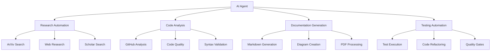

# AI Agents and Toolsets Configuration Guide

## Overview

This guide provides comprehensive strategies for configuring VS Code GitHub Copilot as an AI agent system with custom toolsets, MCP server integration, and advanced automation workflows. Based on the latest 2024 capabilities including Agent Mode, toolsets.jsonc configuration, and Model Context Protocol (MCP) integration.

## Table of Contents

1. [Agent Mode Configuration](<#agent-mode-configuration>)
2. [Custom Toolsets Architecture](<#custom-toolsets-architecture>)
3. [MCP Server Integration](<#mcp-server-integration>)
4. [AI Agent Workflows](<#ai-agent-workflows>)
5. [Advanced Orchestration Patterns](<#advanced-orchestration-patterns>)
6. [Security and Governance](<#security-and-governance>)
7. [Best Practices and Optimization](<#best-practices-and-optimization>)
8. [Troubleshooting and Debugging](<#troubleshooting-and-debugging>)

## Agent Mode Configuration

### Enabling AI Agent Capabilities

#### VS Code Settings Configuration

```json
// settings.json - Enable Agent Mode and MCP Support
{
  "chat.agent.enabled": true,
  "chat.mcp.discovery.enabled": true,
  "github.copilot.chat.virtualTools.threshold": 10,
  "github.copilot.enable": {
    "*": true,
    "plaintext": false,
    "markdown": true,
    "scminput": false
  },
  "github.copilot.advanced": {
    "debug.overrideEngine": "gpt-4",
    "debug.useNodeFetcher": true
  }
}
```

#### Agent Mode Activation Workflow

```bash
# 1. Enable Agent Mode in VS Code
# Command Palette: Developer: Reload Window
# Settings: Search "chat.agent.enabled" → Enable

# 2. Verify MCP Support
# Command Palette: MCP: Show Installed Servers

# 3. Access Agent Mode
# Shortcut: Ctrl+Alt+I (Windows/Linux) or ⌃⌘I (Mac)
# Select "Agent" from dropdown in Chat view
```

### Custom Instructions Integration

#### Workspace-Level Instructions

```markdown
<!-- .github/copilot-instructions.md -->
---
applyTo: "**/*.{py,js,ts,md,json,yaml,yml}"
priority: high
---

# AI Agent Instructions for Knowledge Base Project

## Project Context
- **Type**: Comprehensive AI Knowledge Base with MCP Integration
- **Languages**: Python, JavaScript/TypeScript, Markdown
- **Frameworks**: VS Code Extensions, MCP Servers, Documentation Tools
- **Architecture**: Function-based organization with docs-as-code workflows

## AI Agent Behavior Guidelines

### Code Generation Standards
- **Python**: Use type hints, docstrings, pytest for testing
- **JavaScript/TypeScript**: Use modern ES6+, JSDoc comments, Jest for testing
- **Documentation**: Follow Diátaxis framework (tutorials, how-to, reference, explanation)

### Tool Usage Priorities
1. **Research Tasks**: Use `research-automation` toolset
2. **Code Analysis**: Use `code-analysis` toolset
3. **Documentation**: Use `documentation-generation` toolset
4. **Testing**: Use `testing-automation` toolset

### Quality Standards
- Always validate code syntax before suggesting
- Include comprehensive error handling
- Provide working examples with all suggestions
- Follow established naming conventions (hyphen-separated)

### MCP Integration Patterns
- Prefer multi-server orchestration for complex tasks
- Use knowledge graph storage for research results
- Implement proper error handling and fallbacks
- Document all MCP server configurations
```

#### File-Specific Instructions

```markdown
<!-- .instructions.md for Python files -->
---
applyTo: "**/*.py"
---

# Python Development Instructions

## Code Standards
- Use Python 3.11+ features
- Type hints required for all functions
- Docstrings in Google format
- Error handling with specific exceptions

## Testing Requirements
- pytest with fixtures for setup/teardown
- Coverage target: 85%+
- Property-based testing for complex logic
- Integration tests for MCP server interactions

## Tools Integration
- Use Pylance MCP for code analysis
- Ruff for linting, Black for formatting
- mypy for type checking
- VS Code testing integration required
```

## Custom Toolsets Architecture

### Core Toolset Design Principles

#### 1. Function-Based Grouping

Toolsets are organized by functional purpose rather than technical implementation:

```jsonc
// .github/prompts/custom_toolset.toolsets.jsonc
{
  "research-automation": {
    "tools": [
      "mcp_arxiv-mcp-ser_search_arxiv",
      "mcp_deep-research_deep-research",
      "semantic_search"
    ],
    "description": "Multi-source research with academic and web analysis",
    "icon": "search"
  }
}
```

#### 2. Hierarchical Tool Organization



### Advanced Toolset Configurations

#### Research Automation Toolset

```jsonc
{
  "research-automation": {
    "tools": [
      "mcp_arxiv-mcp-ser_search_arxiv",
      "mcp_arxiv-mcp-ser_get_details", 
      "mcp_arxiv-mcp-ser_load_article_to_context",
      "mcp_deep-research_deep-research",
      "mcp_google-schola_search_google_scholar_advanced",
      "semantic_search",
      "grep_search"
    ],
    "description": "Comprehensive academic and web research automation with multi-source analysis",
    "icon": "search",
    "configuration": {
      "defaultParameters": {
        "depth": 4,
        "breadth": 4,
        "tokenBudget": 50000
      },
      "sources": ["academic", "web", "code"],
      "outputFormat": "structured-markdown"
    }
  }
}
```

#### Code Analysis and Quality Toolset

```jsonc
{
  "code-analysis": {
    "tools": [
      "mcp_github_search_code",
      "mcp_github_search_repositories",
      "mcp_deepwiki_ask_question", 
      "list_code_usages",
      "get_errors",
      "mcp_pylance_mcp_s_pylanceRunCodeSnippet",
      "mcp_pylance_mcp_s_pylanceFileSyntaxErrors"
    ],
    "description": "Advanced code analysis, repository exploration, and quality assessment",
    "icon": "code",
    "workflow": {
      "steps": [
        "syntax-validation",
        "quality-analysis", 
        "usage-patterns",
        "improvement-suggestions"
      ]
    }
  }
}
```

#### Documentation Generation Toolset

```jsonc
{
  "documentation-generation": {
    "tools": [
      "create_file",
      "replace_string_in_file",
      "mcp_markitdown_convert_to_markdown",
      "mcp_mcp_pdf_reade_read-pdf",
      "semantic_search",
      "mermaid-diagram-validator",
      "mermaid-diagram-preview"
    ],
    "description": "Automated documentation creation, conversion, and validation workflows",
    "icon": "book",
    "templates": {
      "guide": "docs/guides/template.md",
      "api": "docs/reference/api-template.md",
      "tutorial": "docs/tutorials/template.md"
    }
  }
}
```

### Toolset Usage Patterns

#### Multi-Toolset Workflows

```javascript
// Example: Comprehensive Project Analysis Workflow
async function analyzeProject() {
  // Step 1: Research similar projects and best practices
  await invokeToolset('research-automation', {
    query: 'documentation automation best practices 2024',
    includeAcademic: true,
    includeCode: true
  });
  
  // Step 2: Analyze current codebase
  await invokeToolset('code-analysis', {
    scope: 'workspace',
    includeQuality: true,
    generateReport: true
  });
  
  // Step 3: Generate comprehensive documentation
  await invokeToolset('documentation-generation', {
    type: 'comprehensive-guide',
    includeExamples: true,
    format: 'markdown'
  });
  
  // Step 4: Validate and test everything
  await invokeToolset('testing-automation', {
    scope: 'full',
    includeIntegration: true
  });
}
```

## MCP Server Integration

### Multi-Server Configuration

#### Primary MCP Servers Setup

```json
// .vscode/mcp.json - MCP Server Configuration
{
  "mcpServers": {
    "arxiv-research": {
      "type": "local",
      "command": "python",
      "args": ["-m", "arxiv_mcp"],
      "env": {
        "ARXIV_CACHE_DIR": "${workspaceRoot}/cache/arxiv",
        "ARXIV_MAX_RESULTS": "50"
      },
      "tools": ["*"],
      "description": "Academic paper research and analysis"
    },
    "deep-research": {
      "type": "local",
      "command": "node",
      "args": ["dist/index.js"],
      "env": {
        "RESEARCH_API_KEY": "${env:RESEARCH_API_KEY}",
        "MAX_DEPTH": "5",
        "CACHE_ENABLED": "true"
      },
      "tools": ["deep-research"],
      "description": "Web research with AI-powered analysis"
    },
    "github-integration": {
      "type": "local", 
      "command": "python",
      "args": ["-m", "github_mcp"],
      "env": {
        "GITHUB_TOKEN": "${env:GITHUB_TOKEN}",
        "GITHUB_CACHE_SIZE": "1000"
      },
      "tools": ["*"],
      "description": "GitHub repository analysis and management"
    },
    "memory-knowledge": {
      "type": "local",
      "command": "python", 
      "args": ["-m", "memory_mcp"],
      "env": {
        "MEMORY_DB_PATH": "${workspaceRoot}/cache/knowledge.db"
      },
      "tools": ["*"],
      "description": "Knowledge graph and memory management"
    },
    "pylance-analysis": {
      "type": "local",
      "command": "python",
      "args": ["-m", "pylance_mcp"], 
      "env": {
        "WORKSPACE_ROOT": "${workspaceRoot}"
      },
      "tools": ["*"],
      "description": "Python code analysis and enhancement"
    }
  }
}
```

#### Advanced MCP Orchestration

```python
# MCP Orchestration Class for AI Agents
class AIAgentOrchestrator:
    """Advanced orchestration for AI agents with MCP servers."""
    
    def __init__(self, toolsets_config: dict):
        self.toolsets = toolsets_config
        self.active_servers = {}
        self.workflow_state = {}
    
    async def execute_research_workflow(self, topic: str):
        """Execute comprehensive research using multiple MCP servers."""
        
        # Phase 1: Academic Research
        academic_results = await self.invoke_toolset(
            "research-automation",
            {
                "primary_tool": "mcp_arxiv-mcp-ser_search_arxiv",
                "query": topic,
                "max_results": 20
            }
        )
        
        # Phase 2: Web Research  
        web_results = await self.invoke_toolset(
            "research-automation",
            {
                "primary_tool": "mcp_deep-research_deep-research",
                "query": f"{topic} implementation best practices",
                "depth": 4,
                "breadth": 4,
                "tokenBudget": 50000
            }
        )
        
        # Phase 3: Code Analysis
        code_results = await self.invoke_toolset(
            "code-analysis",
            {
                "primary_tool": "mcp_github_search_repositories",
                "query": f"{topic} language:python stars:>100"
            }
        )
        
        # Phase 4: Knowledge Storage
        await self.invoke_toolset(
            "knowledge-management",
            {
                "primary_tool": "mcp_memory_create_entities",
                "entities": [{
                    "name": f"{topic}_research",
                    "entityType": "research_project",
                    "observations": [
                        academic_results,
                        web_results, 
                        code_results
                    ]
                }]
            }
        )
        
        return {
            "academic": academic_results,
            "web": web_results,
            "code": code_results,
            "status": "completed"
        }
    
    async def invoke_toolset(self, toolset_name: str, parameters: dict):
        """Invoke a specific toolset with parameters."""
        toolset = self.toolsets.get(toolset_name)
        if not toolset:
            raise ValueError(f"Toolset {toolset_name} not found")
        
        primary_tool = parameters.get("primary_tool")
        if primary_tool and primary_tool in toolset["tools"]:
            # Execute primary tool with fallbacks
            return await self._execute_tool_with_fallbacks(
                primary_tool, 
                parameters,
                toolset["tools"]
            )
        else:
            # Execute all tools in parallel
            return await self._execute_toolset_parallel(toolset, parameters)
```

## AI Agent Workflows

### Intelligent Task Decomposition

#### Automatic Workflow Planning

```python
class IntelligentWorkflowPlanner:
    """AI agent that automatically plans and executes complex workflows."""
    
    async def plan_and_execute(self, user_request: str):
        """Break down user request into executable workflow steps."""
        
        # Step 1: Analyze request and determine required toolsets
        analysis = await self.analyze_request(user_request)
        
        # Step 2: Create execution plan
        plan = await self.create_execution_plan(analysis)
        
        # Step 3: Execute plan with monitoring
        results = await self.execute_plan_with_monitoring(plan)
        
        return results
    
    async def analyze_request(self, request: str) -> dict:
        """Analyze user request to determine toolsets and approach."""
        
        # Use sequential thinking for complex analysis
        thinking_result = await self.invoke_tool(
            "mcp_sequentialthi_sequentialthinking",
            {
                "thought": f"Analyze this request: {request}",
                "nextThoughtNeeded": True,
                "thoughtNumber": 1,
                "totalThoughts": 5
            }
        )
        
        # Determine required toolsets based on analysis
        required_toolsets = self.map_request_to_toolsets(thinking_result)
        
        return {
            "original_request": request,
            "analysis": thinking_result,
            "required_toolsets": required_toolsets,
            "complexity": self.assess_complexity(request)
        }
    
    def map_request_to_toolsets(self, analysis: dict) -> list:
        """Map analyzed request to appropriate toolsets."""
        
        toolset_mapping = {
            "research": ["research-automation", "knowledge-management"],
            "code": ["code-analysis", "testing-automation"],
            "documentation": ["documentation-generation", "knowledge-management"],
            "analysis": ["code-analysis", "security-analysis"],
            "automation": ["development-workflow", "ai-orchestration"]
        }
        
        # Intelligent mapping based on keywords and context
        detected_keywords = self.extract_keywords(analysis)
        required_toolsets = []
        
        for keyword in detected_keywords:
            if keyword in toolset_mapping:
                required_toolsets.extend(toolset_mapping[keyword])
        
        return list(set(required_toolsets))  # Remove duplicates
```

### Multi-Modal AI Interactions

#### Context-Aware Tool Selection

```python
class ContextAwareAgent:
    """AI agent with context-aware tool selection and execution."""
    
    async def handle_context_aware_request(self, request: str, context: dict):
        """Handle requests with full context awareness."""
        
        # Gather additional context
        enhanced_context = await self.enhance_context(context)
        
        # Select optimal tools based on context
        optimal_tools = await self.select_optimal_tools(request, enhanced_context)
        
        # Execute with adaptive parameters
        results = await self.execute_with_adaptation(optimal_tools, request, enhanced_context)
        
        return results
    
    async def enhance_context(self, base_context: dict) -> dict:
        """Enhance context with workspace and project information."""
        
        # Get workspace structure
        workspace_info = await self.invoke_tool("list_dir", {"path": "."})
        
        # Get recent changes
        recent_changes = await self.invoke_tool("get_changed_files", {})
        
        # Get project metadata
        project_metadata = await self.get_project_metadata()
        
        return {
            **base_context,
            "workspace": workspace_info,
            "recent_changes": recent_changes,
            "project": project_metadata,
            "timestamp": datetime.now().isoformat()
        }
    
    async def select_optimal_tools(self, request: str, context: dict) -> list:
        """Select optimal tools based on request and context."""
        
        # Use actor-critic thinking for tool selection
        selection_analysis = await self.invoke_tool(
            "mcp_actor-critic-_actor-critic-thinking",
            {
                "content": f"Select optimal tools for: {request} in context: {context}",
                "role": "actor",
                "nextRoundNeeded": True,
                "thoughtNumber": 1,
                "totalThoughts": 3
            }
        )
        
        # Extract tool recommendations from analysis
        recommended_tools = self.extract_tool_recommendations(selection_analysis)
        
        return recommended_tools
```

## Advanced Orchestration Patterns

### Event-Driven AI Workflows

#### Reactive Agent System

```python
class ReactiveAIAgent:
    """Event-driven AI agent system for automatic responses."""
    
    def __init__(self):
        self.event_handlers = {}
        self.active_workflows = {}
        self.event_queue = asyncio.Queue()
    
    def register_event_handler(self, event_type: str, toolset: str, handler: callable):
        """Register event handlers for automatic responses."""
        
        if event_type not in self.event_handlers:
            self.event_handlers[event_type] = []
        
        self.event_handlers[event_type].append({
            "toolset": toolset,
            "handler": handler
        })
    
    async def handle_file_change_event(self, file_path: str, change_type: str):
        """Handle file change events with appropriate AI responses."""
        
        if file_path.endswith('.py'):
            # Python file changed - run code analysis
            await self.invoke_toolset("code-analysis", {
                "file_path": file_path,
                "include_syntax_check": True,
                "include_quality_analysis": True
            })
            
            # Run tests if test files exist
            await self.invoke_toolset("testing-automation", {
                "scope": "related",
                "file_path": file_path
            })
        
        elif file_path.endswith('.md'):
            # Documentation changed - validate and update cross-references
            await self.invoke_toolset("documentation-generation", {
                "file_path": file_path,
                "validate_links": True,
                "update_references": True
            })
        
        elif file_path.endswith('.json'):
            # Configuration changed - validate and apply changes
            await self.handle_config_change(file_path)
    
    async def handle_research_trigger(self, topic: str, trigger_type: str):
        """Handle research triggers for automatic knowledge updates."""
        
        # Trigger comprehensive research workflow
        await self.invoke_toolset("research-automation", {
            "topic": topic,
            "trigger_type": trigger_type,
            "auto_update_knowledge": True
        })
        
        # Update documentation if needed
        if trigger_type == "documentation_update":
            await self.invoke_toolset("documentation-generation", {
                "topic": topic,
                "update_existing": True,
                "include_latest_research": True
            })
```

### Parallel Processing and Optimization

#### Concurrent AI Workflows

```python
class ConcurrentAIWorkflows:
    """Manage concurrent AI workflows with resource optimization."""
    
    async def execute_parallel_research(self, topics: list[str]):
        """Execute research on multiple topics in parallel."""
        
        # Create semaphore for resource management
        semaphore = asyncio.Semaphore(3)  # Limit concurrent research tasks
        
        async def research_topic(topic: str):
            async with semaphore:
                return await self.invoke_toolset("research-automation", {
                    "topic": topic,
                    "parallel_execution": True,
                    "resource_limit": "medium"
                })
        
        # Execute all research tasks concurrently
        research_tasks = [research_topic(topic) for topic in topics]
        results = await asyncio.gather(*research_tasks, return_exceptions=True)
        
        # Process results and handle exceptions
        processed_results = {}
        for topic, result in zip(topics, results):
            if isinstance(result, Exception):
                processed_results[topic] = {"error": str(result), "status": "failed"}
            else:
                processed_results[topic] = {"result": result, "status": "completed"}
        
        return processed_results
    
    async def optimize_workflow_execution(self, workflow_plan: dict):
        """Optimize workflow execution based on available resources."""
        
        # Analyze resource requirements
        resource_analysis = await self.analyze_resource_requirements(workflow_plan)
        
        # Optimize execution order
        optimized_plan = await self.optimize_execution_order(workflow_plan, resource_analysis)
        
        # Execute with dynamic resource allocation
        results = await self.execute_with_resource_management(optimized_plan)
        
        return results
```

## Security and Governance

### AI Agent Security Framework

#### Secure Tool Execution

```python
class SecureAIAgent:
    """Security-focused AI agent with governance controls."""
    
    def __init__(self, security_config: dict):
        self.security_config = security_config
        self.audit_log = []
        self.tool_permissions = {}
    
    async def execute_with_security_checks(self, toolset: str, parameters: dict):
        """Execute toolset with comprehensive security validation."""
        
        # Step 1: Validate permissions
        if not await self.validate_permissions(toolset, parameters):
            raise SecurityError(f"Insufficient permissions for {toolset}")
        
        # Step 2: Sanitize parameters
        sanitized_params = await self.sanitize_parameters(parameters)
        
        # Step 3: Execute with monitoring
        start_time = time.time()
        try:
            result = await self.invoke_toolset(toolset, sanitized_params)
            
            # Log successful execution
            await self.log_execution(toolset, sanitized_params, result, "success")
            
            return result
            
        except Exception as e:
            # Log failed execution
            await self.log_execution(toolset, sanitized_params, str(e), "error")
            raise
        
        finally:
            execution_time = time.time() - start_time
            await self.monitor_resource_usage(toolset, execution_time)
    
    async def validate_permissions(self, toolset: str, parameters: dict) -> bool:
        """Validate tool execution permissions."""
        
        # Check toolset permissions
        allowed_toolsets = self.security_config.get("allowed_toolsets", [])
        if toolset not in allowed_toolsets:
            return False
        
        # Check parameter constraints
        constraints = self.security_config.get("parameter_constraints", {})
        if toolset in constraints:
            for param, constraint in constraints[toolset].items():
                if param in parameters:
                    if not self.validate_constraint(parameters[param], constraint):
                        return False
        
        return True
    
    async def sanitize_parameters(self, parameters: dict) -> dict:
        """Sanitize input parameters to prevent injection attacks."""
        
        sanitized = {}
        for key, value in parameters.items():
            if isinstance(value, str):
                # Remove potentially dangerous characters
                sanitized[key] = re.sub(r'[<>"\']', '', value)
            else:
                sanitized[key] = value
        
        return sanitized
```

#### Governance and Compliance

```yaml
# .github/ai-governance.yml - AI Agent Governance Configuration
governance:
  security:
    allowed_toolsets:
      - research-automation
      - documentation-generation
      - code-analysis
      - testing-automation
    
    restricted_tools:
      - run_in_terminal  # Requires manual approval
      - install_extension  # Admin only
    
    parameter_constraints:
      research-automation:
        tokenBudget:
          max: 100000
          default: 50000
        depth:
          max: 5
          default: 4
  
  compliance:
    data_retention:
      research_results: 90 # days
      code_analysis: 30 # days
      audit_logs: 365 # days
    
    privacy:
      anonymize_user_data: true
      encrypt_sensitive_params: true
      audit_all_executions: true
  
  quality:
    validation_required:
      - code-generation
      - documentation-updates
      - configuration-changes
    
    approval_workflows:
      high_impact_changes: manual
      routine_operations: automatic
      research_tasks: automatic
```

## Best Practices and Optimization

### Performance Optimization

#### Efficient Tool Execution

```python
class OptimizedAIAgent:
    """Performance-optimized AI agent with caching and batching."""
    
    def __init__(self):
        self.tool_cache = {}
        self.batch_queue = defaultdict(list)
        self.performance_metrics = {}
    
    async def execute_with_caching(self, toolset: str, parameters: dict):
        """Execute toolset with intelligent caching."""
        
        # Generate cache key
        cache_key = self.generate_cache_key(toolset, parameters)
        
        # Check cache first
        if cache_key in self.tool_cache:
            cache_entry = self.tool_cache[cache_key]
            if not self.is_cache_expired(cache_entry):
                return cache_entry["result"]
        
        # Execute and cache result
        result = await self.invoke_toolset(toolset, parameters)
        
        self.tool_cache[cache_key] = {
            "result": result,
            "timestamp": time.time(),
            "ttl": self.get_cache_ttl(toolset)
        }
        
        return result
    
    async def batch_execute(self, requests: list[dict]):
        """Execute multiple requests in optimized batches."""
        
        # Group requests by toolset
        grouped_requests = defaultdict(list)
        for request in requests:
            toolset = request["toolset"]
            grouped_requests[toolset].append(request)
        
        # Execute batches concurrently
        batch_tasks = []
        for toolset, toolset_requests in grouped_requests.items():
            task = self.execute_toolset_batch(toolset, toolset_requests)
            batch_tasks.append(task)
        
        batch_results = await asyncio.gather(*batch_tasks)
        
        # Merge results
        merged_results = {}
        for toolset_results in batch_results:
            merged_results.update(toolset_results)
        
        return merged_results
    
    def monitor_performance(self, toolset: str, execution_time: float):
        """Monitor and track performance metrics."""
        
        if toolset not in self.performance_metrics:
            self.performance_metrics[toolset] = {
                "executions": 0,
                "total_time": 0,
                "average_time": 0,
                "max_time": 0,
                "min_time": float('inf')
            }
        
        metrics = self.performance_metrics[toolset]
        metrics["executions"] += 1
        metrics["total_time"] += execution_time
        metrics["average_time"] = metrics["total_time"] / metrics["executions"]
        metrics["max_time"] = max(metrics["max_time"], execution_time)
        metrics["min_time"] = min(metrics["min_time"], execution_time)
```

### Quality Assurance

#### Automated Validation Framework

```python
class AIAgentQualityFramework:
    """Quality assurance framework for AI agent outputs."""
    
    async def validate_output_quality(self, toolset: str, output: dict):
        """Validate the quality of AI agent outputs."""
        
        validation_rules = {
            "research-automation": self.validate_research_output,
            "code-analysis": self.validate_code_analysis,
            "documentation-generation": self.validate_documentation
        }
        
        validator = validation_rules.get(toolset)
        if validator:
            return await validator(output)
        
        return {"valid": True, "score": 1.0}
    
    async def validate_research_output(self, output: dict) -> dict:
        """Validate research output quality."""
        
        quality_score = 0.0
        issues = []
        
        # Check for required fields
        required_fields = ["sources", "summary", "key_findings"]
        for field in required_fields:
            if field in output:
                quality_score += 0.25
            else:
                issues.append(f"Missing required field: {field}")
        
        # Check source diversity
        sources = output.get("sources", [])
        if len(sources) >= 3:
            quality_score += 0.25
        elif len(sources) < 1:
            issues.append("Insufficient source diversity")
        
        return {
            "valid": quality_score >= 0.7,
            "score": quality_score,
            "issues": issues
        }
    
    async def validate_code_analysis(self, output: dict) -> dict:
        """Validate code analysis output quality."""
        
        quality_score = 0.0
        issues = []
        
        # Check for syntax validation
        if "syntax_errors" in output:
            if len(output["syntax_errors"]) == 0:
                quality_score += 0.3
            else:
                issues.append("Syntax errors detected")
        
        # Check for quality metrics
        if "quality_metrics" in output:
            quality_score += 0.3
        
        # Check for recommendations
        if "recommendations" in output and len(output["recommendations"]) > 0:
            quality_score += 0.4
        
        return {
            "valid": quality_score >= 0.6,
            "score": quality_score,
            "issues": issues
        }
```

## Troubleshooting and Debugging

### Common Issues and Solutions

#### MCP Server Connection Issues

```python
class AIAgentDiagnostics:
    """Diagnostic tools for AI agent troubleshooting."""
    
    async def diagnose_mcp_connectivity(self):
        """Diagnose MCP server connectivity issues."""
        
        diagnostics = {}
        
        # Check MCP server status
        try:
            server_list = await self.invoke_tool("mcp_list_servers", {})
            diagnostics["server_connectivity"] = "ok"
            diagnostics["active_servers"] = server_list
        except Exception as e:
            diagnostics["server_connectivity"] = "failed"
            diagnostics["connectivity_error"] = str(e)
        
        # Check individual server health
        server_health = {}
        for server_name in ["arxiv-research", "deep-research", "github-integration"]:
            try:
                health_check = await self.check_server_health(server_name)
                server_health[server_name] = health_check
            except Exception as e:
                server_health[server_name] = {"status": "error", "error": str(e)}
        
        diagnostics["server_health"] = server_health
        
        return diagnostics
    
    async def diagnose_toolset_issues(self, toolset_name: str):
        """Diagnose issues with specific toolsets."""
        
        diagnostics = {
            "toolset": toolset_name,
            "timestamp": datetime.now().isoformat()
        }
        
        # Check toolset configuration
        try:
            toolset_config = self.get_toolset_config(toolset_name)
            diagnostics["configuration"] = "valid"
            diagnostics["tool_count"] = len(toolset_config.get("tools", []))
        except Exception as e:
            diagnostics["configuration"] = "invalid"
            diagnostics["config_error"] = str(e)
        
        # Test individual tools
        tool_status = {}
        if "tools" in toolset_config:
            for tool_name in toolset_config["tools"][:3]:  # Test first 3 tools
                try:
                    test_result = await self.test_tool(tool_name)
                    tool_status[tool_name] = "functional"
                except Exception as e:
                    tool_status[tool_name] = f"error: {str(e)}"
        
        diagnostics["tool_status"] = tool_status
        
        return diagnostics
```

#### Performance Debugging

```python
class PerformanceProfiler:
    """Performance profiling for AI agent workflows."""
    
    def __init__(self):
        self.execution_profiles = {}
        self.bottleneck_analysis = {}
    
    async def profile_workflow_execution(self, workflow_name: str, workflow_func: callable):
        """Profile workflow execution for performance analysis."""
        
        start_time = time.time()
        memory_start = psutil.Process().memory_info().rss
        
        # Execute workflow with profiling
        try:
            result = await workflow_func()
            
            end_time = time.time()
            memory_end = psutil.Process().memory_info().rss
            
            # Store performance profile
            self.execution_profiles[workflow_name] = {
                "execution_time": end_time - start_time,
                "memory_usage": memory_end - memory_start,
                "status": "success",
                "timestamp": datetime.now().isoformat()
            }
            
            return result
            
        except Exception as e:
            end_time = time.time()
            
            self.execution_profiles[workflow_name] = {
                "execution_time": end_time - start_time,
                "status": "error",
                "error": str(e),
                "timestamp": datetime.now().isoformat()
            }
            
            raise
    
    def analyze_performance_bottlenecks(self) -> dict:
        """Analyze performance data to identify bottlenecks."""
        
        analysis = {
            "slowest_workflows": [],
            "memory_intensive": [],
            "error_prone": [],
            "recommendations": []
        }
        
        # Sort by execution time
        sorted_workflows = sorted(
            self.execution_profiles.items(),
            key=lambda x: x[1].get("execution_time", 0),
            reverse=True
        )
        
        # Identify slow workflows
        analysis["slowest_workflows"] = sorted_workflows[:5]
        
        # Identify memory-intensive workflows
        memory_sorted = sorted(
            self.execution_profiles.items(),
            key=lambda x: x[1].get("memory_usage", 0),
            reverse=True
        )
        analysis["memory_intensive"] = memory_sorted[:3]
        
        # Identify error-prone workflows
        error_workflows = [
            (name, profile) for name, profile in self.execution_profiles.items()
            if profile.get("status") == "error"
        ]
        analysis["error_prone"] = error_workflows
        
        # Generate recommendations
        analysis["recommendations"] = self.generate_performance_recommendations(analysis)
        
        return analysis
```

This comprehensive AI Agents and Toolsets Configuration Guide provides enterprise-grade strategies for implementing VS Code GitHub Copilot as an intelligent agent system. The guide covers advanced configuration patterns, multi-server orchestration, security frameworks, and performance optimization techniques necessary for professional AI-powered development workflows.

## Related Resources

- [VS Code Copilot Complete Guide](../tools/vscode-copilot-complete-guide.md)
- [MCP Integration Workflows](<./mcp-integration-workflows.md>)
- [Documentation Best Practices](<./documentation-best-practices.md>)
- [Testing Comprehensive Guide](<./testing-comprehensive-guide.md>)
