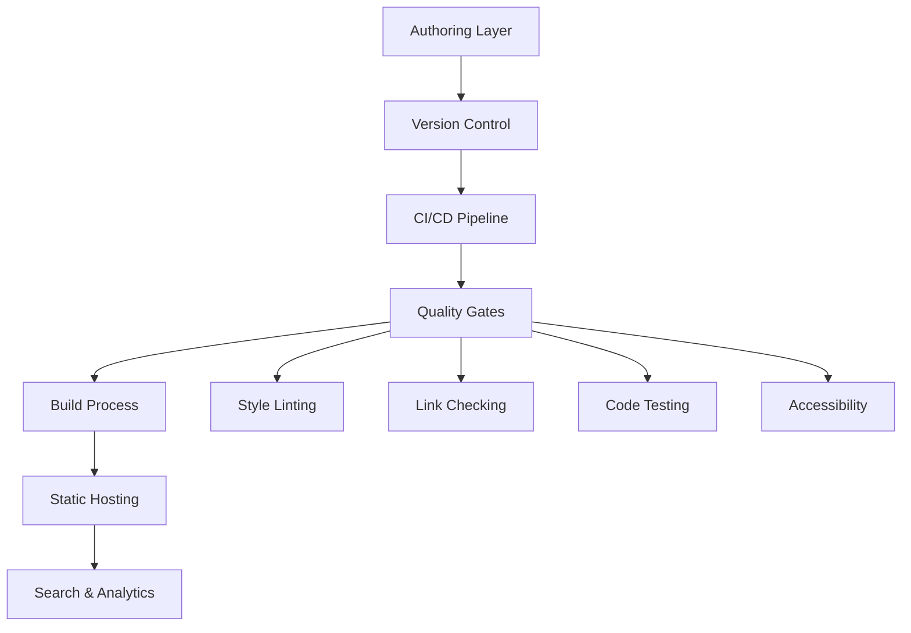

# Documentation Best Practices and Standards

## Executive Summary

High-performing engineering organizations treat documentation as a first-class product: owned, versioned, tested, released, measured, and continuously improved. This comprehensive guide synthesizes industry best practices, formal technical writing standards, and practical implementation for building scalable documentation systems.

## Core Principles

### Documentation as Code (Docs-as-Code)

Documentation should be governed like code with:

- Version control integration
- CI/CD pipelines with quality gates
- Preview environments for every change
- Automated testing and validation
- Release management and versioning

### Quality Gates Framework

1. **Style Enforcement**: Vale, Alex (inclusive language), spell checking
2. **Link Validation**: Zero broken links tolerance
3. **Accessibility**: WCAG 2.2 AA compliance
4. **Code Samples**: Automated testing of all examples
5. **API Alignment**: Schema validation and consistency

## Technical Writing Standards

### Style Guidelines

#### Primary Standards

- **Google Developer Documentation Style Guide**: Developer-centric rules for grammar, formatting, code samples
- **Microsoft Writing Style Guide**: Task-oriented, plain language with accessibility focus
- **WCAG 2.2 AA**: Color contrast, keyboard navigation, semantic structure

#### Language and Structure

```yaml
Writing principles:
- Sentences: Short, active voice
- Structure: Scannable with headings, lists, callouts
- Terminology: Consistent with maintained glossary
- Requirements: RFC 2119/8174 keywords (MUST/SHOULD/MAY) for normative specs
- Accessibility: Alt text, semantic headings, sufficient contrast
```

#### Code Sample Standards

```markdown
Best practices:
- Language-idiomatic examples
- Minimal, runnable, contextually placed
- CI verification required
- No hardcoded secrets
- Clear expected outcomes
```

## Information Architecture (IA)

### Diátaxis Framework

Structure content by user intent for optimal cognitive load:

#### 1. Tutorials

- **Purpose**: Learning by accomplishing from zero
- **Characteristics**: End-to-end, error-free, guided experience
- **Example**: "Build your first API in 10 minutes"

#### 2. How-to Guides  

- **Purpose**: Task-oriented procedures for specific goals
- **Characteristics**: Minimal explanation, clear steps
- **Example**: "How to configure authentication"

#### 3. Reference

- **Purpose**: Exactness and completeness
- **Characteristics**: API docs, config schemas, CLI reference
- **Example**: "API endpoint reference"

#### 4. Explanations

- **Purpose**: Concepts, rationale, trade-offs
- **Characteristics**: Architecture decisions, design principles
- **Example**: "Why we chose microservices architecture"

### Navigation and Findability

```yaml
Navigation principles:
- Hierarchy: Shallow, consistent structure
- Entry points: By role, goal, product area
- Metadata: Audience, version, platform tags
- Search: Version-scoped with faceted results
- Cross-links: Maintain internal link integrity
```

### Versioning Strategy

```markdown
Version management:
- "latest" (development) and "stable" (current GA)
- Breaking changes: Deprecation schedules + migration guides
- Feature matrices: Availability across versions
- Search: Scoped to selected version
```

## Modern Documentation Frameworks

### Framework Selection Matrix

| Framework | Best For | Strengths | Trade-offs |
|-----------|----------|-----------|------------|
| **Sphinx** | Python/API-heavy, Scientific | Autodoc, cross-refs, Jupyter | Python toolchain, reST learning curve |
| **MkDocs Material** | General product docs | Fast, beautiful UX, Markdown-first | Less autodoc for complex APIs |
| **Docusaurus** | React ecosystems, Enterprise | MDX components, versioning, i18n | Node/React stack complexity |
| **Astro Starlight** | Modern, performance-focused | Minimal JS, fast builds | Newer ecosystem |
| **Antora** | Multi-repo, versioned components | Component model, AsciiDoc power | AsciiDoc learning curve |
| **DocFX** | .NET ecosystems | XML doc integration | Language-specific |

### Sphinx Deep Dive

#### When to Choose Sphinx

- Python ecosystems with heavy API documentation
- Scientific computing with Jupyter integration
- Multi-language API references with autodoc pipelines
- Complex cross-referencing requirements

#### Recommended Stack

```python
# conf.py baseline configuration
extensions = [
    'myst_parser',           # Markdown support
    'sphinx.ext.autodoc',    # API documentation
    'sphinx.ext.autosummary', # API summaries
    'sphinx.ext.napoleon',   # Google/NumPy docstrings
    'sphinx.ext.intersphinx', # Cross-project linking
    'sphinx_copybutton',     # Copy code buttons
    'sphinx_design',         # Design components
    'sphinxcontrib.mermaid', # Diagrams
    'sphinxcontrib.openapi', # OpenAPI integration
]

# Quality settings
nitpicky = True              # Catch missing references
autosummary_generate = True  # Auto-generate summaries
autodoc_member_order = 'bysource'

# Theme
html_theme = 'furo'          # Modern, clean theme
```

#### Best Practices

```yaml
Content organization:
- Source: MyST Markdown for contributor ease
- Reuse: Include directives and Jinja templating
- Code: literalinclude for source file integration
- Performance: Parallel builds (-j auto), caching

Quality assurance:
- Links: intersphinx_mapping for external references
- Testing: doctest integration for code examples
- CI: Comprehensive link checking and style validation
```

### MkDocs Material Implementation

```yaml
# mkdocs.yml configuration
site_name: Your Product Docs
theme:
  name: material
  features:
    - navigation.tabs
    - navigation.sections
    - navigation.expand
    - search.highlight
    - content.code.copy

plugins:
  - search
  - mkdocstrings    # API documentation
  - i18n            # Internationalization
  - git-revision-date-localized

markdown_extensions:
  - pymdownx.highlight
  - pymdownx.superfences
  - pymdownx.tabbed
  - admonition
  - codehilite
```

## Documentation Architecture

### Technical Platform Layers



#### Authoring Layer

- **Format**: Markdown/MDX, MyST, AsciiDoc
- **Tools**: VS Code with extensions, Git integration
- **Structure**: Clear separation of content types

#### Quality Gates (CI Pipeline)

```bash
# Example CI pipeline stages
1. Lint style (Vale, markdownlint)
2. Check inclusive language (Alex)
3. Spell check (cspell/codespell)
4. Validate links (lychee/linkinator)
5. Test code snippets (doctest/pytest)
6. API schema validation (Spectral)
7. Accessibility check (axe/pa11y)
8. Build documentation
9. Deploy to staging/production
```

#### Publishing and Delivery

```yaml
Hosting options:
- Read the Docs: Turnkey Sphinx/MkDocs hosting
- Netlify/Vercel: Modern static hosting with previews
- Cloudflare Pages: Global CDN with edge functions
- GitHub Pages: Simple, free hosting for public repos

Requirements:
- Immutable releases
- CDN invalidation on deploy
- SSL/TLS by default
- Preview environments for PRs
```

### Repository Structure

```
docs/
├── conf.py / mkdocs.yml     # Configuration
├── requirements.txt         # Dependencies
├── index.md                 # Main entry point
├── tutorials/               # Learning-oriented
├── how-to/                  # Task-oriented
├── reference/               # Information-oriented
│   ├── api/                 # Auto-generated API docs
│   └── cli/                 # Command reference
├── explanations/            # Understanding-oriented
├── includes/                # Reusable content
├── assets/                  # Images, videos
└── locales/                 # Internationalization
```

## Content Type Best Practices

### API Documentation

#### Essential Components

```yaml
API documentation must include:
- OpenAPI/GraphQL schemas as source of truth
- Request/response examples with real data
- Error codes and troubleshooting
- Rate limits and pagination
- Authentication and authorization
- SDK code samples (tested in CI)
- Interactive "Try it" console
- Versioning and migration guides
```

#### Implementation Pattern

```python
# Sphinx + OpenAPI integration
extensions = ['sphinxcontrib.openapi']

# In your documentation
```yaml
.. openapi:: path/to/openapi.yaml
   :include:
     - /users
     - /users/{id}
```

### Code Examples and Snippets

#### Testing Strategy

```yaml
Automated validation:
- Python: doctest, pytest integration
- JavaScript: Unit tests with ts-node
- Multi-language: Source from real SDK repositories
- CI requirement: All examples must pass tests
- Maintenance: Automated updates with API changes
```

#### Best Practices

```markdown
1. **Minimal viable examples**: Show core concept only
2. **Complete context**: Include imports, setup, cleanup
3. **Real data**: Use realistic but safe example data
4. **Error handling**: Show proper error management
5. **Security**: Environment variables for secrets
6. **Platform coverage**: Examples for major platforms
```

### Quickstart and Onboarding

#### Optimization for Time-to-First-Success (TTFS)

```yaml
Quickstart requirements:
- Duration: Target <10 minutes for first success
- Prerequisites: Clearly stated and minimal
- Environment: Containerized dev environment preferred
- Validation: Built-in verification steps
- Next steps: Clear progression paths
- Troubleshooting: Common issues and solutions
```

### Troubleshooting Documentation

#### Error Catalog Structure

```yaml
Error documentation format:
- Error code/message (searchable)
- Symptoms and context
- Root cause explanation
- Step-by-step resolution
- Prevention strategies
- Related errors and issues
- Links from runtime errors to docs
```

## Internationalization and Localization

### Strategy Framework

```yaml
Localization approach:
- Phase 1: High-impact content (quickstarts, top tasks)
- Ownership: Per-locale content owners with SLAs
- Tooling: TMS integration (Crowdin, Lokalise, Transifex)
- Quality: Locale-specific style guides and terminologies
- Maintenance: Automated translation status tracking
```

### Technical Implementation

#### Sphinx i18n

```bash
# Extract translatable strings
sphinx-build -b gettext source source/_build/gettext

# Initialize language
sphinx-intl update -p source/_build/gettext -l ja

# Build localized docs
sphinx-build -b html -D language=ja source source/_build/html/ja
```

#### Docusaurus i18n

```bash
# Extract default messages
npm run docusaurus write-translations

# Translate and build
npm run docusaurus build -- --locale ja
```

## Accessibility Standards

### WCAG 2.2 AA Compliance

```yaml
Accessibility requirements:
- Semantic HTML: Proper heading hierarchy (h1→h2→h3)
- Color contrast: Minimum 4.5:1 for normal text
- Keyboard navigation: All functionality accessible via keyboard
- Focus indicators: Visible focus states for all interactive elements
- Alt text: Descriptive alternative text for images
- Link text: Descriptive, meaningful link text
- ARIA labels: Proper labeling for complex interactions
```

### Testing Strategy

```yaml
Accessibility testing:
- Automated: axe, pa11y in CI pipeline
- Manual: Screen reader testing (NVDA, JAWS, VoiceOver)
- Checklist: Pre-release accessibility audit
- Training: Team education on accessible content creation
```

## Measurement and Analytics

### Key Performance Indicators (KPIs)

#### Leading Indicators

```yaml
Primary metrics:
- Time-to-first-success (TTFS): Quickstart completion time
- Task completion rate: User success with documentation
- Search success rate: Queries leading to desired outcomes
- Page engagement: Dwell time with success signals
- Content coverage: Documentation completeness metrics
```

#### Lagging Indicators

```yaml
Impact metrics:
- Support ticket deflection: Reduced support volume
- Feature adoption: New feature usage rates
- User satisfaction: NPS/CSAT for documentation
- Developer productivity: Time to complete tasks
- Community contribution: External contributions to docs
```

### Analytics Implementation

```yaml
Tracking setup:
- Privacy-preserving: Plausible, PostHog for analytics
- Custom events: Task completion, code copy, search queries
- Feedback: Page-level "Was this helpful?" with routing
- Heatmaps: User interaction patterns (Hotjar, FullStory)
- A/B testing: Content and structure optimization
```

### Feedback Loops

```yaml
Continuous improvement:
- Quarterly content audits: Freshness and accuracy review
- Support ticket analysis: Documentation gap identification
- User interviews: Deep feedback on documentation experience
- Analytics review: Monthly performance assessment
- Content debt tracking: Technical debt for documentation
```

## Implementation Roadmap

### Phase 0: Foundations (Weeks 1-4)

```yaml
Setup tasks:
- Choose framework: Sphinx (Python-heavy) or MkDocs/Docusaurus
- Adopt IA: Implement Diátaxis structure
- Style guide: Select Google or Microsoft style standards
- CI pipeline: Basic linting, link checking, spell check
- Theme: Modern, accessible theme selection
- Search: Algolia DocSearch or Lunr integration
```

### Phase 1: Content Migration (Weeks 5-10)

```yaml
Migration priorities:
- High-traffic content: Move to new IA structure
- Quickstart: Create <10 minute success experience
- API docs: Integrate schemas and generate reference
- Error catalog: Document common issues and solutions
- Feedback: Implement page-level feedback collection
```

### Phase 2: Advanced Features (Weeks 11-16)

```yaml
Enhancement tasks:
- Content reuse: Implement includes/partials system
- Code testing: Automated validation of all examples
- Accessibility: Manual audits and remediation
- Internationalization: Set up i18n infrastructure
- Analytics: Advanced tracking and dashboard creation
```

### Phase 3: Optimization (Weeks 17+)

```yaml
Advanced capabilities:
- Docs-as-tests: Critical flows as acceptance tests
- Advanced search: Faceted search with version scoping
- AI integration: RAG-based documentation assistant
- Performance: Optimization and monitoring
- Governance: Documentation health dashboard
```

## Tools and Technology Stack

### Authoring and Quality

```yaml
Content creation:
- Editors: VS Code with Markdown/reST extensions
- Style: Vale (configurable style checking)
- Inclusive: Alex (inclusive language checking)
- Spelling: cspell, codespell for accuracy
- Formatting: Prettier for Markdown/MDX consistency
```

### Build and Deployment

```yaml
CI/CD tools:
- Link checking: lychee, linkinator
- Accessibility: axe, pa11y automated testing
- API validation: Spectral for OpenAPI schemas
- Code testing: Language-specific test runners
- Hosting: Read the Docs, Netlify, Vercel, Cloudflare Pages
```

### Search and Analytics

```yaml
Discovery tools:
- Search: Algolia DocSearch (hosted) or Lunr (client-side)
- Analytics: Plausible, PostHog for privacy-preserving tracking
- Feedback: Custom feedback widgets with issue routing
- Performance: Lighthouse, Core Web Vitals monitoring
```

## Security and Governance

### Content Security

```yaml
Security practices:
- Source control: All content in version control
- Secrets: Environment variables, no hardcoded credentials
- Dependencies: Pinned versions, vulnerability scanning
- Access: Role-based permissions for sensitive content
- Compliance: Regular security and compliance audits
```

### Governance Framework

```yaml
Ownership model:
- CODEOWNERS: Clear ownership per content area
- SLAs: Response times for reviews and updates
- Review process: Subject matter expert + editorial review
- Quality gates: Required checks before publication
- Escalation: Clear process for content disputes
```

## Advanced Patterns and Emerging Trends

### Executable Documentation

```yaml
Living documentation:
- Notebook integration: Jupyter, Observable for interactive examples
- Infrastructure validation: Terraform, Docker examples tested in CI
- API testing: Postman collections, automated API testing
- Environment provisioning: Sandbox environments for tutorials
```

### AI-Enhanced Documentation

```yaml
AI integration considerations:
- RAG systems: Retrieval-augmented generation for Q&A
- Content analysis: Automated gap identification
- Translation: AI-assisted localization workflows
- Maintenance: Automated freshness and accuracy checking
- Quality: Human oversight and validation required
```

### Documentation as Data

```yaml
Structured content:
- Metadata: Rich frontmatter for automation
- Schemas: OpenAPI, JSON Schema integration
- Semantics: JSON-LD for machine readability
- APIs: Documentation APIs for programmatic access
- Integration: IDE and tooling integration
```

## Common Anti-Patterns and Pitfalls

### Content Anti-Patterns

```yaml
Avoid these mistakes:
- Information dumping: Unstructured content without clear purpose
- Expert curse: Assuming too much user knowledge
- Stale examples: Code that doesn't work with current versions
- Inconsistent voice: Multiple writing styles without guidelines
- Missing context: Examples without sufficient setup information
```

### Technical Anti-Patterns

```yaml
Technical mistakes:
- Broken links: Poor link maintenance and validation
- Accessibility barriers: Non-compliance with WCAG standards
- Performance issues: Large images, slow loading times
- Search problems: Poor indexing and discoverability
- Mobile unfriendly: Non-responsive design and navigation
```

### Process Anti-Patterns

```yaml
Process failures:
- No ownership: Unclear responsibility for content areas
- Manual processes: Lack of automation for routine tasks
- Feedback ignoring: Not acting on user feedback and analytics
- Version drift: Documentation not kept in sync with product
- Knowledge silos: Important information not documented
```

## Conclusion

Excellence in documentation requires treating it as a product with dedicated ownership, quality standards, and continuous improvement. By implementing docs-as-code practices, adopting proven frameworks, and measuring outcomes rather than just outputs, organizations can build documentation that truly serves users and scales with their products.

The choice of framework (Sphinx, MkDocs, Docusaurus, etc.) matters less than consistent application of these principles: clear information architecture, accessibility compliance, automated quality gates, and responsive feedback loops. Start with foundations, migrate high-impact content first, and build advanced capabilities incrementally.

Remember: great documentation is not an artifact—it's an operational capability that directly impacts user success and product adoption.

## References

### Standards and Guidelines

- [Google Developer Documentation Style Guide](https://developers.google.com/style)
- [Microsoft Writing Style Guide](https://docs.microsoft.com/en-us/style-guide/)
- [WCAG 2.2 Accessibility Guidelines](https://www.w3.org/WAI/WCAG22/quickref/)
- [ISO/IEC/IEEE 26514:2022 - User documentation](https://www.iso.org/standard/82661.html)
- [Diátaxis Documentation Framework](https://diataxis.fr/)

### Frameworks and Tools

- [Sphinx Documentation](https://www.sphinx-doc.org/)
- [MkDocs Material](https://squidfunk.github.io/mkdocs-material/)
- [Docusaurus](https://docusaurus.io/)
- [Astro Starlight](https://starlight.astro.build/)
- [Antora](https://antora.org/)

### Quality and Testing

- [Vale - Prose Linting](https://vale.sh/)
- [Alex - Inclusive Language](https://alexjs.com/)
- [axe - Accessibility Testing](https://www.deque.com/axe/)
- [Algolia DocSearch](https://docsearch.algolia.com/)

### Industry Resources

- [Write the Docs Community](https://www.writethedocs.org/)
- [The Good Docs Project](https://thegooddocsproject.dev/)
- [Documentation System Architecture](https://documentation.divio.com/)
