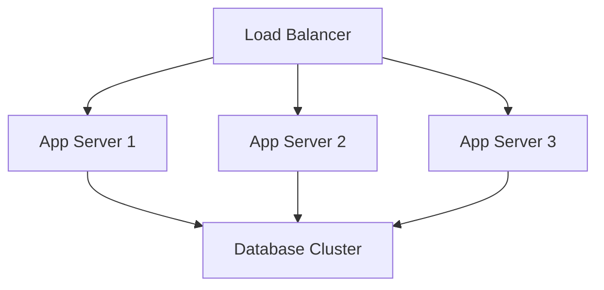
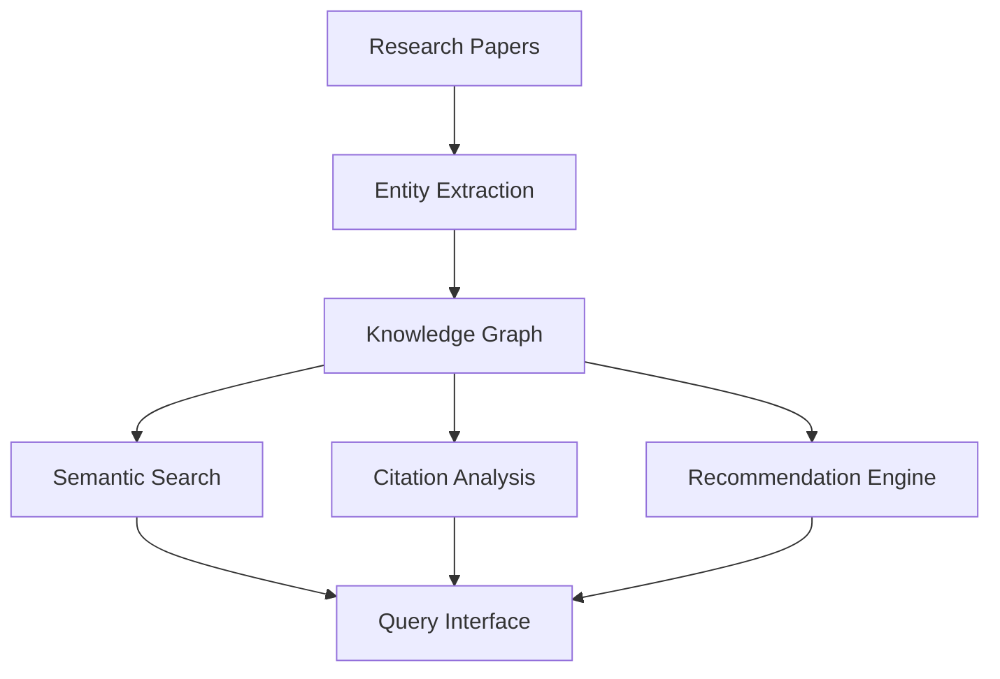

# System Design and Software Patterns Guide

## Executive Summary

This guide provides comprehensive coverage of system design principles, software architectural patterns, and implementation strategies tailored for academic research platforms and enterprise applications. Based on established design patterns, distributed systems principles, and modern software engineering practices.

## Table of Contents

1. [System Design Fundamentals](<#system-design-fundamentals>)
2. [Architectural Patterns](<#architectural-patterns>)
3. [Distributed Systems Design](<#distributed-systems-design>)
4. [Academic Research Platform Patterns](<#academic-research-platform-patterns>)
5. [Implementation Strategies](<#implementation-strategies>)
6. [Quality Assurance and Testing](<#quality-assurance-and-testing>)
7. [Performance and Scalability](<#performance-and-scalability>)
8. [Security and Compliance](<#security-and-compliance>)

## System Design Fundamentals

### Core Principles

```yaml
Design Principles:
- Separation of Concerns: Clear module boundaries
- Single Responsibility: Each component has one purpose
- Open/Closed Principle: Open for extension, closed for modification
- Dependency Inversion: Depend on abstractions, not concretions
- Composition over Inheritance: Favor object composition
```

### Scalability Patterns

#### Horizontal vs Vertical Scaling



#### Microservices Architecture

```yaml
Benefits:
- Independent deployment and scaling
- Technology diversity
- Fault isolation
- Team autonomy

Challenges:
- Network complexity
- Data consistency
- Service discovery
- Monitoring overhead
```

## Architectural Patterns

### Model-View-Controller (MVC)

```python
# Example: Academic paper management system
class PaperModel:
    def __init__(self, title, authors, abstract):
        self.title = title
        self.authors = authors
        self.abstract = abstract
    
    def save_to_database(self):
        # Data persistence logic
        pass

class PaperView:
    def render_paper_details(self, paper):
        # Presentation logic
        pass

class PaperController:
    def __init__(self, model, view):
        self.model = model
        self.view = view
    
    def handle_paper_submission(self, paper_data):
        paper = self.model(paper_data)
        paper.save_to_database()
        return self.view.render_confirmation()
```

### Repository Pattern

```python
from abc import ABC, abstractmethod

class PaperRepository(ABC):
    @abstractmethod
    def find_by_id(self, paper_id):
        pass
    
    @abstractmethod
    def find_by_author(self, author_name):
        pass
    
    @abstractmethod
    def save(self, paper):
        pass

class DatabasePaperRepository(PaperRepository):
    def __init__(self, db_connection):
        self.db = db_connection
    
    def find_by_id(self, paper_id):
        return self.db.query("SELECT * FROM papers WHERE id = ?", paper_id)
    
    def find_by_author(self, author_name):
        return self.db.query("SELECT * FROM papers WHERE author = ?", author_name)
    
    def save(self, paper):
        self.db.execute("INSERT INTO papers ...", paper.to_dict())
```

## Distributed Systems Design

### CAP Theorem and Consistency Models

```yaml
CAP Theorem:
- Consistency: All nodes see the same data simultaneously
- Availability: System remains operational
- Partition Tolerance: System continues despite network failures

Consistency Models:
- Strong Consistency: All reads receive most recent write
- Eventual Consistency: System will become consistent over time
- Weak Consistency: No guarantees about when consistency occurs
```

### Event-Driven Architecture

```python
class EventBus:
    def __init__(self):
        self.handlers = {}
    
    def subscribe(self, event_type, handler):
        if event_type not in self.handlers:
            self.handlers[event_type] = []
        self.handlers[event_type].append(handler)
    
    def publish(self, event):
        handlers = self.handlers.get(event.type, [])
        for handler in handlers:
            handler(event)

class PaperSubmittedEvent:
    def __init__(self, paper_id, author):
        self.type = "paper_submitted"
        self.paper_id = paper_id
        self.author = author

# Usage
event_bus = EventBus()
event_bus.subscribe("paper_submitted", email_notification_handler)
event_bus.subscribe("paper_submitted", indexing_handler)
event_bus.publish(PaperSubmittedEvent("123", "Dr. Smith"))
```

## Academic Research Platform Patterns

### Knowledge Graph Architecture



### Data Pipeline Design

```python
from abc import ABC, abstractmethod

class PipelineStage(ABC):
    @abstractmethod
    def process(self, data):
        pass

class PDFExtractionStage(PipelineStage):
    def process(self, pdf_path):
        # Extract text from PDF
        return extracted_text

class NERStage(PipelineStage):
    def process(self, text):
        # Named Entity Recognition
        return entities

class IndexingStage(PipelineStage):
    def process(self, entities):
        # Index in search engine
        return indexed_document

class ResearchPipeline:
    def __init__(self, stages):
        self.stages = stages
    
    def execute(self, input_data):
        result = input_data
        for stage in self.stages:
            result = stage.process(result)
        return result
```

## Implementation Strategies

### Domain-Driven Design (DDD)

```python
# Bounded Context: Academic Publishing
class Paper:
    def __init__(self, title, authors, content):
        self.title = title
        self.authors = authors
        self.content = content
        self.status = "draft"
    
    def submit_for_review(self):
        if self.status != "draft":
            raise ValueError("Can only submit draft papers")
        self.status = "under_review"
    
    def approve(self):
        if self.status != "under_review":
            raise ValueError("Can only approve papers under review")
        self.status = "published"

class Author:
    def __init__(self, name, affiliation, orcid):
        self.name = name
        self.affiliation = affiliation
        self.orcid = orcid
    
    def calculate_h_index(self):
        # Business logic for h-index calculation
        pass
```

### CQRS (Command Query Responsibility Segregation)

```python
# Command Side (Write)
class CreatePaperCommand:
    def __init__(self, title, authors, content):
        self.title = title
        self.authors = authors
        self.content = content

class PaperCommandHandler:
    def __init__(self, repository, event_bus):
        self.repository = repository
        self.event_bus = event_bus
    
    def handle_create_paper(self, command):
        paper = Paper(command.title, command.authors, command.content)
        self.repository.save(paper)
        self.event_bus.publish(PaperCreatedEvent(paper.id))

# Query Side (Read)
class PaperQueryService:
    def __init__(self, read_database):
        self.db = read_database
    
    def get_papers_by_author(self, author_name):
        return self.db.query_optimized_view("author_papers", author_name)
    
    def search_papers(self, query):
        return self.db.full_text_search("papers", query)
```

## Quality Assurance and Testing

### Testing Strategies for Distributed Systems

```python
# Integration Testing with Test Containers
import pytest
from testcontainers.postgres import PostgresContainer

@pytest.fixture(scope="session")
def postgres_container():
    with PostgresContainer("postgres:13") as postgres:
        yield postgres

@pytest.fixture
def paper_repository(postgres_container):
    db_url = postgres_container.get_connection_url()
    return DatabasePaperRepository(db_url)

def test_paper_creation_and_retrieval(paper_repository):
    # Test paper persistence and retrieval
    paper = Paper("Test Title", ["Author"], "Content")
    paper_repository.save(paper)
    
    retrieved = paper_repository.find_by_id(paper.id)
    assert retrieved.title == "Test Title"
```

### Chaos Engineering

```python
class ChaosMonkey:
    def __init__(self, services):
        self.services = services
    
    def random_service_failure(self):
        import random
        service = random.choice(self.services)
        service.simulate_failure()
    
    def network_partition(self, duration):
        # Simulate network partition between services
        pass
    
    def high_latency_injection(self, service, latency_ms):
        service.add_latency(latency_ms)
```

## Performance and Scalability

### Caching Strategies

```python
from functools import wraps
import redis

class CacheManager:
    def __init__(self, redis_client):
        self.redis = redis_client
    
    def cache_result(self, key, ttl=3600):
        def decorator(func):
            @wraps(func)
            def wrapper(*args, **kwargs):
                cached = self.redis.get(key)
                if cached:
                    return json.loads(cached)
                
                result = func(*args, **kwargs)
                self.redis.setex(key, ttl, json.dumps(result))
                return result
            return wrapper
        return decorator

# Usage
cache = CacheManager(redis.Redis())

@cache.cache_result("paper_recommendations", ttl=1800)
def get_paper_recommendations(user_id):
    # Expensive recommendation calculation
    return recommendations
```

### Database Optimization

```sql
-- Indexing strategies for academic database
CREATE INDEX idx_papers_author ON papers(author);
CREATE INDEX idx_papers_publication_date ON papers(publication_date);
CREATE INDEX idx_citations_source_target ON citations(source_paper_id, target_paper_id);

-- Full-text search optimization
CREATE INDEX idx_papers_content_fts ON papers USING gin(to_tsvector('english', content));

-- Materialized views for complex queries
CREATE MATERIALIZED VIEW author_metrics AS
SELECT 
    author_id,
    COUNT(*) as paper_count,
    AVG(citation_count) as avg_citations,
    calculate_h_index(author_id) as h_index
FROM papers p
JOIN authors a ON p.author_id = a.id
GROUP BY author_id;
```

## Security and Compliance

### Authentication and Authorization

```python
from jwt import encode, decode
from functools import wraps

class AuthManager:
    def __init__(self, secret_key):
        self.secret_key = secret_key
    
    def generate_token(self, user_id, permissions):
        payload = {
            'user_id': user_id,
            'permissions': permissions,
            'exp': datetime.utcnow() + timedelta(hours=24)
        }
        return encode(payload, self.secret_key, algorithm='HS256')
    
    def verify_token(self, token):
        try:
            return decode(token, self.secret_key, algorithms=['HS256'])
        except:
            return None

def requires_permission(permission):
    def decorator(func):
        @wraps(func)
        def wrapper(*args, **kwargs):
            token = get_token_from_request()
            payload = auth_manager.verify_token(token)
            
            if not payload or permission not in payload['permissions']:
                raise PermissionError("Insufficient permissions")
            
            return func(*args, **kwargs)
        return wrapper
    return decorator

@requires_permission('paper.create')
def create_paper(paper_data):
    # Only users with paper.create permission can access
    pass
```

### Data Privacy and GDPR Compliance

```python
class DataPrivacyManager:
    def __init__(self):
        self.anonymization_rules = {}
    
    def anonymize_author_data(self, author_data):
        """Anonymize personally identifiable information"""
        anonymized = author_data.copy()
        anonymized['email'] = self.hash_email(author_data['email'])
        anonymized['name'] = f"Author_{hash(author_data['id'])[:8]}"
        return anonymized
    
    def implement_right_to_erasure(self, user_id):
        """GDPR Article 17 - Right to erasure"""
        # Remove personal data while preserving research integrity
        pass
    
    def data_portability_export(self, user_id):
        """GDPR Article 20 - Right to data portability"""
        return {
            'papers': self.get_user_papers(user_id),
            'reviews': self.get_user_reviews(user_id),
            'profile': self.get_user_profile(user_id)
        }
```

## Implementation Roadmap

### Phase 1: Foundation (Weeks 1-4)

- Core domain models and repository patterns
- Basic CRUD operations with proper validation
- Authentication and authorization framework
- Database schema and initial migrations

### Phase 2: Core Features (Weeks 5-8)

- Paper submission and review workflow
- Search and discovery capabilities
- Citation graph construction
- Basic recommendation engine

### Phase 3: Advanced Features (Weeks 9-12)

- Real-time collaboration features
- Advanced analytics and metrics
- Integration with external academic databases
- Mobile API development

### Phase 4: Scale and Optimize (Weeks 13-16)

- Performance optimization and caching
- Monitoring and observability
- Automated testing and CI/CD
- Security audit and compliance verification

## Conclusion

This system design guide provides a comprehensive foundation for building scalable, maintainable academic research platforms. The patterns and practices outlined here emphasize separation of concerns, testability, and adaptability to changing requirements.

The key to successful system design is balancing complexity with functionality, ensuring that architectural decisions support both current needs and future growth while maintaining code quality and system reliability.

## References

- Martin Fowler. *Patterns of Enterprise Application Architecture*
- Eric Evans. *Domain-Driven Design*
- Sam Newman. *Building Microservices*
- Kleppmann, Martin. *Designing Data-Intensive Applications*
- Vernon, Vaughn. *Implementing Domain-Driven Design*
