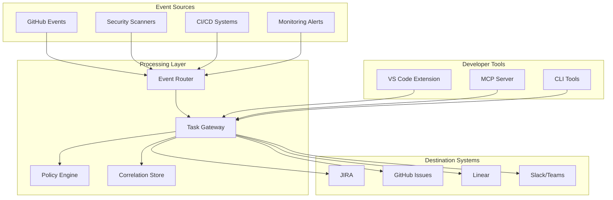

# Task Creation Automation - Comprehensive Integration Guide

## Executive Summary

This comprehensive guide provides technical implementation details for automating task creation across engineering workflows, covering JIRA integration patterns, GitHub Actions workflow automation, VS Code task automation, MCP server task management, and best practices for workflow automation systems.

**Key Recommendations:**

- Centralize task creation logic in a Task Gateway service with adapters for multiple systems
- Implement event-driven, idempotent automations with strict noise controls
- Use human-in-the-loop gates for high-risk or ambiguous actions
- Leverage MCP servers to expose controlled, auditable "task tools" to AI agents
- Implement comprehensive observability and SLO monitoring

**Target Audience:** Platform engineers, SREs, DevEx teams, and engineering leaders responsible for automation and developer productivity.

## Table of Contents

- [Task Creation Automation - Comprehensive Integration Guide](<#task-creation-automation---comprehensive-integration-guide>)
  - [Executive Summary](<#executive-summary>)
  - [Table of Contents](<#table-of-contents>)
  - [1. Landscape Overview](<#1-landscape-overview>)
    - [Categories of Task Automation and Creation](<#categories-of-task-automation-and-creation>)
  - [2. JIRA Integration Patterns](<#2-jira-integration-patterns>)
    - [2.1 Core Integration Mechanisms](<#21-core-integration-mechanisms>)
    - [2.2 Implementation Patterns](<#22-implementation-patterns>)
    - [2.3 Security and Best Practices](<#23-security-and-best-practices>)
  - [3. GitHub Actions Workflow Automation](<#3-github-actions-workflow-automation>)
    - [3.1 Core Concepts](<#31-core-concepts>)
    - [3.2 Task Creation Patterns](<#32-task-creation-patterns>)
    - [3.3 Best Practices and Pitfalls](<#33-best-practices-and-pitfalls>)
  - [4. VS Code Task Automation](<#4-vs-code-task-automation>)
    - [4.1 Core Mechanisms](<#41-core-mechanisms>)
    - [4.2 Implementation Patterns](<#42-implementation-patterns>)
    - [4.3 Integration with External Systems](<#43-integration-with-external-systems>)
  - [5. MCP Server Task Management](<#5-mcp-server-task-management>)
    - [5.1 Core Concepts](<#51-core-concepts>)
    - [5.2 Implementation Patterns](<#52-implementation-patterns>)
    - [5.3 Security and Governance](<#53-security-and-governance>)
  - [6. Automated Project Management Tools](<#6-automated-project-management-tools>)
    - [6.1 Major Systems Comparison](<#61-major-systems-comparison>)
    - [6.2 API Design Commonalities](<#62-api-design-commonalities>)
    - [6.3 Implementation Best Practices](<#63-implementation-best-practices>)
  - [7. Workflow Automation Best Practices](<#7-workflow-automation-best-practices>)
    - [7.1 Architectural Principles](<#71-architectural-principles>)
    - [7.2 Governance and Security](<#72-governance-and-security>)
    - [7.3 Noise Management](<#73-noise-management>)
    - [7.4 Observability and Metrics](<#74-observability-and-metrics>)
  - [8. Academic Research Insights](<#8-academic-research-insights>)
    - [8.1 Human Factors and Interruptions](<#81-human-factors-and-interruptions>)
    - [8.2 Coordination Theory](<#82-coordination-theory>)
    - [8.3 Trust and Automation Bias](<#83-trust-and-automation-bias>)
  - [9. Reference Integration Architecture](<#9-reference-integration-architecture>)
    - [9.1 High-Level System Design](<#91-high-level-system-design>)
    - [9.2 Task Gateway Service](<#92-task-gateway-service>)
    - [9.3 Developer Experience Integration](<#93-developer-experience-integration>)
  - [10. Implementation Examples](<#10-implementation-examples>)
    - [10.1 GitHub Actions: CI Failure Task Creation](<#101-github-actions-ci-failure-task-creation>)
    - [10.2 JIRA Issue Creation Script](<#102-jira-issue-creation-script>)
    - [10.3 MCP Server with Task Tools](<#103-mcp-server-with-task-tools>)
  - [11. Risk Management](<#11-risk-management>)
    - [11.1 Common Risks and Mitigations](<#111-common-risks-and-mitigations>)
    - [11.2 Monitoring and Alerting](<#112-monitoring-and-alerting>)
    - [11.3 Disaster Recovery](<#113-disaster-recovery>)
  - [12. Actionable Implementation Checklist](<#12-actionable-implementation-checklist>)
    - [Phase 1: Foundation (Weeks 1-2)](<#phase-1-foundation-weeks-1-2>)
    - [Phase 2: Automation Integration (Weeks 3-4)](<#phase-2-automation-integration-weeks-3-4>)
    - [Phase 3: Developer Experience (Weeks 5-6)](<#phase-3-developer-experience-weeks-5-6>)
    - [Phase 4: AI Integration (Weeks 7-8)](<#phase-4-ai-integration-weeks-7-8>)
    - [Phase 5: Scale and Optimize (Weeks 9-12)](<#phase-5-scale-and-optimize-weeks-9-12>)
    - [Ongoing Maintenance](<#ongoing-maintenance>)
  - [Conclusion](<#conclusion>)

## 1. Landscape Overview

### Categories of Task Automation and Creation

**Source Control and CI/CD:**

- GitHub Actions, GitLab CI, Azure Pipelines
- Task creation triggered by events: failed builds, security scans, policy violations
- Integration with issue tracking systems via webhooks and APIs

**Issue/PM Systems:**

- JIRA, GitHub Issues/Projects, Linear, Asana, Trello, Monday, ClickUp, Azure DevOps Boards
- Each provides APIs, webhooks, and native automation capabilities
- Cross-platform integration through standardized APIs

**IDE Automation:**

- VS Code tasks, problem matchers, and extensions
- Surface tasks close to developer context
- Integration with external project management systems

**Automation Platforms:**

- Temporal, Airflow, Dagster, Argo, Camunda for workflow orchestration
- n8n/Zapier/Make/Pipedream for rapid prototyping
- Complex workflows that may result in task creation

**AI Tooling and Orchestration:**

- MCP servers exposing controlled tools to assistants/agents
- Task creation, updates, and triage with guardrails and audits
- Human-in-the-loop approval workflows

## 2. JIRA Integration Patterns

### 2.1 Core Integration Mechanisms

**REST API:**

- **Cloud v3**: Modern API with comprehensive CRUD operations
- **Server/DC v2**: Legacy but still widely used
- **Operations**: Issues, transitions, comments, attachments, links, watchers, worklogs
- **Search**: JQL (JIRA Query Language) for complex queries and bulk operations

**Webhooks:**

- Issue created/updated/transitioned events
- Project-level events and custom field changes
- Drive event-driven automations with real-time updates

**JIRA Automation (Built-in):**

- No-code rules triggered by events, schedules, or incoming webhooks
- Actions: create/update issues, transition states, send notifications
- Integration with external systems via smart values and web requests

**Authentication Methods:**

- **OAuth 2.0 (3LO)**: Three-legged OAuth for user delegation
- **OAuth 2.0 (Client Credentials)**: For server-to-server integration
- **API Tokens**: Basic auth with email + token (Cloud)
- **Personal Access Tokens**: For Data Center/Server

### 2.2 Implementation Patterns

**Event-Driven Synchronization:**

```javascript
// Idempotent issue creation with correlation ID
async function upsertJiraIssue(correlationId, issueData) {
  // Search for existing issue by correlation ID
  const jql = `project = ${issueData.projectKey} AND cf[CorrelationId] ~ "${correlationId}"`;
  const searchResult = await jira.issueSearch.searchForIssuesUsingJql({
    jql,
    maxResults: 1
  });

  if (searchResult.issues.length > 0) {
    // Update existing issue
    const issueKey = searchResult.issues[0].key;
    await jira.issues.editIssue({
      issueIdOrKey: issueKey,
      fields: {
        summary: issueData.summary,
        description: issueData.description,
        priority: issueData.priority
      }
    });
    return { issueKey, action: 'updated' };
  } else {
    // Create new issue
    const newIssue = await jira.issues.createIssue({
      fields: {
        project: { key: issueData.projectKey },
        issuetype: { id: issueData.issueTypeId },
        summary: issueData.summary,
        description: issueData.description,
        priority: issueData.priority,
        [correlationFieldId]: correlationId,
        labels: issueData.labels
      }
    });
    return { issueKey: newIssue.key, action: 'created' };
  }
}
```

**Bulk Creation and Deduplication:**

- Batch multiple findings into single epic with subtasks
- Gate creation by severity thresholds (P1-P2 immediate, P3-P4 batched weekly)
- Use custom fields for correlation and deduplication

**Error Handling and Rate Limits:**

```javascript
async function resilientJiraCall(apiCall, retryCount = 3) {
  for (let attempt = 1; attempt <= retryCount; attempt++) {
    try {
      return await apiCall();
    } catch (error) {
      if (error.status === 429) {
        // Rate limited - exponential backoff
        const delay = Math.pow(2, attempt) * 1000;
        await new Promise(resolve => setTimeout(resolve, delay));
        continue;
      }
      if (error.status >= 500 && attempt < retryCount) {
        // Server error - retry
        continue;
      }
      throw error;
    }
  }
}
```

### 2.3 Security and Best Practices

**Service Account Management:**

- Create dedicated service accounts per integration
- Use minimal required permissions (scopes)
- Rotate credentials regularly
- Implement proper secret management

**Custom Fields and Schema:**

- Centralize field definitions and mapping logic
- Validate required fields per project/issue type
- Use typed enums for consistency
- Document correlation ID patterns

**Testing and Observability:**

- Integration tests against Atlassian sandbox
- Contract tests for field schemas
- Monitor: creation rate, deduplication effectiveness, triage time
- Alert on false-positive rate increases

## 3. GitHub Actions Workflow Automation

### 3.1 Core Concepts

**Triggers:**

- `push`, `pull_request`, `schedule`, `workflow_dispatch`
- `repository_dispatch`, `check_run`, `issue` events
- Webhook-driven external triggers

**Security Model:**

- `GITHUB_TOKEN` with scoped permissions per workflow/job
- OIDC integration for cloud provider authentication
- Prefer `permissions:` blocks with minimal required access

**Workflow Organization:**

- Reusable workflows for common patterns
- Composite actions for modular functionality
- Concurrency groups to prevent duplicate execution

### 3.2 Task Creation Patterns

**CI Failure Task Creation:**

```yaml
name: CI with Task Creation
on: [push, pull_request]

jobs:
  test:
    runs-on: ubuntu-latest
    outputs:
      test-result: ${{ steps.test.outcome }}
    steps:
      - uses: actions/checkout@v4
      - name: Run tests
        id: test
        run: npm ci && npm test

  create-task-on-failure:
    needs: test
    if: ${{ needs.test.outputs.test-result == 'failure' }}
    runs-on: ubuntu-latest
    permissions:
      contents: read
      issues: write
    steps:
      - uses: actions/checkout@v4
      - name: Generate correlation ID
        id: correlation
        run: |
          echo "id=${{ github.repository }}@${{ github.sha }}@${{ github.workflow }}" >> $GITHUB_OUTPUT

      - name: Upsert tracking issue
        env:
          GITHUB_TOKEN: ${{ secrets.GITHUB_TOKEN }}
          CORRELATION_ID: ${{ steps.correlation.outputs.id }}
        run: |
          # Check for existing issue
          existing=$(gh issue list --label "ci-failure" --search "$CORRELATION_ID" --json number --jq '.[0].number // empty')

          if [ -n "$existing" ]; then
            # Update existing issue
            gh issue edit $existing --body "Updated: $(date)\nCommit: ${{ github.sha }}\nWorkflow: ${{ github.workflow }}"
          else
            # Create new issue
            gh issue create \
              --title "CI Failure: ${{ github.workflow }}" \
              --body "Correlation ID: $CORRELATION_ID\nCommit: ${{ github.sha }}\nWorkflow Run: ${{ github.server_url }}/${{ github.repository }}/actions/runs/${{ github.run_id }}" \
              --label "ci-failure,automated" \
              --assignee "${{ github.actor }}"
          fi
```

**Security Vulnerability Task Creation:**

```yaml
name: Security Scan
on:
  schedule:
    - cron: '0 2 * * *'  # Daily at 2 AM
  push:
    branches: [main]

jobs:
  security-scan:
    runs-on: ubuntu-latest
    permissions:
      contents: read
      security-events: write
      issues: write
    steps:
      - uses: actions/checkout@v4

      - name: Run security scan
        uses: github/codeql-action/analyze@v2

      - name: Process security findings
        if: always()
        run: |
          # Process SARIF results and create issues for high-severity findings
          # Batch low-severity findings into weekly digest
          node scripts/process-security-findings.js
```

### 3.3 Best Practices and Pitfalls

**Avoid Infinite Loops:**

- Never create workflows that trigger on issues and also create issues
- Use guard conditions and proper event filtering
- Implement circuit breakers for high-frequency events

**Permissions Management:**

- Set `permissions:` to `none` by default
- Enable minimal required permissions per job
- Use OIDC for cloud provider authentication

**Rate Limiting and Resilience:**

- Implement exponential backoff for API calls
- Cache authentication tokens appropriately
- Use GraphQL for more efficient API usage where possible

## 4. VS Code Task Automation

### 4.1 Core Mechanisms

**tasks.json Configuration:**

- Define shell/process tasks with problem matchers
- Pre-launch tasks for debug configurations
- Cross-platform command definitions

**Task Providers via Extensions:**

- Programmatic task discovery and execution
- Integration with external services
- Dynamic task generation based on context

**Problem Matchers:**

- Parse command output into VS Code diagnostics
- Trigger code actions and quick fixes
- Link errors to specific files and line numbers

### 4.2 Implementation Patterns

**Comprehensive tasks.json Example:**

```json
{
  "version": "2.0.0",
  "tasks": [
    {
      "label": "verify-ci-local",
      "type": "shell",
      "command": "npm",
      "args": ["run", "ci:local"],
      "group": "test",
      "presentation": {
        "echo": true,
        "reveal": "always",
        "focus": false,
        "panel": "shared"
      },
      "problemMatcher": [
        "$eslint-stylish",
        "$tsc",
        {
          "owner": "jest",
          "fileLocation": "relative",
          "pattern": {
            "regexp": "^\\s*(.*?):(\\d+):(\\d+):\\s+(error|warning|info):\\s+(.*)$",
            "file": 1,
            "line": 2,
            "column": 3,
            "severity": 4,
            "message": 5
          }
        }
      ]
    },
    {
      "label": "create-tracking-issue",
      "type": "shell",
      "command": "node",
      "args": ["scripts/create-tracking-issue.js", "${file}", "${lineNumber}"],
      "group": "build",
      "presentation": {
        "echo": true,
        "reveal": "silent",
        "focus": false,
        "panel": "shared"
      },
      "problemMatcher": []
    },
    {
      "label": "sync-project-tasks",
      "type": "shell",
      "command": "curl",
      "args": [
        "-X", "POST",
        "-H", "Content-Type: application/json",
        "-d", "@.vscode/task-sync-payload.json",
        "${config:taskGateway.endpoint}/sync"
      ],
      "group": "build"
    }
  ]
}
```

**Task Provider Extension Example:**

```typescript
// VS Code extension that provides dynamic tasks
import * as vscode from 'vscode';

export class TaskCreationProvider implements vscode.TaskProvider {
  provideTasks(): vscode.Task[] {
    const tasks: vscode.Task[] = [];

    // Create task from current diagnostic
    if (vscode.window.activeTextEditor) {
      const diagnostics = vscode.languages.getDiagnostics(
        vscode.window.activeTextEditor.document.uri
      );

      if (diagnostics.length > 0) {
        const task = new vscode.Task(
          { type: 'tracking-issue', diagnostic: 'current' },
          vscode.TaskScope.Workspace,
          'Create Issue from Diagnostic',
          'task-automation',
          new vscode.ShellExecution('node', [
            'scripts/create-issue-from-diagnostic.js',
            vscode.window.activeTextEditor.document.fileName,
            diagnostics[0].range.start.line.toString()
          ])
        );
        tasks.push(task);
      }
    }

    return tasks;
  }

  resolveTask(task: vscode.Task): vscode.Task | undefined {
    // Resolve task with current context
    return task;
  }
}
```

### 4.3 Integration with External Systems

**Local Task Gateway CLI:**

```bash
#!/bin/bash
# scripts/task-gateway-cli.sh

CORRELATION_ID="$1"
TITLE="$2"
DESCRIPTION="$3"
SEVERITY="${4:-P3}"

# Call local task gateway service
curl -X POST "http://localhost:3000/api/tasks" \
  -H "Content-Type: application/json" \
  -H "Authorization: Bearer ${TASK_GATEWAY_TOKEN}" \
  -d "{
    \"correlationId\": \"${CORRELATION_ID}\",
    \"title\": \"${TITLE}\",
    \"description\": \"${DESCRIPTION}\",
    \"severity\": \"${SEVERITY}\",
    \"source\": \"vscode\",
    \"metadata\": {
      \"workspace\": \"$(pwd)\",
      \"branch\": \"$(git branch --show-current)\",
      \"commit\": \"$(git rev-parse HEAD)\"
    }
  }"
```

## 5. MCP Server Task Management

### 5.1 Core Concepts

**Model Context Protocol (MCP):**

- Standardizes communication between LLM clients and external tools
- Enables controlled, auditable tool access for AI assistants
- Supports tools (functions), resources (documents), and prompts

**Task Management via MCP:**

- Expose `create_task`, `update_task`, `link_entities` tools
- Implement rigorous validation, RBAC, and audit logging
- Human-in-the-loop approval for high-impact operations

### 5.2 Implementation Patterns

**MCP Server Task Tools:**

```typescript
// MCP server with task management tools
import { Server } from '@modelcontextprotocol/sdk/server/index.js';
import { z } from 'zod';

const server = new Server({
  name: 'task-management-server',
  version: '1.0.0'
});

// Tool schemas with validation
const createTaskSchema = z.object({
  title: z.string().min(5).max(200),
  description: z.string().max(5000),
  priority: z.enum(['P0', 'P1', 'P2', 'P3']),
  correlation_id: z.string().min(1),
  destination: z.enum(['jira', 'github', 'linear']),
  labels: z.array(z.string()).optional(),
  assignee: z.string().optional(),
  external_refs: z.object({
    repo: z.string().optional(),
    sha: z.string().optional(),
    workflow: z.string().optional()
  }).optional()
});

server.addTool({
  name: 'create_task',
  description: 'Create or update a task via Task Gateway with idempotency',
  inputSchema: createTaskSchema,
  handler: async (args) => {
    const validated = createTaskSchema.parse(args);

    // Log the request for audit
    console.log(`Task creation request: ${JSON.stringify(validated)}`);

    // Check for existing task by correlation ID
    const existing = await checkExistingTask(validated.correlation_id);

    if (existing) {
      // Update existing task
      const updated = await updateTask(existing.id, validated);
      return {
        action: 'updated',
        task_id: existing.id,
        url: updated.url,
        correlation_id: validated.correlation_id
      };
    } else {
      // Create new task
      const created = await createNewTask(validated);
      return {
        action: 'created',
        task_id: created.id,
        url: created.url,
        correlation_id: validated.correlation_id
      };
    }
  }
});

server.addTool({
  name: 'link_pr_to_task',
  description: 'Link a pull request to an existing task',
  inputSchema: z.object({
    task_id: z.string(),
    pr_url: z.string().url(),
    relationship: z.enum(['fixes', 'relates-to', 'implements'])
  }),
  handler: async (args) => {
    // Implementation for linking PR to task
    return await linkPullRequestToTask(args);
  }
});
```

**Policy Engine Integration:**

```typescript
// Policy-aware tool execution
async function executeTool(toolName: string, args: any, context: any) {
  // Check policy before execution
  const policy = await evaluatePolicy(toolName, args, context);

  if (!policy.allowed) {
    throw new Error(`Action not allowed: ${policy.reason}`);
  }

  if (policy.requiresApproval) {
    // Store pending request and return approval link
    const approvalId = await storePendingRequest(toolName, args, context);
    return {
      status: 'pending_approval',
      approval_url: `${config.approvalBaseUrl}/approve/${approvalId}`,
      message: 'This action requires human approval'
    };
  }

  // Execute the tool
  return await actualToolExecution(toolName, args);
}
```

### 5.3 Security and Governance

**RBAC and Audit Logging:**

- Every tool call logged with actor, timestamp, inputs, outputs
- Role-based access control for different tool capabilities
- Correlation IDs for tracing request flows

**Rate Limiting and Circuit Breakers:**

- Per-user and per-tool rate limiting
- Circuit breakers for downstream service protection
- Queue management with backpressure handling

## 6. Automated Project Management Tools

### 6.1 Major Systems Comparison

| System | Strengths | API | Authentication | Best For |
|--------|-----------|-----|----------------|----------|
| JIRA | Rich workflows, enterprise features | REST v3, v2 | OAuth 2.0, API tokens | Complex delivery workflows |
| GitHub Issues | Native git integration, developer-friendly | REST, GraphQL | GitHub App, PAT | Code-centric tasks |
| Linear | Fast, opinionated, modern UX | GraphQL | API keys, OAuth | Product development |
| Asana | Project management focus | REST | OAuth 2.0, PAT | Cross-functional projects |
| Azure DevOps | Full ALM integration | REST | PAT, OAuth | Microsoft ecosystem |

### 6.2 API Design Commonalities

**Standard Task Creation Fields:**

- **Core**: title/summary, description, project/board, type, priority
- **Assignment**: assignee, watchers, teams
- **Organization**: labels/tags, epic/parent, sprint/milestone
- **Metadata**: custom fields, external references, attachments

**Authentication Patterns:**

- OAuth 2.0 for user delegation and multi-tenant apps
- API tokens/PAT for service-to-service integration
- Webhook signature verification for security

**Error Handling Standards:**

- 429 for rate limiting with Retry-After headers
- 400 for validation errors with detailed field messages
- 500 for server errors with request IDs for support

### 6.3 Implementation Best Practices

**Universal Task Schema:**

```typescript
interface UniversalTask {
  correlationId: string;
  title: string;
  description: string;
  priority: 'P0' | 'P1' | 'P2' | 'P3';
  type: string;
  labels: string[];
  assignee?: string;
  project: string;
  externalRefs: {
    repo?: string;
    sha?: string;
    pr?: string;
    workflow?: string;
  };
  customFields: Record<string, any>;
}
```

**Provider Adapter Pattern:**

```typescript
abstract class TaskProvider {
  abstract async createTask(task: UniversalTask): Promise<TaskResult>;
  abstract async updateTask(id: string, task: Partial<UniversalTask>): Promise<TaskResult>;
  abstract async findByCorrelationId(correlationId: string): Promise<TaskResult | null>;
  abstract async linkExternalRef(taskId: string, ref: ExternalRef): Promise<void>;
}

class JiraProvider extends TaskProvider {
  async createTask(task: UniversalTask): Promise<TaskResult> {
    const jiraIssue = this.mapToJiraFields(task);
    const response = await this.jiraClient.issues.createIssue({
      fields: jiraIssue
    });
    return this.mapFromJiraResponse(response);
  }

  private mapToJiraFields(task: UniversalTask) {
    return {
      project: { key: task.project },
      issuetype: { name: task.type },
      summary: task.title,
      description: task.description,
      priority: { name: this.mapPriority(task.priority) },
      labels: task.labels,
      [this.correlationFieldId]: task.correlationId
    };
  }
}
```

## 7. Workflow Automation Best Practices

### 7.1 Architectural Principles

**Event-Driven Design:**

- Use event sourcing for audit trails and replay capability
- Implement idempotent operations with correlation keys
- Design for eventual consistency across systems

**Composable Workflows:**

- Small, single-purpose services with clear interfaces
- DAG-based orchestration for complex multi-step flows
- Configuration-as-code with version control

**Human-in-the-Loop:**

- Approval workflows for high-impact or ambiguous actions
- Escalation paths and SLA enforcement
- Override capabilities with proper authorization

### 7.2 Governance and Security

**Security Model:**

```yaml
# Example security configuration
security:
  authentication:
    method: "oidc"
    provider: "github"
    scopes: ["repo:read", "issues:write"]

  authorization:
    rbac:
      roles:
        - name: "automation-service"
          permissions: ["task:create", "task:update"]
          resources: ["project:critical/*"]
        - name: "developer"
          permissions: ["task:create"]
          resources: ["project:*/issues"]

  secrets:
    vault: "hashicorp-vault"
    rotation: "30d"
    encryption: "envelope"
```

**Compliance and Audit:**

- Comprehensive logging with correlation IDs
- Data retention policies per regulatory requirements
- Regular access reviews and permission audits

### 7.3 Noise Management

**Precision-First Automation:**

- High-quality, fewer tasks > many low-signal tasks
- Implement confidence thresholds and validation rules
- Batch similar issues to reduce noise

**WIP Limits and Auto-Archival:**

```typescript
// Auto-archival policy implementation
interface ArchivalPolicy {
  maxAge: number; // days
  conditions: {
    noActivity: boolean;
    noAssignee: boolean;
    lowPriority: boolean;
  };
}

async function enforceArchivalPolicy(policy: ArchivalPolicy) {
  const candidates = await findTasksMatchingCriteria({
    createdBefore: new Date(Date.now() - policy.maxAge * 24 * 60 * 60 * 1000),
    status: 'open',
    priority: ['P3', 'P4']
  });

  for (const task of candidates) {
    if (shouldArchive(task, policy)) {
      await archiveTask(task.id, 'Auto-archived due to inactivity');
    }
  }
}
```

### 7.4 Observability and Metrics

**Key Performance Indicators:**

```typescript
interface AutomationMetrics {
  // Flow metrics
  leadTime: number; // median time from creation to close
  cycleTime: number; // median time from start to finish
  throughput: number; // tasks completed per period
  wipCount: number; // work in progress

  // Quality metrics
  automationPrecision: number; // % of auto-created tasks accepted
  duplicateRate: number; // % of tasks identified as duplicates
  falsePositiveRate: number; // % of auto-created tasks closed as invalid

  // Performance metrics
  creationLatency: number; // median time from trigger to task creation
  apiSuccessRate: number; // % of successful API calls
  errorRate: number; // % of failed operations
}
```

**Dashboard and Alerting:**

```yaml
# Example Grafana dashboard configuration
dashboard:
  metrics:
    - name: "task_creation_rate"
      query: "rate(tasks_created_total[5m])"
      alert:
        threshold: 10
        duration: "5m"
        message: "High task creation rate detected"

    - name: "automation_precision"
      query: "tasks_accepted_total / tasks_created_total"
      alert:
        threshold: 0.8
        direction: "below"
        message: "Automation precision dropped below 80%"
```

## 8. Academic Research Insights

### 8.1 Human Factors and Interruptions

**Research Findings:**

- Frequent context switching degrades performance by 25-40% (Mark et al.)
- Recovery time from interruption averages 23 minutes
- Batch notifications and provide "focus mode" options

**Design Implications:**

- Defer non-critical notifications during focus periods
- Provide snooze/defer mechanisms for task triage
- Batch similar tasks into single notifications

### 8.2 Coordination Theory

**Malone & Crowston Framework:**

- Task dependencies must be explicitly modeled
- Coordination mechanisms should surface blocking relationships
- Effective automation aligns task assignments with capabilities

**Implementation:**

- Model task dependencies in workflow definitions
- Surface blocking tasks prominently in dashboards
- Auto-assign based on expertise mapping and availability

### 8.3 Trust and Automation Bias

**Research Insights:**

- Users over-rely on automation without proper validation
- Transparency and explainability increase trust and adoption
- Provide graceful degradation and override capabilities

**Mitigation Strategies:**

- Include confidence scores with automated decisions
- Provide clear rationale for task creation
- Enable easy override and feedback mechanisms

## 9. Reference Integration Architecture

### 9.1 High-Level System Design



### 9.2 Task Gateway Service

**Core Service Implementation:**

```typescript
class TaskGateway {
  private providers: Map<string, TaskProvider>;
  private correlationStore: CorrelationStore;
  private policyEngine: PolicyEngine;
  private eventBus: EventBus;

  async createTask(request: TaskCreationRequest): Promise<TaskCreationResult> {
    // Validate request
    const validation = await this.validateRequest(request);
    if (!validation.valid) {
      throw new ValidationError(validation.errors);
    }

    // Check policy
    const policyResult = await this.policyEngine.evaluate(request);
    if (!policyResult.allowed) {
      throw new PolicyError(policyResult.reason);
    }

    // Check for existing task
    const existing = await this.correlationStore.findByCorrelationId(
      request.correlationId
    );

    if (existing) {
      return await this.updateExistingTask(existing, request);
    }

    // Create new task
    const provider = this.providers.get(request.destination);
    const result = await provider.createTask(request);

    // Store correlation
    await this.correlationStore.store(request.correlationId, result);

    // Emit event
    await this.eventBus.emit('task.created', {
      correlationId: request.correlationId,
      taskId: result.id,
      destination: request.destination
    });

    return result;
  }
}
```

### 9.3 Developer Experience Integration

**VS Code Extension Integration:**

```typescript
// VS Code extension for task creation
export async function createTaskFromDiagnostic(
  diagnostic: vscode.Diagnostic,
  document: vscode.TextDocument
) {
  const correlationId = generateCorrelationId(document, diagnostic);

  const taskRequest = {
    correlationId,
    title: `${diagnostic.severity}: ${diagnostic.message}`,
    description: generateDescription(diagnostic, document),
    priority: mapSeverityToPriority(diagnostic.severity),
    destination: getDestinationForFile(document.fileName),
    externalRefs: {
      repo: getRepoName(),
      sha: getCommitSha(),
      file: document.fileName,
      line: diagnostic.range.start.line
    }
  };

  const result = await taskGatewayClient.createTask(taskRequest);

  // Show result to user
  vscode.window.showInformationMessage(
    `Task ${result.action}: ${result.url}`,
    'Open Task'
  ).then(selection => {
    if (selection === 'Open Task') {
      vscode.env.openExternal(vscode.Uri.parse(result.url));
    }
  });
}
```

## 10. Implementation Examples

### 10.1 GitHub Actions: CI Failure Task Creation

```yaml
name: CI with Intelligent Task Creation

on:
  push:
    branches: [main, develop]
  pull_request:
    branches: [main]

concurrency:
  group: ci-${{ github.ref }}
  cancel-in-progress: true

jobs:
  test:
    runs-on: ubuntu-latest
    outputs:
      test-result: ${{ steps.test.outcome }}
      coverage: ${{ steps.coverage.outputs.percentage }}
    steps:
      - uses: actions/checkout@v4

      - name: Setup Node.js
        uses: actions/setup-node@v4
        with:
          node-version: '18'
          cache: 'npm'

      - name: Install dependencies
        run: npm ci

      - name: Run tests
        id: test
        run: npm test

      - name: Generate coverage
        id: coverage
        if: always()
        run: |
          npm run coverage
          COVERAGE=$(cat coverage/coverage-summary.json | jq '.total.lines.pct')
          echo "percentage=$COVERAGE" >> $GITHUB_OUTPUT

  create-failure-task:
    needs: test
    if: failure() && needs.test.outputs.test-result == 'failure'
    runs-on: ubuntu-latest
    permissions:
      contents: read
      issues: write
    steps:
      - uses: actions/checkout@v4

      - name: Generate correlation ID
        id: correlation
        run: |
          CORRELATION="${{ github.repository }}@${{ github.sha }}@test-failure"
          echo "id=$CORRELATION" >> $GITHUB_OUTPUT

      - name: Create or update failure task
        env:
          GITHUB_TOKEN: ${{ secrets.GITHUB_TOKEN }}
          TASK_GATEWAY_URL: ${{ secrets.TASK_GATEWAY_URL }}
          TASK_GATEWAY_TOKEN: ${{ secrets.TASK_GATEWAY_TOKEN }}
        run: |
          # Call Task Gateway service
          curl -X POST "$TASK_GATEWAY_URL/api/tasks" \
            -H "Content-Type: application/json" \
            -H "Authorization: Bearer $TASK_GATEWAY_TOKEN" \
            -d '{
              "correlationId": "${{ steps.correlation.outputs.id }}",
              "title": "Test Failure: ${{ github.workflow }}",
              "description": "Automated task created for test failure\\n\\n**Workflow:** ${{ github.workflow }}\\n**Branch:** ${{ github.ref_name }}\\n**Commit:** ${{ github.sha }}\\n**Run:** ${{ github.server_url }}/${{ github.repository }}/actions/runs/${{ github.run_id }}",
              "priority": "P2",
              "destination": "github",
              "project": "${{ github.repository }}",
              "labels": ["ci-failure", "automated"],
              "assignee": "${{ github.actor }}",
              "externalRefs": {
                "repo": "${{ github.repository }}",
                "sha": "${{ github.sha }}",
                "workflow": "${{ github.workflow }}",
                "runId": "${{ github.run_id }}"
              }
            }'
```

### 10.2 JIRA Issue Creation Script

```javascript
// scripts/upsert-jira-issue.js
const { JiraApi } = require('jira-client');

class JiraTaskManager {
  constructor(config) {
    this.jira = new JiraApi({
      protocol: 'https',
      host: config.host,
      username: config.email,
      password: config.token,
      apiVersion: '3',
      strictSSL: true
    });
    this.correlationFieldId = config.correlationFieldId;
  }

  async upsertIssue(correlationId, issueData) {
    try {
      // Search for existing issue
      const jql = `project = "${issueData.projectKey}" AND cf[${this.correlationFieldId}] ~ "${correlationId}"`;
      const searchResult = await this.jira.searchJira(jql, {
        maxResults: 1,
        fields: ['key', 'summary', 'status']
      });

      if (searchResult.issues.length > 0) {
        return await this.updateExistingIssue(searchResult.issues[0], issueData);
      } else {
        return await this.createNewIssue(correlationId, issueData);
      }
    } catch (error) {
      console.error('Error upserting JIRA issue:', error);
      throw error;
    }
  }

  async createNewIssue(correlationId, issueData) {
    const issue = {
      fields: {
        project: { key: issueData.projectKey },
        issuetype: { id: issueData.issueTypeId },
        summary: issueData.summary,
        description: this.formatDescription(issueData),
        priority: { name: issueData.priority },
        labels: issueData.labels || [],
        [this.correlationFieldId]: correlationId
      }
    };

    if (issueData.assignee) {
      issue.fields.assignee = { name: issueData.assignee };
    }

    const result = await this.jira.addNewIssue(issue);

    console.log(`Created JIRA issue: ${result.key}`);
    return {
      action: 'created',
      issueKey: result.key,
      url: `${this.jira.protocol}://${this.jira.host}/browse/${result.key}`
    };
  }

  async updateExistingIssue(existingIssue, issueData) {
    const updateData = {
      fields: {
        summary: issueData.summary,
        description: this.formatDescription(issueData),
        priority: { name: issueData.priority }
      }
    };

    await this.jira.updateIssue(existingIssue.key, updateData);

    console.log(`Updated JIRA issue: ${existingIssue.key}`);
    return {
      action: 'updated',
      issueKey: existingIssue.key,
      url: `${this.jira.protocol}://${this.jira.host}/browse/${existingIssue.key}`
    };
  }

  formatDescription(issueData) {
    let description = issueData.description;

    if (issueData.externalRefs) {
      description += '\n\n*External References:*\n';
      if (issueData.externalRefs.repo) {
        description += `• Repository: ${issueData.externalRefs.repo}\n`;
      }
      if (issueData.externalRefs.sha) {
        description += `• Commit: ${issueData.externalRefs.sha}\n`;
      }
      if (issueData.externalRefs.workflow) {
        description += `• Workflow: ${issueData.externalRefs.workflow}\n`;
      }
    }

    description += `\n\n*Last Updated:* ${new Date().toISOString()}`;
    return description;
  }
}

// CLI usage
if (require.main === module) {
  const correlationId = process.argv[2];
  const config = {
    host: process.env.JIRA_HOST,
    email: process.env.JIRA_EMAIL,
    token: process.env.JIRA_TOKEN,
    correlationFieldId: 'customfield_10001'
  };

  const manager = new JiraTaskManager(config);

  const issueData = {
    projectKey: 'DEV',
    issueTypeId: '10001',
    summary: 'Automated CI Failure',
    description: 'This issue was automatically created due to a CI failure.',
    priority: 'Medium',
    labels: ['automated', 'ci-failure'],
    externalRefs: {
      repo: process.env.GITHUB_REPOSITORY,
      sha: process.env.GITHUB_SHA,
      workflow: process.env.GITHUB_WORKFLOW
    }
  };

  manager.upsertIssue(correlationId, issueData)
    .then(result => {
      console.log('Result:', JSON.stringify(result, null, 2));
      process.exit(0);
    })
    .catch(error => {
      console.error('Error:', error);
      process.exit(1);
    });
}

module.exports = { JiraTaskManager };
```

### 10.3 MCP Server with Task Tools

```typescript
// mcp-task-server.ts
import { Server } from '@modelcontextprotocol/sdk/server/index.js';
import { z } from 'zod';
import { TaskGateway } from './task-gateway.js';

const server = new Server({
  name: 'task-automation-server',
  version: '1.0.0'
});

const taskGateway = new TaskGateway({
  providers: {
    jira: new JiraProvider(config.jira),
    github: new GitHubProvider(config.github),
    linear: new LinearProvider(config.linear)
  }
});

// Schema definitions
const CreateTaskSchema = z.object({
  title: z.string().min(5).max(200),
  description: z.string().max(5000),
  priority: z.enum(['P0', 'P1', 'P2', 'P3']),
  correlation_id: z.string().min(1),
  destination: z.enum(['jira', 'github', 'linear']),
  labels: z.array(z.string()).default([]),
  assignee: z.string().optional(),
  project: z.string(),
  external_refs: z.object({
    repo: z.string().optional(),
    sha: z.string().optional(),
    pr_url: z.string().optional(),
    workflow: z.string().optional()
  }).optional()
});

const UpdateTaskSchema = z.object({
  task_id: z.string(),
  title: z.string().optional(),
  description: z.string().optional(),
  priority: z.enum(['P0', 'P1', 'P2', 'P3']).optional(),
  status: z.string().optional(),
  assignee: z.string().optional()
});

// Tool implementations
server.addTool({
  name: 'create_task',
  description: 'Create a new task or update existing one by correlation ID',
  inputSchema: CreateTaskSchema,
  handler: async (args) => {
    const request = CreateTaskSchema.parse(args);

    try {
      const result = await taskGateway.createTask({
        correlationId: request.correlation_id,
        title: request.title,
        description: request.description,
        priority: request.priority,
        destination: request.destination,
        project: request.project,
        labels: request.labels,
        assignee: request.assignee,
        externalRefs: request.external_refs
      });

      return {
        success: true,
        action: result.action,
        task_id: result.id,
        url: result.url,
        correlation_id: request.correlation_id
      };
    } catch (error) {
      return {
        success: false,
        error: error.message,
        correlation_id: request.correlation_id
      };
    }
  }
});

server.addTool({
  name: 'update_task_status',
  description: 'Update the status of an existing task',
  inputSchema: UpdateTaskSchema,
  handler: async (args) => {
    const request = UpdateTaskSchema.parse(args);

    try {
      const result = await taskGateway.updateTask(request.task_id, {
        title: request.title,
        description: request.description,
        priority: request.priority,
        status: request.status,
        assignee: request.assignee
      });

      return {
        success: true,
        task_id: request.task_id,
        url: result.url
      };
    } catch (error) {
      return {
        success: false,
        error: error.message,
        task_id: request.task_id
      };
    }
  }
});

server.addTool({
  name: 'search_tasks',
  description: 'Search for tasks by correlation ID or other criteria',
  inputSchema: z.object({
    correlation_id: z.string().optional(),
    project: z.string().optional(),
    assignee: z.string().optional(),
    status: z.string().optional(),
    limit: z.number().default(10)
  }),
  handler: async (args) => {
    try {
      const results = await taskGateway.searchTasks(args);
      return {
        success: true,
        tasks: results.map(task => ({
          id: task.id,
          title: task.title,
          status: task.status,
          url: task.url,
          correlation_id: task.correlationId
        }))
      };
    } catch (error) {
      return {
        success: false,
        error: error.message
      };
    }
  }
});

// Start the server
if (require.main === module) {
  server.connect({
    command: process.argv[0],
    args: process.argv.slice(1)
  }).catch(console.error);
}

export { server };
```

## 11. Risk Management

### 11.1 Common Risks and Mitigations

**Duplicate Task Creation:**

- **Risk**: Storm of duplicate tasks from rapid events
- **Mitigation**: Implement concurrency groups, idempotency keys, and rate limiting
- **Detection**: Monitor creation rate spikes and correlation ID collision rates

**Vendor Lock-in:**

- **Risk**: Deep integration with single provider
- **Mitigation**: Abstract via Task Gateway with swappable adapters
- **Strategy**: Maintain canonical task schema and export capabilities

**Security Incidents:**

- **Risk**: Unauthorized task creation or data exposure
- **Mitigation**: Implement least privilege, audit trails, and anomaly detection
- **Response**: Circuit breakers and automatic credential rotation

**Organizational Overload:**

- **Risk**: Automation creates more noise than value
- **Mitigation**: WIP limits, auto-archival, and regular hygiene reviews
- **Metrics**: Track false-positive rates and user satisfaction

### 11.2 Monitoring and Alerting

**Critical Alerts:**

```yaml
alerts:
  - name: "high_task_creation_rate"
    condition: "rate(tasks_created_total[5m]) > 50"
    severity: "warning"
    description: "Unusually high task creation rate detected"

  - name: "low_automation_precision"
    condition: "tasks_accepted_total / tasks_created_total < 0.7"
    severity: "critical"
    description: "Automation precision below acceptable threshold"

  - name: "api_error_rate_high"
    condition: "rate(api_errors_total[5m]) > 5"
    severity: "critical"
    description: "High API error rate to downstream services"

  - name: "correlation_collision"
    condition: "rate(correlation_collisions_total[1h]) > 1"
    severity: "warning"
    description: "Correlation ID collisions detected"
```

**Dashboard Metrics:**

```typescript
interface DashboardMetrics {
  // Volume metrics
  tasksCreatedPerDay: number;
  tasksUpdatedPerDay: number;
  tasksClosedPerDay: number;

  // Quality metrics
  duplicateRate: number;
  falsePositiveRate: number;
  userAcceptanceRate: number;

  // Performance metrics
  averageCreationLatency: number;
  apiSuccessRate: number;
  correlationHitRate: number;

  // Operational metrics
  wipCount: number;
  averageTtriage: number;
  slaBreachRate: number;
}
```

### 11.3 Disaster Recovery

**Data Recovery:**

- Maintain event sourcing for replay capability
- Regular backups of correlation store and configuration
- Cross-region replication for critical components

**Service Recovery:**

- Blue-green deployment for zero-downtime updates
- Circuit breakers with graceful degradation
- Manual override capabilities for emergency situations

## 12. Actionable Implementation Checklist

### Phase 1: Foundation (Weeks 1-2)

- [ ] **Define Universal Task Schema**
  - [ ] Create canonical task data model
  - [ ] Define correlation ID generation strategy
  - [ ] Establish priority and severity mappings

- [ ] **Set Up Task Gateway Service**
  - [ ] Implement core gateway service with REST API
  - [ ] Add correlation store (Redis/PostgreSQL)
  - [ ] Implement basic provider adapter pattern

- [ ] **Implement First Provider**
  - [ ] Choose primary task management system (JIRA/GitHub/Linear)
  - [ ] Implement provider adapter with create/update/search
  - [ ] Add idempotency and error handling

### Phase 2: Automation Integration (Weeks 3-4)

- [ ] **GitHub Actions Integration**
  - [ ] Create reusable workflow for task creation
  - [ ] Implement correlation ID generation for CI events
  - [ ] Add error handling and retry logic

- [ ] **Security and Governance**
  - [ ] Implement authentication and authorization
  - [ ] Add audit logging and correlation tracking
  - [ ] Set up secrets management

- [ ] **Basic Observability**
  - [ ] Add metrics collection (Prometheus/StatsD)
  - [ ] Create basic dashboard (Grafana)
  - [ ] Set up alerting for critical errors

### Phase 3: Developer Experience (Weeks 5-6)

- [ ] **VS Code Integration**
  - [ ] Create VS Code extension for task creation
  - [ ] Add tasks.json templates and examples
  - [ ] Implement problem matcher integration

- [ ] **CLI Tools**
  - [ ] Create command-line interface for task operations
  - [ ] Add configuration management
  - [ ] Implement local development workflow

### Phase 4: AI Integration (Weeks 7-8)

- [ ] **MCP Server Implementation**
  - [ ] Create MCP server with task management tools
  - [ ] Implement policy engine for approval workflows
  - [ ] Add human-in-the-loop capabilities

- [ ] **Advanced Features**
  - [ ] Implement batch operations and bulk updates
  - [ ] Add task linking and relationship management
  - [ ] Create automated triage and routing

### Phase 5: Scale and Optimize (Weeks 9-12)

- [ ] **Multi-Provider Support**
  - [ ] Add additional task management system adapters
  - [ ] Implement cross-system synchronization
  - [ ] Add provider health checks and failover

- [ ] **Advanced Automation**
  - [ ] Implement workflow orchestration (Temporal/Airflow)
  - [ ] Add intelligent routing and assignment
  - [ ] Create feedback loops and learning mechanisms

- [ ] **Production Readiness**
  - [ ] Complete security audit and penetration testing
  - [ ] Implement disaster recovery procedures
  - [ ] Add comprehensive monitoring and SLI/SLO tracking

### Ongoing Maintenance

- [ ] **Regular Reviews**
  - [ ] Monthly precision/recall analysis
  - [ ] Quarterly security and access reviews
  - [ ] Annual architecture and technology assessment

- [ ] **Continuous Improvement**
  - [ ] A/B testing for automation rules
  - [ ] User feedback collection and analysis
  - [ ] Performance optimization and capacity planning

## Conclusion

Task automation represents a critical capability for modern software development teams, enabling faster response to issues, improved workflow efficiency, and reduced manual overhead. Success requires careful attention to:

1. **Architectural Design**: Event-driven, idempotent systems with proper abstraction layers
2. **Security and Governance**: Comprehensive audit trails, least-privilege access, and human oversight
3. **Developer Experience**: Seamless integration with existing tools and workflows
4. **Quality Control**: Precision-focused automation with continuous measurement and improvement

By following the patterns and practices outlined in this guide, teams can build robust, scalable task automation systems that enhance productivity while maintaining reliability and security standards. The key is to start small, measure outcomes, and iterate based on real-world usage and feedback.

Remember: Effective automation is about precision and reliability, not just volume. Focus on creating high-quality, actionable tasks that genuinely improve workflow efficiency rather than adding noise to an already complex development environment.
