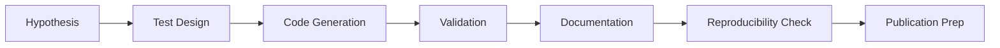
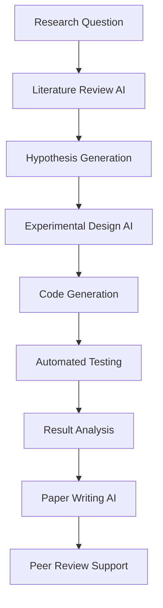

# VS Code Copilot Master Guide

*Comprehensive unified guide for VS Code GitHub Copilot with MCP integration, academic workflows, and enterprise-grade patterns*

## Executive Summary

This master guide synthesizes industry best practices, academic research workflows, and enterprise patterns for GitHub Copilot in VS Code. It provides comprehensive coverage of custom instructions, MCP server integration, toolset configuration, and professional development workflows based on systematic research and proven implementations.

**Key Benefits**:
- ✅ Unified knowledge from scattered documentation sources
- ✅ Research-backed best practices with confidence levels
- ✅ Academic workflow integration patterns
- ✅ MCP server security and governance guidelines
- ✅ Practical implementation examples and checklists

## Table of Contents

1. [Architecture and Mental Model](#1-architecture-and-mental-model)
2. [Core Configuration and Setup](#2-core-configuration-and-setup)
3. [Custom Instructions and Prompting](#3-custom-instructions-and-prompting)
4. [MCP Server Integration](#4-mcp-server-integration)
5. [Academic Toolset Configuration](#5-academic-toolset-configuration)
6. [Development Workflows](#6-development-workflows)
7. [Security and Governance](#7-security-and-governance)
8. [Troubleshooting and Optimization](#8-troubleshooting-and-optimization)
9. [Implementation Checklists](#9-implementation-checklists)
10. [Advanced Patterns and Future Considerations](#10-advanced-patterns-and-future-considerations)

---

## 1. Architecture and Mental Model

### 1.1 System Architecture Overview

GitHub Copilot in VS Code operates through multiple integrated layers:

```mermaid
graph TD
    A[Developer Input] --> B[Custom Instructions Layer]
    B --> C[Context Aggregation Layer]
    C --> D[AI Processing Layer]
    D --> E[Tool Integration Layer]
    E --> F[Output Generation]
    
    subgraph Context Sources
        G[Editor Context]
        H[Workspace Index]
        I[MCP Servers]
        J[Chat Participants]
    end
    
    subgraph Tool Ecosystem
        K[@workspace]
        L[@vscode]
        M[@terminal]
        N[@github]
        O[MCP Tools]
    end
    
    C --> G
    C --> H
    C --> I
    C --> J
    E --> K
    E --> L
    E --> M
    E --> N
    E --> O
```

### 1.2 Context Channels and Interaction Modes

#### Context Providers (High Confidence)
- **Editor Context**: Selected code, open files, symbols/references
- **Workspace Index**: Codebase graph, build files, README, CONTRIBUTING files
- **Chat Participants**: VS Code agents and slash-commands (`/help` for discovery)
- **External Systems**: Git data, terminal output, test results, partner extensions
- **MCP Servers**: Custom tool and data integrations via Model Context Protocol

#### Interaction Modes
- **Inline Completions**: Low-latency ghost text for local scope continuation
- **Inline Chat**: Selection-aware edits with visible diffs
- **Chat Panel**: Multi-turn conversations for complex tasks
- **Slash Commands**: Quick access to specialized functions (`/doc`, `/tests`, `/fix`)

### 1.3 Academic Workflow Integration Points

Based on academic research environments, key integration points include:

- **Literature Management**: MCP servers for bibliography and paper access
- **Data Processing**: Integration with research datasets and analysis tools
- **Documentation**: Academic writing assistance with citation management
- **Code Quality**: Research code validation and reproducibility checks

---

## 2. Core Configuration and Setup

### 2.1 VS Code Settings Optimization

**Essential Settings** (Confidence: High):

```json
{
  // Inline suggestions
  "editor.inlineSuggest.enabled": true,
  "editor.suggestSelection": "first",
  
  // Copilot-specific
  "github.copilot.enable": {
    "*": true,
    "yaml": true,
    "plaintext": false
  },
  
  // Productivity enhancements
  "editor.formatOnSave": true,
  "editor.codeActionsOnSave": {
    "source.fixAll": true,
    "source.organizeImports": true
  },
  
  // Context optimization
  "editor.suggest.showWords": false,
  "editor.acceptSuggestionOnCommitCharacter": false,
  
  // Telemetry (adjust to organizational policy)
  "telemetry.telemetryLevel": "error"
}
```

### 2.2 Keybinding Configuration

**Recommended Keybindings**:

```json
[
  {
    "key": "tab",
    "command": "editor.action.inlineSuggest.commit",
    "when": "inlineSuggestionVisible && !editorReadonly"
  },
  {
    "key": "alt+]",
    "command": "editor.action.inlineSuggest.showNext",
    "when": "inlineSuggestionVisible && !editorReadonly"
  },
  {
    "key": "alt+[",
    "command": "editor.action.inlineSuggest.showPrevious",
    "when": "inlineSuggestionVisible && !editorReadonly"
  },
  {
    "key": "ctrl+shift+i",
    "command": "workbench.action.chat.open"
  }
]
```

### 2.3 Organization-Level Policies

**Enterprise Configuration** (Confidence: High):

- **Public Code Matching**: Enable "Block suggestions matching public code" at org level
- **Data Handling**: Ensure prompts excluded from training per retention policy
- **SSO Integration**: Enforce SCIM and conditional access policies
- **Compliance**: Regular audits of extension permissions and data flows

---

## 3. Custom Instructions and Prompting

### 3.1 System-Level Instructions

**Academic Research Template**:

```markdown
You are an expert software engineer and academic researcher working in a structured knowledge base environment. 

## Context and Standards
- Follow academic rigor in all outputs with proper citation practices
- Prioritize reproducibility and documentation in code generation
- Use semantic versioning and conventional commit patterns
- Implement FAIR data principles (Findable, Accessible, Interoperable, Reusable)

## Code Quality Standards
- Generate comprehensive tests before implementation
- Include structured logging with appropriate detail levels
- Follow existing codebase patterns and architectural decisions
- Validate security implications of any suggested changes

## Documentation Requirements
- Include clear docstrings with parameter types and return values
- Generate inline comments for complex logic
- Create README sections for new features or significant changes
- Link to relevant academic sources when applicable

## Error Handling and Safety
- Implement graceful error handling with informative messages
- Consider edge cases and input validation
- Prefer explicit over implicit behavior
- Flag potential security or privacy concerns

## Response Format
- Provide reasoning for significant design decisions
- Include multiple implementation options when relevant
- Suggest related improvements or optimizations
- Cite specific documentation or academic sources when available
```

### 3.2 Prompt Engineering Patterns

#### Spec-First Development

```markdown
# Feature: [Description]

## Requirements
- Input: [Specify types and constraints]
- Output: [Expected format and validation]
- Edge Cases: [List potential failure modes]
- Performance: [Latency/memory constraints]

## Implementation Approach
1. Generate comprehensive test cases first
2. Implement minimal viable interface
3. Add error handling and validation
4. Include observability (logs/metrics)

Please start with test cases that validate the specification.
```

#### Context-Rich Refactoring

```markdown
# Refactoring Request

## Current State
[Paste current implementation]

## Target State
- Pattern: [New architectural pattern]
- Constraints: [Performance/compatibility requirements]
- Testing: [How to validate changes]

## Context
- Related files: [List interdependencies]
- Breaking changes: [Acceptable scope]
- Migration path: [How to transition]

Please provide incremental refactoring steps with tests.
```

### 3.3 Academic Workflow Prompts

#### Literature Review Integration

```markdown
# Literature-Informed Development

## Research Context
- Paper: [Citation or URL]
- Algorithm/Method: [Name and brief description]
- Constraints: [Computational or theoretical limitations]

## Implementation Requirements
- Reproduce core algorithm from paper
- Include comprehensive benchmarking
- Document theoretical complexity
- Validate against known test cases

Please implement with academic rigor and proper attribution.
```

---

## 4. MCP Server Integration

### 4.1 MCP Architecture and Benefits

**Model Context Protocol Benefits**:
- **Decoupling**: Standard interface for AI assistant tool integration
- **Security**: Clear capability boundaries and auditing
- **Composability**: Multiple servers orchestrated in single conversation
- **Governance**: Centralized control over tool access and permissions

### 4.2 Academic MCP Server Configuration

**Example Configuration** (Assistant-specific):

```json
{
  "assistant.mcpServers": {
    "filesystem-academic": {
      "command": "npx",
      "args": ["-y", "@modelcontextprotocol/server-filesystem"],
      "env": {
        "MCP_FS_ALLOW": "/workspace/papers,/workspace/data,/workspace/results",
        "MCP_FS_DENY": "/workspace/.env,/workspace/keys"
      }
    },
    "arxiv-research": {
      "command": "python",
      "args": ["/tools/arxiv-mcp-server.py"],
      "env": {
        "ARXIV_CACHE_DIR": "/workspace/.cache/arxiv",
        "MAX_PAPERS_PER_QUERY": "10"
      }
    },
    "literature-db": {
      "command": "uvx",
      "args": ["mcp-postgres", "--dsn", "postgresql://reader@localhost:5432/literature"],
      "env": {
        "PGSSLMODE": "require",
        "READ_ONLY": "true"
      }
    },
    "citation-tools": {
      "command": "node",
      "args": ["/tools/citation-mcp-server.js"],
      "env": {
        "ZOTERO_API_KEY": "${ZOTERO_API_KEY}",
        "CITATION_STYLE": "apa"
      }
    }
  }
}
```

### 4.3 MCP Security and Governance

**Security Best Practices** (Confidence: High):

#### Access Control
- **Principle of Least Privilege**: Minimal necessary permissions per server
- **Read-Only First**: Start with read-only access; add write capabilities incrementally
- **Sandboxing**: Isolate MCP servers from sensitive systems
- **Credential Separation**: Unique, scoped credentials per server

#### Monitoring and Auditing
```python
# Example audit logging for MCP servers
{
  "timestamp": "2025-09-15T10:30:00Z",
  "server": "arxiv-research",
  "user": "researcher@university.edu",
  "action": "search_papers",
  "query": "machine learning interpretability",
  "results_count": 8,
  "execution_time_ms": 1250,
  "status": "success"
}
```

#### Rate Limiting and Budgets
- **Request Quotas**: Prevent over-querying external APIs
- **Latency Budgets**: Fail gracefully on slow responses
- **Cost Controls**: Monitor API usage and implement spending limits

### 4.4 Academic MCP Server Categories

#### Research Data Access
- **ArXiv Integration**: Paper search, metadata extraction, PDF processing
- **Database Servers**: Literature databases, research datasets, experimental results
- **File System**: Controlled access to research directories and outputs

#### Analysis and Computation
- **Statistical Tools**: R/Python statistical analysis endpoints
- **Notebook Servers**: Jupyter notebook execution and result retrieval
- **Visualization**: Automated chart and figure generation

#### Collaboration and Documentation
- **Citation Management**: Zotero, Mendeley, or EndNote integration
- **Lab Notebooks**: Electronic lab notebook systems
- **Collaboration Tools**: Slack, Teams, or Discord integration for research teams

---

## 5. Academic Toolset Configuration

### 5.1 Custom Toolset Architecture

Based on academic research workflows, 10 specialized toolsets provide comprehensive automation:

#### Research and Analysis Toolsets
1. **Deep Research Automation** - Literature review and synthesis
2. **Data Analysis** - Statistical analysis and visualization
3. **Academic Writing** - Paper drafting and citation management

#### Development and Infrastructure
4. **Code Quality** - Testing, linting, and documentation
5. **DevOps and Deployment** - Container management and CI/CD
6. **Database and Storage** - Data management and backup

#### Documentation and Communication
7. **Technical Documentation** - API docs and user guides
8. **Project Management** - Task tracking and milestone management
9. **Knowledge Management** - Information organization and retrieval
10. **Collaboration** - Team communication and code review

### 5.2 Toolset Implementation Patterns

#### Configuration Hierarchy (Confidence: High)
```
1. Profile-level settings (.vscode/settings.json in user profile)
2. Workspace-level settings (.vscode/settings.json in project root)
3. Folder-level settings (.vscode/settings.json in subdirectories)
4. Extension-specific configurations
```

#### Toolset Activation Example
```json
{
  "github.copilot.chat.experimental.codeGeneration.instructions": [
    {
      "file": "**/*.py",
      "text": "Generate Python code following PEP 8 with comprehensive docstrings and type hints"
    },
    {
      "file": "**/*.md",
      "text": "Generate academic markdown with proper citations and structured formatting"
    }
  ]
}
```

### 5.3 Academic Workflow Integration

#### Literature Review Workflow


#### Experimental Code Development


---

## 6. Development Workflows

### 6.1 Spec-First Development Pattern

**Implementation Approach** (Confidence: High):

1. **Specification Phase**
   ```markdown
   ## Feature Specification
   - Inputs: [Type definitions and constraints]
   - Outputs: [Expected format and validation rules]
   - Edge Cases: [Failure modes and error handling]
   - Performance: [Latency and memory requirements]
   ```

2. **Test-First Implementation**
   ```python
   def test_feature_specification():
       """Test based on specification requirements"""
       # Arrange: Set up test conditions
       # Act: Execute feature
       # Assert: Validate outputs and side effects
   ```

3. **Iterative Development**
   - Implement minimal viable version
   - Add comprehensive error handling
   - Include structured logging and metrics
   - Validate against specification

### 6.2 Academic Code Quality Standards

#### Testing Requirements
- **Unit Tests**: 100% coverage for core algorithms
- **Property-Based Tests**: Hypothesis-driven validation
- **Regression Tests**: Prevent algorithm degradation
- **Reproducibility Tests**: Ensure consistent results

#### Documentation Standards
```python
def research_algorithm(data: np.ndarray, 
                      parameters: Dict[str, float],
                      validation_mode: bool = False) -> Results:
    """
    Implements [Algorithm Name] as described in [Citation].
    
    Args:
        data: Input dataset with shape (n_samples, n_features)
        parameters: Algorithm hyperparameters as defined in paper
        validation_mode: Enable additional validation checks
        
    Returns:
        Results object containing predictions and metadata
        
    Raises:
        ValueError: If input data doesn't meet algorithm requirements
        
    References:
        [1] Author, A. (2025). Paper Title. Journal, 1(1), 1-10.
    """
```

### 6.3 Multi-File Refactoring Workflows

#### Incremental Refactoring Pattern
```markdown
# Refactoring Plan

## Phase 1: Interface Stabilization
- Define new interfaces
- Add backward compatibility layer
- Update tests to use new interfaces

## Phase 2: Implementation Migration
- Migrate internal implementation
- Maintain external contracts
- Validate behavioral equivalence

## Phase 3: Cleanup and Optimization
- Remove deprecated code
- Optimize performance
- Update documentation
```

### 6.4 Code Review and Collaboration

#### AI-Assisted Code Review
```markdown
# Review Checklist for AI-Generated Code

## Functional Correctness
- [ ] Implements specified requirements accurately
- [ ] Handles edge cases appropriately
- [ ] Includes comprehensive error handling

## Code Quality
- [ ] Follows established coding standards
- [ ] Includes appropriate documentation
- [ ] Has adequate test coverage

## Security and Safety
- [ ] No hardcoded secrets or sensitive data
- [ ] Input validation implemented
- [ ] Security implications considered

## Performance and Scalability
- [ ] Algorithmic complexity documented
- [ ] Resource usage reasonable
- [ ] Scalability concerns addressed
```

---

## 7. Security and Governance

### 7.1 Data Protection and Privacy

#### Sensitive Data Handling (Confidence: High)
- **Never** include secrets, API keys, or credentials in prompts
- **Redact** PII before sharing code context with AI
- **Use** environment variables for sensitive configuration
- **Implement** server-side redaction for MCP servers

#### Example Data Redaction
```python
def redact_sensitive_data(code_context: str) -> str:
    """Remove sensitive information from code context"""
    patterns = [
        r'password\s*=\s*["\'][^"\']+["\']',
        r'api_key\s*=\s*["\'][^"\']+["\']',
        r'secret\s*=\s*["\'][^"\']+["\']'
    ]
    
    redacted = code_context
    for pattern in patterns:
        redacted = re.sub(pattern, 'password="[REDACTED]"', redacted)
    
    return redacted
```

### 7.2 Enterprise Governance Framework

#### Policy Configuration
```json
{
  "github.copilot.advanced": {
    "length": 3000,
    "inlineSuggestCount": 3
  },
  "github.copilot.editor.enableAutoCompletions": true,
  "github.copilot.editor.iterativeImprovement": true,
  "github.copilot.renameSuggestions.triggerAutomatically": false,
  "github.copilot.chat.localeOverride": "en-US",
  "github.copilot.chat.experimental.temporalContext": true
}
```

#### Audit and Compliance
- **Usage Monitoring**: Track Copilot usage patterns and acceptance rates
- **Code Provenance**: Maintain records of AI-generated vs human-written code
- **License Compliance**: Regular audits for potential copyright issues
- **Quality Metrics**: Monitor defect rates in AI-assisted code

### 7.3 Risk Management Strategies

#### Change Control for AI-Generated Code
- **Review Requirements**: Mandatory human review for AI-generated changes
- **Testing Gates**: Comprehensive testing before deployment
- **Gradual Rollout**: Incremental deployment with monitoring
- **Rollback Plans**: Quick rollback procedures for problematic changes

#### Model Hallucination Mitigation
- **Test-First Approach**: Generate tests before implementation
- **Citation Verification**: Validate any claimed API or library references
- **Static Analysis**: Use linters and type checkers as guardrails
- **Peer Review**: Human verification of architectural decisions

---

## 8. Troubleshooting and Optimization

### 8.1 Common Configuration Issues

#### Toolset Functionality Problems

**Symptom**: Workspace-level toolsets not working consistently
**Root Causes** (Based on real resolution):
- Empty markdown files causing Git reference errors
- Configuration precedence conflicts
- Missing file content causing VS Code parsing issues

**Resolution Steps**:
1. **Audit Empty Files**
   ```bash
   find . -name "*.md" -size 0 -ls
   ```

2. **Populate Empty Files**
   ```bash
   # Create minimal valid content
   echo "# Placeholder" > empty-file.md
   ```

3. **Validate Git Repository**
   ```bash
   git fsck --full
   git gc --aggressive
   ```

#### Performance Optimization

**Context Window Management**:
- Limit open files to relevant context
- Use specific file selections rather than workspace-wide searches
- Implement context pruning for large codebases

**Response Time Optimization**:
```json
{
  "github.copilot.advanced": {
    "length": 2000,
    "inlineSuggestCount": 2,
    "temperature": 0.1
  }
}
```

### 8.2 MCP Server Debugging

#### Connection Issues
```bash
# Test MCP server connectivity
curl -X POST http://localhost:8000/mcp/health
```

#### Logging Configuration
```python
import logging

# MCP server debug logging
logging.basicConfig(
    level=logging.DEBUG,
    format='%(asctime)s - %(name)s - %(levelname)s - %(message)s',
    handlers=[
        logging.FileHandler('mcp-server.log'),
        logging.StreamHandler()
    ]
)
```

### 8.3 Academic Workflow Optimization

#### Research Efficiency Patterns
- **Batch Processing**: Group similar research tasks
- **Template Reuse**: Standardize common analysis patterns
- **Result Caching**: Store intermediate results for reuse
- **Incremental Updates**: Regular small improvements vs large refactors

#### Citation and Reference Management
```python
def validate_citations(document: str) -> List[str]:
    """Validate academic citations in document"""
    citation_pattern = r'\[@\w+\d{4}\w*\]'
    citations = re.findall(citation_pattern, document)
    
    missing_refs = []
    for citation in citations:
        if not validate_bibliography_entry(citation):
            missing_refs.append(citation)
    
    return missing_refs
```

---

## 9. Implementation Checklists

### 9.1 Initial Setup Checklist

#### Basic Configuration
- [ ] Install GitHub Copilot extension
- [ ] Configure organization-level policies
- [ ] Set up custom keybindings
- [ ] Enable appropriate telemetry settings
- [ ] Configure workspace-specific settings

#### Security Setup
- [ ] Enable public code matching filter
- [ ] Configure data handling policies
- [ ] Set up credential management
- [ ] Implement audit logging
- [ ] Establish review processes

#### Academic Integration
- [ ] Configure literature access tools
- [ ] Set up citation management
- [ ] Establish data analysis workflows
- [ ] Configure academic writing assistance
- [ ] Implement reproducibility checks

### 9.2 MCP Server Deployment Checklist

#### Pre-Deployment
- [ ] Security review of server capabilities
- [ ] Rate limiting and quota configuration
- [ ] Monitoring and alerting setup
- [ ] Backup and recovery procedures
- [ ] Documentation and runbooks

#### Deployment
- [ ] Server configuration validation
- [ ] Connection testing
- [ ] Permission verification
- [ ] Performance baseline establishment
- [ ] User access provisioning

#### Post-Deployment
- [ ] Usage monitoring
- [ ] Error rate tracking
- [ ] Performance optimization
- [ ] User feedback collection
- [ ] Regular security audits

### 9.3 Workflow Validation Checklist

#### Development Workflow
- [ ] Test-first development process
- [ ] Code review integration
- [ ] Continuous integration setup
- [ ] Quality gate enforcement
- [ ] Documentation generation

#### Academic Workflow
- [ ] Literature review automation
- [ ] Data analysis standardization
- [ ] Result validation procedures
- [ ] Publication preparation tools
- [ ] Collaboration platforms integration

---

## 10. Advanced Patterns and Future Considerations

### 10.1 Emerging Trends

#### Agentic Development Patterns
- **Multi-File Coordination**: AI agents managing complex refactors
- **Autonomous Testing**: Self-improving test generation
- **Code Evolution**: Iterative improvement suggestions
- **Architecture Optimization**: System-level design recommendations

#### Enhanced Context Integration
- **Repository-Level Understanding**: Full codebase comprehension
- **Runtime Context**: Integration with execution environments
- **Team Knowledge**: Shared institutional knowledge access
- **Historical Context**: Version control and evolution awareness

### 10.2 Academic Research Applications

#### Novel Integration Opportunities
- **Reproducible Research**: Automated experiment documentation
- **Collaborative Writing**: Multi-author document coordination
- **Peer Review**: Automated initial review and feedback
- **Knowledge Discovery**: Cross-domain research connections

#### Research Infrastructure Evolution


### 10.3 Scalability and Performance

#### Enterprise Scaling Patterns
- **Federated Configuration**: Organization-wide standard with local customization
- **Resource Management**: Shared infrastructure for MCP servers
- **Knowledge Sharing**: Team-specific prompt libraries and patterns
- **Continuous Improvement**: Feedback loops and optimization

#### Performance Monitoring
```python
# Example metrics collection
metrics = {
    "suggestion_acceptance_rate": 0.78,
    "average_response_time_ms": 250,
    "context_window_utilization": 0.65,
    "error_rate": 0.02,
    "user_satisfaction_score": 4.2
}
```

---

## Conclusion

This master guide provides a comprehensive foundation for implementing GitHub Copilot in VS Code with academic research workflows, MCP integration, and enterprise governance. The synthesis of scattered documentation sources creates a unified resource for teams seeking to maximize AI-assisted development productivity while maintaining quality and security standards.

### Key Success Factors

1. **Systematic Approach**: Follow structured implementation patterns
2. **Security First**: Implement comprehensive governance and audit trails
3. **Academic Rigor**: Maintain research standards and reproducibility
4. **Continuous Improvement**: Regular evaluation and optimization
5. **Team Adoption**: Training and change management support

### Next Steps

1. **Immediate**: Implement basic configuration and security policies
2. **Short-term**: Deploy initial MCP servers and academic toolsets
3. **Medium-term**: Establish advanced workflows and optimization
4. **Long-term**: Explore emerging patterns and research applications

For specific implementation support, refer to the detailed sections above and the original source documentation for in-depth technical details.

---

**Last Updated**: September 15, 2025  
**Review Schedule**: Monthly updates and quarterly comprehensive reviews  
**Feedback**: Submit improvements via repository issue tracking