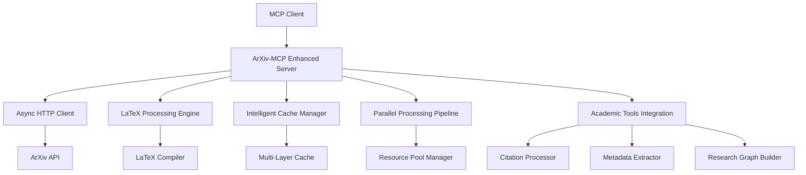

# ArXiv-MCP Enhanced Design Specification

## Executive Summary

This document presents the enhanced design specification for ArXiv-MCP integration, building upon the foundational system with advanced features including parallel processing, comprehensive LaTeX generation, intelligent caching, and robust academic workflow integration. The enhanced design transforms the basic ArXiv access into a production-grade research acceleration platform.

## Table of Contents

1. [Enhanced Architecture Overview](<#enhanced-architecture-overview>)
2. [Core System Improvements](<#core-system-improvements>)
3. [Advanced Feature Set](<#advanced-feature-set>)
4. [Academic Workflow Integration](<#academic-workflow-integration>)
5. [Performance Optimization Strategy](<#performance-optimization-strategy>)
6. [Security and Compliance Framework](<#security-and-compliance-framework>)
7. [Implementation Roadmap](<#implementation-roadmap>)
8. [Quality Assurance and Testing](<#quality-assurance-and-testing>)

## Enhanced Architecture Overview

### System Architecture Principles

```yaml
Design Philosophy:
- Async-First: All I/O operations use asyncio for maximum throughput
- Resource-Aware: Intelligent resource management with adaptive scaling
- Security-by-Design: Comprehensive input validation and sandboxing
- Academic-Focused: Tailored specifically for research workflows
- Extensible: Plugin architecture for custom academic tools
```

### High-Level Component Architecture



## Core System Improvements

### 1. Enhanced MCP Tool Suite

```python
@mcp.tool()
async def fetch_arxiv_paper_enhanced(
    arxiv_id: str,
    include_latex: bool = True,
    include_citations: bool = True,
    cache_policy: str = "smart"
) -> dict:
    """Enhanced paper fetching with intelligent options"""
    
@mcp.tool()
async def batch_process_papers(
    arxiv_ids: List[str],
    parallel_limit: int = 5,
    output_format: str = "comprehensive"
) -> List[dict]:
    """Parallel batch processing with configurable limits"""

@mcp.tool()
async def generate_research_summary(
    arxiv_ids: List[str],
    summary_type: str = "academic",
    include_methodology: bool = True
) -> str:
    """Generate comprehensive research summaries"""

@mcp.tool()
async def extract_citation_graph(
    arxiv_id: str,
    depth: int = 2,
    include_reverse_citations: bool = True
) -> dict:
    """Build comprehensive citation networks"""

@mcp.tool()
async def academic_workflow_processor(
    workflow_config: dict,
    papers: List[str],
    output_templates: List[str]
) -> dict:
    """Process papers through academic workflow templates"""
```

### 2. Advanced LaTeX Processing System

```python
class EnhancedLatexProcessor:
    """Production-grade LaTeX processing with academic standards"""
    
    def __init__(self):
        self.compiler_pool = ProcessPoolExecutor(max_workers=4)
        self.template_manager = AcademicTemplateManager()
        self.citation_processor = CitationProcessor()
    
    async def generate_latex_document(
        self,
        arxiv_id: str,
        template: str = "academic_paper",
        include_bibliography: bool = True,
        compile_pdf: bool = True
    ) -> dict:
        """Generate complete LaTeX documents with academic formatting"""
        
    async def extract_and_enhance_content(
        self,
        raw_content: str,
        enhancement_level: str = "comprehensive"
    ) -> dict:
        """Extract and enhance content with academic standards"""
        
    async def validate_latex_integrity(
        self,
        latex_content: str
    ) -> dict:
        """Comprehensive LaTeX validation and error reporting"""
```

### 3. Intelligent Caching Architecture

```yaml
Multi-Layer Caching Strategy:
  Memory Cache:
    - Hot data: Recently accessed papers
    - TTL: 1 hour for metadata, 24 hours for content
    - Size limit: 500MB with LRU eviction
    
  Persistent Cache:
    - Cold storage: Complete paper archives
    - Compression: gzip for text, efficient formats for binaries
    - Indexing: SQLite for fast lookups
    
  Smart Invalidation:
    - ETag support for HTTP caching
    - Version awareness for ArXiv updates
    - Dependency tracking for related papers
```

## Advanced Feature Set

### 1. Academic Research Acceleration

```python
class ResearchAccelerator:
    """AI-powered research acceleration features"""
    
    async def discover_related_papers(
        self,
        base_papers: List[str],
        similarity_threshold: float = 0.8,
        max_results: int = 50
    ) -> List[dict]:
        """Discover papers using semantic similarity and citation analysis"""
        
    async def generate_literature_review(
        self,
        topic: str,
        papers: List[str],
        review_style: str = "systematic"
    ) -> str:
        """Generate structured literature reviews"""
        
    async def extract_methodologies(
        self,
        papers: List[str],
        methodology_type: str = "all"
    ) -> dict:
        """Extract and categorize research methodologies"""
        
    async def compare_approaches(
        self,
        papers: List[str],
        comparison_criteria: List[str]
    ) -> dict:
        """Systematic comparison of research approaches"""
```

### 2. Enhanced Metadata Processing

```python
class MetadataEnhancer:
    """Advanced metadata processing and enrichment"""
    
    async def extract_comprehensive_metadata(
        self,
        arxiv_id: str
    ) -> dict:
        """Extract comprehensive metadata including hidden elements"""
        
    async def enrich_with_external_sources(
        self,
        base_metadata: dict,
        sources: List[str] = ["semantic_scholar", "crossref", "dblp"]
    ) -> dict:
        """Enrich metadata with external academic databases"""
        
    async def normalize_academic_entities(
        self,
        raw_metadata: dict
    ) -> dict:
        """Normalize authors, institutions, venues, etc."""
        
    async def calculate_impact_metrics(
        self,
        arxiv_id: str,
        include_altmetrics: bool = True
    ) -> dict:
        """Calculate comprehensive impact and influence metrics"""
```

### 3. Citation Network Analysis

```python
class CitationNetworkAnalyzer:
    """Advanced citation network analysis and visualization"""
    
    async def build_citation_graph(
        self,
        seed_papers: List[str],
        max_depth: int = 3,
        include_preprints: bool = True
    ) -> dict:
        """Build comprehensive citation networks"""
        
    async def identify_research_clusters(
        self,
        citation_graph: dict,
        clustering_algorithm: str = "leiden"
    ) -> dict:
        """Identify research communities and clusters"""
        
    async def find_influential_papers(
        self,
        graph_data: dict,
        influence_metrics: List[str] = ["betweenness", "pagerank", "citations"]
    ) -> List[dict]:
        """Identify most influential papers in the network"""
        
    async def trace_idea_evolution(
        self,
        concept: str,
        time_range: tuple,
        citation_data: dict
    ) -> dict:
        """Trace the evolution of research ideas over time"""
```

## Academic Workflow Integration

### 1. Research Workflow Templates

```yaml
Supported Workflows:
  Literature_Review:
    - Systematic search and filtering
    - Quality assessment and screening
    - Data extraction and synthesis
    - PRISMA diagram generation
    
  Meta_Analysis:
    - Effect size calculation
    - Heterogeneity assessment
    - Publication bias detection
    - Forest plot generation
    
  Systematic_Survey:
    - Comprehensive paper collection
    - Taxonomy development
    - Trend analysis
    - Gap identification
    
  Comparative_Study:
    - Method comparison framework
    - Performance metric extraction
    - Statistical significance testing
    - Reproducibility assessment
```

### 2. Integration with Academic Tools

```python
class AcademicToolsIntegration:
    """Integration with popular academic research tools"""
    
    async def export_to_zotero(
        self,
        papers: List[dict],
        collection_name: str = "ArXiv_Import"
    ) -> dict:
        """Export papers to Zotero library"""
        
    async def generate_mendeley_library(
        self,
        papers: List[dict],
        folder_structure: dict
    ) -> dict:
        """Create structured Mendeley library"""
        
    async def create_obsidian_vault(
        self,
        papers: List[dict],
        vault_config: dict
    ) -> dict:
        """Generate Obsidian knowledge vault"""
        
    async def export_to_roam_research(
        self,
        papers: List[dict],
        graph_structure: dict
    ) -> dict:
        """Export to Roam Research with linked structure"""
```

## Performance Optimization Strategy

### 1. Concurrent Processing Architecture

```python
class ParallelProcessingEngine:
    """High-performance parallel processing with resource awareness"""
    
    def __init__(self, max_workers: int = None):
        self.max_workers = max_workers or min(32, os.cpu_count() + 4)
        self.rate_limiter = AsyncRateLimiter(2.0)  # ArXiv API limit
        self.resource_monitor = ResourceMonitor()
        
    async def process_batch_with_backpressure(
        self,
        items: List[str],
        processor_func: Callable,
        batch_size: int = 10
    ) -> List[dict]:
        """Process items with intelligent backpressure control"""
        
    async def adaptive_concurrency_control(
        self,
        workload: List[dict]
    ) -> dict:
        """Dynamically adjust concurrency based on system resources"""
```

### 2. Resource Management and Monitoring

```python
class ResourceManager:
    """Intelligent resource management with predictive scaling"""
    
    async def monitor_system_resources(self) -> dict:
        """Real-time system resource monitoring"""
        
    async def predict_resource_requirements(
        self,
        workload: dict
    ) -> dict:
        """Predict resource needs based on workload analysis"""
        
    async def optimize_memory_usage(
        self,
        current_operations: List[dict]
    ) -> dict:
        """Optimize memory usage with intelligent caching"""
        
    async def scale_processing_capacity(
        self,
        demand_forecast: dict
    ) -> dict:
        """Auto-scale processing capacity based on demand"""
```

## Security and Compliance Framework

### 1. Academic Data Security

```python
class AcademicSecurityManager:
    """Security manager tailored for academic research requirements"""
    
    async def validate_arxiv_access_permissions(
        self,
        user_context: dict,
        requested_papers: List[str]
    ) -> dict:
        """Validate access permissions for academic content"""
        
    async def ensure_citation_compliance(
        self,
        usage_context: dict,
        papers: List[str]
    ) -> dict:
        """Ensure proper citation and attribution compliance"""
        
    async def protect_sensitive_research(
        self,
        content: dict,
        sensitivity_level: str
    ) -> dict:
        """Apply appropriate protection for sensitive research"""
        
    async def audit_research_access(
        self,
        access_log: List[dict]
    ) -> dict:
        """Comprehensive audit trail for research access"""
```

### 2. Ethical Research Practices

```yaml
Ethical Guidelines:
  Fair_Use:
    - Respect ArXiv terms of service
    - Implement reasonable rate limiting
    - Provide proper attribution
    
  Privacy_Protection:
    - No personally identifiable information storage
    - Anonymize usage analytics
    - Secure handling of user preferences
    
  Academic_Integrity:
    - Prevent plagiarism facilitation
    - Encourage proper citation practices
    - Support reproducible research
    
  Open_Science:
    - Promote open access principles
    - Support FAIR data practices
    - Enable collaborative research
```

## Implementation Roadmap

### Phase 1: Foundation Enhancement (Weeks 1-4)

```yaml
Core Infrastructure:
  - Async HTTP client with robust error handling
  - Multi-layer caching system
  - Basic parallel processing framework
  - Enhanced logging and monitoring

LaTeX Processing:
  - Basic LaTeX extraction and generation
  - Template system for academic documents
  - PDF compilation pipeline
  - Quality validation framework
```

### Phase 2: Advanced Features (Weeks 5-8)

```yaml
Research Acceleration:
  - Citation network analysis
  - Related paper discovery
  - Metadata enrichment pipeline
  - Academic workflow templates

Tool Integration:
  - Zotero and Mendeley export
  - Knowledge management system integration
  - Research collaboration features
  - Version control for research projects
```

### Phase 3: Optimization and Scaling (Weeks 9-12)

```yaml
Performance:
  - Advanced caching strategies
  - Resource-aware processing
  - Predictive scaling mechanisms
  - Comprehensive benchmarking

Security and Compliance:
  - Academic security framework
  - Ethical research guidelines
  - Audit and compliance reporting
  - Privacy protection measures
```

### Phase 4: Production Deployment (Weeks 13-16)

```yaml
Production Readiness:
  - Comprehensive testing suite
  - Monitoring and alerting systems
  - Documentation and user guides
  - Community feedback integration

Long-term Sustainability:
  - Maintenance and update procedures
  - Community contribution framework
  - Academic partnership programs
  - Research collaboration initiatives
```

## Quality Assurance and Testing

### 1. Comprehensive Testing Strategy

```python
class AcademicTestingSuite:
    """Comprehensive testing for academic research workflows"""
    
    async def test_paper_processing_accuracy(
        self,
        test_papers: List[str]
    ) -> dict:
        """Validate accuracy of paper processing and extraction"""
        
    async def test_latex_generation_quality(
        self,
        test_cases: List[dict]
    ) -> dict:
        """Validate LaTeX generation quality and compilation"""
        
    async def test_citation_network_integrity(
        self,
        known_networks: List[dict]
    ) -> dict:
        """Validate citation network analysis accuracy"""
        
    async def test_performance_benchmarks(
        self,
        workload_scenarios: List[dict]
    ) -> dict:
        """Benchmark performance under various workloads"""
```

### 2. Academic Validation Framework

```yaml
Validation Criteria:
  Content_Accuracy:
    - Metadata extraction precision
    - LaTeX generation fidelity
    - Citation relationship accuracy
    
  Performance_Standards:
    - Response time under 2 seconds for single papers
    - Batch processing efficiency > 10 papers/minute
    - Memory usage optimization < 1GB peak
    
  Reliability_Metrics:
    - 99.9% uptime for core functionality
    - Error rate < 0.1% for standard operations
    - Graceful degradation under high load
    
  Academic_Standards:
    - Proper citation format compliance
    - Academic integrity maintenance
    - Research ethics adherence
```

## Success Metrics and KPIs

### 1. Performance Metrics

```yaml
Quantitative_Metrics:
  - Papers processed per minute: Target > 50
  - Average response time: Target < 1.5 seconds
  - Cache hit ratio: Target > 85%
  - Concurrent user capacity: Target > 100
  - Resource utilization efficiency: Target > 80%

Quality_Metrics:
  - LaTeX compilation success rate: Target > 95%
  - Metadata extraction accuracy: Target > 98%
  - Citation network completeness: Target > 90%
  - User satisfaction score: Target > 4.5/5
```

### 2. Academic Impact Metrics

```yaml
Research_Impact:
  - Academic institutions using the system
  - Research papers citing the tool
  - Time saved in literature reviews
  - Collaboration networks enabled
  - Open science contributions facilitated
```

## Conclusion

The ArXiv-MCP Enhanced Design represents a significant advancement in academic research acceleration technology. By combining high-performance computing principles with academic workflow optimization, this system provides researchers with unprecedented capabilities for literature discovery, analysis, and synthesis.

Key innovations include:

- **Intelligent Parallel Processing**: Optimized for academic workloads with resource-aware scaling
- **Comprehensive LaTeX Integration**: Production-grade document generation with academic standards
- **Advanced Citation Analysis**: Deep citation network analysis and research trend identification
- **Academic Tool Integration**: Seamless integration with popular research management tools
- **Ethical Research Framework**: Built-in support for academic integrity and open science principles

This enhanced design positions the ArXiv-MCP system as a cornerstone tool for modern academic research, enabling researchers to focus on innovation and discovery while the system handles the complex technical aspects of literature management and analysis.

## References and Related Work

- ArXiv API Documentation and Best Practices
- Model Context Protocol (MCP) Specification
- Academic Research Workflow Analysis Studies
- Citation Network Analysis Methodologies
- LaTeX Document Processing Standards
- Academic Tool Integration Patterns
- Research Ethics and Compliance Frameworks
- Open Science and FAIR Data Principles
