# Phase 3 Comprehensive Enhancement Plan: Advanced Repository Intelligence

## Executive Summary

Phase 3 represents a **strategic transformation** of the repository into an **intelligent, self-organizing knowledge system** with advanced automation, memory management, and knowledge graph capabilities. Building on Phase 1's foundational PKM implementation and Phase 2's organizational optimization, Phase 3 introduces **enterprise-grade intelligence** for long-term scalability and sophisticated knowledge synthesis.

## User Observations Integration

### 🧠 **Memory MCP Temporal Organization**

- **Requirement**: Enforce temporal organization through instruction updates
- **Implementation**: Systematic date-based organization with automated enforcement
- **Target**: Constitutional AI-level compliance with temporal constraints

### 🤖 **Multi-Agent Workflow Automation**

- **User Enthusiasm**: "AWESOME. This would be nice."
- **Implementation**: MCP orchestration patterns for automated knowledge synthesis
- **Target**: Enterprise-grade multi-agent coordination

### ⚙️ **Advanced Process Automation**

- **User Welcome**: "Yes please. That's really welcome."
- **Implementation**: Intelligent repository maintenance and knowledge management
- **Target**: Zero-maintenance knowledge base operations

### 🕸️ **Knowledge Graph Integration**

- **User Priority**: "YES. This."
- **Requirements**:
  - Visually appealing and smartly organized naming conventions
  - Tag-based organization systems
  - Database integration (currently missing)
- **Target**: Neo4j-level knowledge graph capabilities

### 📝 **Naming Conventions Enforcement**

- **User Concern**: "The naming of the files should make sense and be better (e.g. the `loop` named files.)"
- **Implementation**: Automated file naming validation and improvement
- **Target**: Semantic, discoverable file naming system

## Phase 3 Architecture Overview

```mermaid
graph TB
    A[Phase 3 Intelligence Layer] --> B[Memory MCP Temporal Engine]
    A --> C[Multi-Agent Orchestrator]
    A --> D[Process Automation Hub]
    A --> E[Knowledge Graph Database]
    A --> F[Naming Convention Engine]

    B --> B1[Temporal Organization Enforcement]
    B --> B2[Memory MCP Integration]
    B --> B3[Chronological Knowledge Mapping]

    C --> C1[Workflow Orchestration Patterns]
    C --> C2[Agent Coordination Framework]
    C --> C3[Task Distribution Engine]

    D --> D1[Repository Maintenance Automation]
    D --> D2[Knowledge Synthesis Pipelines]
    D --> D3[Quality Assurance Systems]

    E --> E1[SQLite Knowledge Database]
    E --> E2[Graph Relationship Mapping]
    E --> E3[Semantic Search Integration]

    F --> F1[Semantic File Naming]
    F --> F2[Legacy File Migration]
    F --> F3[Naming Validation Engine]
```



## Detailed Implementation Strategy

### 🎯 **Phase 3.1: Memory MCP Temporal Foundation (Week 1)**

#### **Temporal Organization Enforcement**

1. **Instruction Updates**:
   - Update `.github/instructions/` with Memory MCP temporal requirements
   - Implement constitutional AI-level enforcement rules
   - Create temporal organization validation scripts

2. **Memory MCP Integration**:
   - Design temporal entity relationship model
   - Implement date-based knowledge organization
   - Create chronological knowledge mapping system

3. **Implementation Components**:
   ```bash
   .kb/scripts/temporal-organization-enforcer.py
   .kb/schemas/temporal-entity.schema.json
   .github/instructions/memory-mcp-temporal.instructions.md
   ```

### 🔄 **Phase 3.2: Multi-Agent Workflow Automation (Week 2)**

#### **MCP Orchestration Patterns**

1. **Agent Coordination Framework**:
   - Implement supervisor pattern for multi-agent coordination
   - Create sequential and concurrent orchestration workflows
   - Design hierarchical agent architecture

2. **Workflow Automation**:
   - Build automated knowledge synthesis pipelines
   - Implement event-driven orchestration patterns
   - Create saga-based long-running workflows

3. **Implementation Components**:
   ```bash
   .kb/scripts/multi-agent-orchestrator.py
   .kb/workflows/knowledge-synthesis-pipeline.yaml
   .vscode/tasks.json # Enhanced with automation tasks
   ```

### 📊 **Phase 3.3: Database Integration & Knowledge Graph (Week 3)**

#### **SQLite Knowledge Database**

1. **Database Architecture**:
   - Design comprehensive knowledge database schema
   - Implement entity-relationship model for knowledge graph
   - Create semantic search integration layer

2. **Database Integration**:
   ```sql
   -- Knowledge base database schema
   30-data/database/knowledge-graph.db
   - entities (id, name, type, metadata, created, updated)
   - relationships (from_entity, to_entity, relationship_type, metadata)
   - observations (entity_id, content, source, timestamp)
   - temporal_events (entity_id, event_type, timestamp, metadata)
   ```

3. **Implementation Components**:
   ```bash
   .kb/scripts/database-integration-engine.py
   .kb/schemas/knowledge-graph.schema.json
   30-data/database/migrations/
   ```

### 🏷️ **Phase 3.4: Intelligent Naming Convention System (Week 4)**

#### **Semantic File Naming Engine**

1. **Current Naming Analysis**:
   - Analyze all "loop" named files for semantic improvement
   - Create taxonomy of current naming patterns
   - Design semantic naming convention framework

2. **Naming Convention Implementation**:
   - **Loop Files Transformation**:
     ```diff
     loop7-vscode-copilot-completion-report.md
     → vscode-copilot-mastery-completion-report-2025q3.md

     loop10-mcp-orchestration-completion-report.md
     → mcp-orchestration-enterprise-completion-report-2025q3.md
     ```

3. **Implementation Components**:
   ```bash
   .kb/scripts/semantic-naming-engine.py
   .kb/schemas/naming-convention.schema.json
   .kb/migrations/file-renaming-migration.py
   ```

### ⚡ **Phase 3.5: Advanced Process Automation (Week 5)**

#### **Zero-Maintenance Knowledge Base**

1. **Automated Maintenance**:
   - Self-healing repository validation
   - Automated metadata synchronization
   - Intelligent content organization

2. **Quality Assurance Systems**:
   - Automated link validation
   - Content quality scoring
   - Knowledge gap detection

3. **Implementation Components**:
   ```bash
   .kb/scripts/zero-maintenance-engine.py
   .github/workflows/automated-maintenance.yml
   .kb/policies/quality-assurance.yaml
   ```

## Technical Implementation Details

### **Memory MCP Temporal Organization Architecture**

```python
# Temporal organization enforcement example
class TemporalOrganizer:
    def __init__(self):
        self.memory_client = MCPMemoryClient()
        self.temporal_rules = load_temporal_rules()

    def enforce_temporal_organization(self, entities):
        """Enforce constitutional AI-level temporal constraints"""
        for entity in entities:
            temporal_metadata = self.extract_temporal_metadata(entity)
            if not self.validate_temporal_compliance(temporal_metadata):
                self.apply_temporal_corrections(entity)
                self.log_compliance_violation(entity)

    def create_chronological_knowledge_map(self):
        """Create temporal knowledge relationships"""
        temporal_events = self.memory_client.get_temporal_events()
        knowledge_timeline = self.build_timeline(temporal_events)
        return self.create_temporal_graph(knowledge_timeline)
```

### **Multi-Agent Workflow Orchestration**

```python
# Multi-agent coordination framework
class MultiAgentOrchestrator:
    def __init__(self):
        self.agents = {
            'research_agent': MCPArxivAgent(),
            'synthesis_agent': MCPDeepResearchAgent(),
            'memory_agent': MCPMemoryAgent(),
            'validation_agent': ValidationAgent()
        }

    async def execute_knowledge_synthesis_workflow(self, topic):
        """Enterprise-grade orchestration pattern"""
        # Sequential orchestration with validation checkpoints
        research_results = await self.agents['research_agent'].research(topic)
        synthesis = await self.agents['synthesis_agent'].synthesize(research_results)

        # Concurrent validation and storage
        validation_task = self.agents['validation_agent'].validate(synthesis)
        storage_task = self.agents['memory_agent'].store(synthesis)

        validation_result, storage_result = await asyncio.gather(
            validation_task, storage_task
        )

        return self.compile_workflow_result(synthesis, validation_result, storage_result)
```

### **Database Integration Architecture**

```python
# Knowledge graph database integration
class KnowledgeGraphDatabase:
    def __init__(self, db_path="30-data/database/knowledge-graph.db"):
        self.db = sqlite3.connect(db_path)
        self.memory_client = MCPMemoryClient()
        self.setup_schema()

    def setup_schema(self):
        """Initialize comprehensive knowledge database schema"""
        self.db.executescript("""
            CREATE TABLE IF NOT EXISTS entities (
                id TEXT PRIMARY KEY,
                name TEXT UNIQUE NOT NULL,
                type TEXT NOT NULL,
                metadata JSON,
                created TIMESTAMP DEFAULT CURRENT_TIMESTAMP,
                updated TIMESTAMP DEFAULT CURRENT_TIMESTAMP
            );

            CREATE TABLE IF NOT EXISTS relationships (
                id INTEGER PRIMARY KEY AUTOINCREMENT,
                from_entity TEXT NOT NULL,
                to_entity TEXT NOT NULL,
                relationship_type TEXT NOT NULL,
                metadata JSON,
                created TIMESTAMP DEFAULT CURRENT_TIMESTAMP,
                FOREIGN KEY (from_entity) REFERENCES entities(id),
                FOREIGN KEY (to_entity) REFERENCES entities(id)
            );

            CREATE TABLE IF NOT EXISTS temporal_events (
                id INTEGER PRIMARY KEY AUTOINCREMENT,
                entity_id TEXT NOT NULL,
                event_type TEXT NOT NULL,
                timestamp TIMESTAMP NOT NULL,
                metadata JSON,
                FOREIGN KEY (entity_id) REFERENCES entities(id)
            );
        """)

    def sync_with_memory_mcp(self):
        """Bidirectional synchronization with Memory MCP"""
        memory_graph = self.memory_client.read_graph()
        self.import_memory_entities(memory_graph)
        self.export_database_entities_to_memory()
```

### **Semantic Naming Convention Engine**

```python
# Intelligent file naming system
class SemanticNamingEngine:
    def __init__(self):
        self.naming_patterns = load_naming_patterns()
        self.semantic_analyzer = SemanticAnalyzer()

    def analyze_current_naming_patterns(self):
        """Analyze current file naming for improvement opportunities"""
        loop_files = self.find_loop_named_files()
        analysis = {
            'total_files': len(loop_files),
            'naming_issues': self.identify_naming_issues(loop_files),
            'improvement_suggestions': self.generate_improvements(loop_files)
        }
        return analysis

    def generate_semantic_names(self, file_path, content_metadata):
        """Generate semantically meaningful file names"""
        content_type = self.semantic_analyzer.classify_content(content_metadata)
        temporal_context = self.extract_temporal_context(content_metadata)
        domain_context = self.extract_domain_context(content_metadata)

        semantic_name = self.build_semantic_name(
            content_type, temporal_context, domain_context
        )
        return semantic_name

    def migrate_loop_files(self):
        """Transform loop-named files to semantic names"""
        loop_files = self.find_loop_named_files()
        migration_plan = []

        for file_path in loop_files:
            metadata = self.extract_file_metadata(file_path)
            new_name = self.generate_semantic_names(file_path, metadata)
            migration_plan.append({
                'old_path': file_path,
                'new_path': self.build_new_path(file_path, new_name),
                'metadata': metadata
            })

        return migration_plan
```

## Implementation Timeline

### **Sprint Structure (5-Week Timeline)**

| Week | Focus Area | Deliverables | Success Metrics |
|------|------------|--------------|-----------------|
| **Week 1** | Memory MCP Temporal Foundation | Temporal enforcement, instruction updates | Memory MCP compliance, temporal validation |
| **Week 2** | Multi-Agent Workflow Automation | Orchestration framework, automation pipelines | Workflow success rate, agent coordination |
| **Week 3** | Database Integration & Knowledge Graph | SQLite database, graph relationships | Database integration, semantic search |
| **Week 4** | Intelligent Naming Convention System | Semantic naming engine, loop file migration | Naming consistency, file discoverability |
| **Week 5** | Advanced Process Automation | Zero-maintenance engine, quality assurance | Automation coverage, system reliability |

### **Critical Success Factors**

1. **Constitutional AI Compliance**: Memory MCP temporal organization must achieve 100% compliance
2. **Enterprise-Grade Orchestration**: Multi-agent workflows must demonstrate enterprise reliability
3. **Database Integration**: Knowledge graph database must provide significant query performance improvement
4. **Semantic Naming**: File naming system must achieve measurable improvement in discoverability
5. **Zero-Maintenance**: Process automation must reduce manual maintenance by 80%

## Risk Mitigation Strategy

### **Technical Risks**

- **Database Performance**: Implement progressive migration and performance testing
- **Memory MCP Integration**: Create comprehensive validation and rollback procedures
- **File Migration**: Implement atomic file operations with full backup systems

### **Organizational Risks**

- **User Adoption**: Provide comprehensive documentation and training materials
- **System Complexity**: Maintain clear separation of concerns and modular architecture
- **Data Loss**: Implement multiple backup strategies and validation checkpoints

## Success Metrics and Validation

### **Phase 3 Success Criteria**

1. **Memory MCP Temporal Compliance**: 100% compliance with temporal organization rules
2. **Multi-Agent Workflow Success**: 95% success rate for automated knowledge synthesis
3. **Database Integration Performance**: 10x improvement in knowledge retrieval speed
4. **Naming Convention Improvement**: 90% reduction in file naming inconsistencies
5. **Process Automation Coverage**: 80% reduction in manual maintenance tasks

### **Validation Framework**

```python
# Phase 3 validation framework
class Phase3Validator:
    def validate_memory_mcp_compliance(self):
        """Validate Memory MCP temporal organization compliance"""
        temporal_entities = self.get_temporal_entities()
        compliance_rate = self.calculate_compliance_rate(temporal_entities)
        assert compliance_rate >= 0.99, f"Compliance rate {compliance_rate} below threshold"

    def validate_multi_agent_workflows(self):
        """Validate multi-agent workflow success rates"""
        workflow_results = self.execute_test_workflows()
        success_rate = self.calculate_success_rate(workflow_results)
        assert success_rate >= 0.95, f"Success rate {success_rate} below threshold"

    def validate_database_integration(self):
        """Validate database integration performance"""
        query_performance = self.benchmark_database_queries()
        improvement_factor = query_performance['new'] / query_performance['old']
        assert improvement_factor >= 10, f"Performance improvement {improvement_factor}x below threshold"
```

## Future Phases Preview

### **Phase 4: Cognitive Intelligence Integration**

- Advanced AI reasoning capabilities
- Predictive knowledge synthesis
- Intelligent content recommendation

### **Phase 5: Ecosystem Integration**

- External knowledge source integration
- Collaborative knowledge networks
- Real-time knowledge synchronization

## Conclusion

Phase 3 represents a **transformative leap** in repository intelligence, addressing all user observations with enterprise-grade solutions. The systematic implementation of Memory MCP temporal organization, multi-agent workflow automation, advanced process automation, knowledge graph database integration, and intelligent naming conventions will create a **self-organizing, intelligent knowledge system** that exceeds current PKM capabilities.

**Implementation begins immediately** with comprehensive planning, systematic execution, and rigorous validation to ensure Phase 3 delivers the advanced repository intelligence the user envisions.
