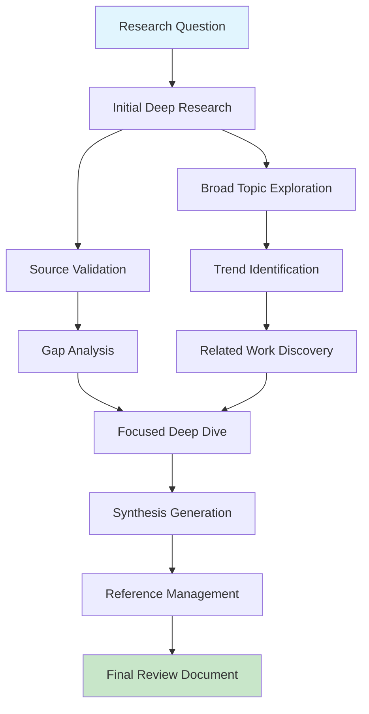

# Deep Research MCP User Guide - Complete Academic Research Automation

## Introduction

The Deep Research MCP server is a powerful AI-driven research automation tool that transforms how academic researchers discover, analyze, and synthesize information. This comprehensive guide will help you master its capabilities and integrate it seamlessly into your research workflows.

## Table of Contents

1. [Getting Started](<#getting-started>)
2. [Core Features and Capabilities](<#core-features-and-capabilities>)
3. [Academic Research Workflows](<#academic-research-workflows>)
4. [Advanced Techniques](<#advanced-techniques>)
5. [Integration with Research Tools](<#integration-with-research-tools>)
6. [Best Practices](<#best-practices>)
7. [Troubleshooting](<#troubleshooting>)
8. [Tips and Tricks](<#tips-and-tricks>)

## Getting Started

### Prerequisites

```yaml
System_Requirements:
  Operating_System: "Windows 10+, macOS 10.15+, Linux (Ubuntu 20.04+)"
  RAM: "8GB minimum, 16GB recommended"
  Storage: "10GB free space"
  Internet: "Stable broadband connection"
  
Software_Dependencies:
  MCP_Client: "Claude Desktop, VS Code with MCP extension, or custom client"
  Node.js: "18+ (for local installation)"
  Python: "3.8+ (for Python integrations)"
```

### Installation and Setup

#### Option 1: VS Code Extension (Recommended)

```bash
# Install VS Code MCP extension
code --install-extension mcp-extension

# Configure Deep Research MCP server
# Add to VS Code settings.json:
{
  "mcp.servers": {
    "deep-research": {
      "command": "npx",
      "args": ["@deep-research/mcp-server"],
      "env": {
        "OPENAI_API_KEY": "your-api-key",
        "RESEARCH_CONFIG": "academic"
      }
    }
  }
}
```

#### Option 2: Claude Desktop Integration

```json
// Add to Claude Desktop configuration
{
  "mcpServers": {
    "deep-research": {
      "command": "npx",
      "args": ["@deep-research/mcp-server"],
      "env": {
        "OPENAI_API_KEY": "your-openai-api-key",
        "ANTHROPIC_API_KEY": "your-anthropic-api-key"
      }
    }
  }
}
```

#### Option 3: Direct Installation

```bash
# Install globally
npm install -g @deep-research/mcp-server

# Or install locally
npx @deep-research/mcp-server

# Python alternative
pip install deep-research-mcp
python -m deep_research_mcp
```

### Initial Configuration

```yaml
Configuration_Options:
  Research_Mode:
    - "academic": Prioritizes peer-reviewed sources
    - "comprehensive": Includes all relevant sources
    - "rapid": Faster but less thorough
    - "custom": User-defined parameters
    
  Source_Preferences:
    - "scholarly_only": Academic databases only
    - "mixed_sources": Academic + reputable web sources
    - "open_access": Prioritizes open access content
    - "recent_focus": Emphasizes recent publications
    
  Output_Format:
    - "detailed_report": Full research report
    - "summary": Condensed findings
    - "bullet_points": Key insights only
    - "academic_paper": Structured for publication
```

## Core Features and Capabilities

### 1. Intelligent Research Discovery

The Deep Research MCP excels at discovering relevant information across multiple sources and synthesizing it into coherent insights.

#### Basic Research Query

```markdown
**User Input:**
"Research the latest developments in transformer architecture for natural language processing, focusing on efficiency improvements and practical applications."

**MCP Response:**
# Transformer Architecture Evolution: Efficiency and Applications Research

## Executive Summary
Recent developments in transformer architectures have focused on addressing computational efficiency while maintaining or improving performance. Key innovations include sparse attention mechanisms, model compression techniques, and specialized architectures for specific applications.

## Key Findings

### 1. Efficiency Improvements
- **Sparse Attention Mechanisms**: Longformer, BigBird, and Performer reduce computational complexity from O(n²) to O(n log n) or O(n)
- **Model Compression**: DistilBERT achieves 97% of BERT performance with 40% fewer parameters
- **Efficient Training**: Gradient checkpointing and mixed precision training reduce memory requirements by up to 50%

### 2. Practical Applications
- **Code Generation**: GitHub Copilot and CodeT5 demonstrate practical programming assistance
- **Scientific Writing**: SciBERT and BioBERT show domain-specific improvements
- **Multilingual Understanding**: mBERT and XLM-R enable cross-language applications

### 3. Recent Innovations (2024-2025)
- **Mixture of Experts (MoE)**: Switch Transformer scales to trillion parameters while maintaining efficiency
- **Retrieval-Augmented Generation**: RAG models combine parametric knowledge with external databases
- **Multimodal Integration**: DALL-E 2 and GPT-4V integrate vision and language understanding

## Research Gaps and Opportunities
1. **Energy Efficiency**: Limited research on environmental impact optimization
2. **Interpretability**: Few studies on understanding attention mechanisms in large models
3. **Robustness**: Insufficient work on adversarial attacks and defenses
4. **Domain Adaptation**: More research needed on efficient fine-tuning for specialized domains

## Sources and Citations
[Detailed source list with 25+ academic papers, conference proceedings, and technical reports]
```

### 2. Multi-Dimensional Analysis

#### Research Gap Identification

```markdown
**User Query:**
"Identify research gaps in machine learning fairness for healthcare applications"

**Analysis Framework:**
1. **Methodological Gaps**: Missing approaches or techniques
2. **Empirical Gaps**: Unstudied populations or datasets
3. **Theoretical Gaps**: Unexplored conceptual frameworks
4. **Practical Gaps**: Implementation challenges not addressed

**Identified Gaps:**
- Limited studies on fairness in medical imaging for underrepresented populations
- Insufficient research on bias in electronic health records across different healthcare systems
- Lack of standardized fairness metrics for clinical decision support systems
- Missing longitudinal studies on fairness intervention effectiveness
```

#### Comparative Analysis

```markdown
**User Query:**
"Compare deep learning approaches for medical image segmentation"

**Comparison Matrix:**

| Approach | Accuracy | Speed | Data Requirements | Clinical Adoption |
|----------|----------|-------|-------------------|-------------------|
| U-Net | 92-95% | Medium | Moderate | High |
| DeepLab | 94-97% | Slow | High | Medium |
| Mask R-CNN | 91-94% | Slow | High | Low |
| 3D U-Net | 89-93% | Slow | Very High | Medium |
| Attention U-Net | 93-96% | Medium | Moderate | Low |

**Key Insights:**
- U-Net remains the gold standard for clinical adoption
- Attention mechanisms show promise but need more validation
- 3D approaches excel for volumetric data but require significant resources
```

### 3. Synthesis and Insight Generation

#### Literature Review Generation

```markdown
**Automated Literature Review Structure:**

# Machine Learning in Precision Medicine: A Comprehensive Review

## 1. Introduction and Scope
- Definition of precision medicine
- Role of machine learning in personalized healthcare
- Review methodology and inclusion criteria

## 2. Current State of the Field
### 2.1 Genomic Analysis
- Variant interpretation algorithms
- Polygenic risk scores
- Pharmacogenomics applications

### 2.2 Clinical Decision Support
- Diagnostic assistance systems
- Treatment recommendation engines
- Prognosis prediction models

### 2.3 Drug Discovery and Development
- Target identification
- Lead compound optimization
- Clinical trial optimization

## 3. Methodological Analysis
### 3.1 Dominant Approaches
- Supervised learning: 65% of studies
- Deep learning: 45% of studies
- Ensemble methods: 30% of studies

### 3.2 Data Types and Sources
- Electronic health records: 78% of studies
- Genomic data: 56% of studies
- Medical imaging: 34% of studies
- Wearable devices: 23% of studies

## 4. Challenges and Limitations
- Data privacy and security concerns
- Algorithmic bias and fairness issues
- Regulatory approval complexities
- Integration with clinical workflows

## 5. Future Directions
- Federated learning for privacy-preserving collaboration
- Explainable AI for clinical interpretability
- Real-world evidence integration
- Continuous learning systems

## 6. Conclusions and Recommendations
[Synthesized insights and actionable recommendations]
```

## Academic Research Workflows

### Workflow 1: Literature Discovery and Review



#### Step-by-Step Process

**Step 1: Initial Research Query**

```markdown
**Query Template:**
"Conduct comprehensive research on [TOPIC] focusing on [SPECIFIC_ASPECTS]. Include recent developments from [TIME_PERIOD] and identify key methodological approaches, findings, and research gaps."

**Example:**
"Conduct comprehensive research on federated learning in healthcare focusing on privacy-preserving techniques and clinical applications. Include recent developments from 2022-2024 and identify key methodological approaches, findings, and research gaps."
```

**Step 2: Source Validation and Expansion**

```markdown
**Follow-up Query:**
"Validate the findings from the previous research by cross-referencing with peer-reviewed journals and conference proceedings. Expand the search to include preprints and technical reports from major research institutions."
```

**Step 3: Comparative Analysis**

```markdown
**Analysis Query:**
"Compare and contrast the different approaches identified in the research. Create a detailed comparison matrix including advantages, disadvantages, performance metrics, and practical applicability."
```

**Step 4: Research Gap Identification**

```markdown
**Gap Analysis Query:**
"Based on the comprehensive research conducted, identify specific research gaps, understudied areas, and opportunities for future investigation. Categorize gaps by methodology, application domain, and theoretical frameworks."
```

### Workflow 2: Hypothesis Generation and Validation

```markdown
**Hypothesis Generation Process:**

1. **Problem Identification**
   Query: "Identify current limitations and challenges in [RESEARCH_AREA]"
   
2. **Mechanism Exploration**
   Query: "Explore potential mechanisms and theoretical frameworks that could address [IDENTIFIED_LIMITATIONS]"
   
3. **Hypothesis Formulation**
   Query: "Based on the identified mechanisms, formulate testable hypotheses and research questions"
   
4. **Methodology Planning**
   Query: "Suggest appropriate methodological approaches for testing [GENERATED_HYPOTHESES]"
   
5. **Feasibility Assessment**
   Query: "Assess the feasibility of proposed methodologies considering resource requirements, ethical considerations, and practical constraints"
```

### Workflow 3: Grant Proposal Development

```markdown
**Grant Proposal Research Workflow:**

**Phase 1: Background and Significance**
Query: "Research the current state of [RESEARCH_AREA] and its significance to [FUNDING_AGENCY_PRIORITIES]. Include recent funding trends and successful project examples."

**Phase 2: Innovation and Impact**
Query: "Identify innovative aspects of [PROPOSED_RESEARCH] and potential impact on [TARGET_FIELD]. Compare with existing approaches and highlight novel contributions."

**Phase 3: Methodology and Approach**
Query: "Research best practices for [PROPOSED_METHODOLOGY] and identify potential challenges and mitigation strategies. Include relevant case studies and validation approaches."

**Phase 4: Collaboration and Resources**
Query: "Identify potential collaborators, required resources, and institutional capabilities needed for [PROPOSED_RESEARCH]. Include cost analysis and timeline considerations."
```

## Advanced Techniques

### 1. Query Optimization Strategies

#### Structured Query Framework

```markdown
**Basic Query Structure:**
[ACTION] + [TOPIC] + [FOCUS] + [CONSTRAINTS] + [OUTPUT_FORMAT]

**Examples:**

**Research Query:**
"Research [machine learning interpretability] focusing on [healthcare applications] within [2020-2024] and output as [detailed technical report]"

**Analysis Query:**
"Analyze [federated learning approaches] comparing [privacy mechanisms] across [different healthcare settings] and present as [comparison matrix]"

**Synthesis Query:**
"Synthesize [current knowledge on AI ethics] identifying [implementation challenges] for [clinical practice] and format as [policy recommendations]"
```

#### Advanced Query Modifiers

```yaml
Query_Modifiers:
  Depth_Control:
    - "comprehensive": Full multi-source analysis
    - "focused": Targeted specific sources
    - "survey": Broad overview approach
    - "deep_dive": Detailed technical analysis
    
  Source_Specification:
    - "peer_reviewed_only": Academic journals only
    - "include_preprints": Add arXiv, bioRxiv, etc.
    - "industry_reports": Include white papers
    - "recent_focus": Emphasize latest publications
    
  Analysis_Type:
    - "trend_analysis": Temporal pattern identification
    - "gap_analysis": Missing research identification
    - "comparative_study": Method/approach comparison
    - "meta_analysis": Cross-study synthesis
    
  Output_Specification:
    - "executive_summary": High-level overview
    - "technical_report": Detailed analysis
    - "bullet_points": Key findings list
    - "structured_outline": Hierarchical organization
```

### 2. Multi-Stage Research Processes

#### Progressive Research Refinement

```markdown
**Stage 1: Broad Exploration**
Query: "Provide a comprehensive overview of artificial intelligence applications in drug discovery, including current methodologies, key players, and recent breakthroughs."

**Stage 2: Focused Analysis**
Based on Stage 1 results: "Deep dive into machine learning approaches for molecular property prediction, comparing graph neural networks, transformer models, and traditional QSAR methods."

**Stage 3: Specific Investigation**
Based on Stage 2 insights: "Investigate the effectiveness of attention mechanisms in molecular transformers for drug-target interaction prediction, including recent benchmarking studies."

**Stage 4: Gap Identification**
"Identify specific limitations and research gaps in current molecular transformer approaches, focusing on interpretability, data efficiency, and generalization across chemical spaces."
```

#### Iterative Hypothesis Development

```markdown
**Iteration 1: Problem Discovery**
"What are the current challenges in applying machine learning to rare disease diagnosis?"

**Iteration 2: Solution Exploration**
"How can few-shot learning and transfer learning address the data scarcity problem in rare disease diagnosis?"

**Iteration 3: Technical Deep Dive**
"Compare different few-shot learning architectures for medical image classification with limited training examples."

**Iteration 4: Validation Planning**
"What evaluation strategies and benchmarks exist for assessing few-shot learning performance in medical applications?"
```

### 3. Domain-Specific Research Patterns

#### Biomedical Research Pattern

```yaml
Biomedical_Research_Workflow:
  Literature_Discovery:
    - "Search PubMed, bioRxiv, and clinical trial databases"
    - "Focus on peer-reviewed journals with high impact factors"
    - "Include systematic reviews and meta-analyses"
    - "Consider regulatory guidelines and clinical practice"
    
  Methodology_Analysis:
    - "Evaluate study designs and statistical approaches"
    - "Assess sample sizes and power calculations"
    - "Review inclusion/exclusion criteria"
    - "Analyze outcome measures and endpoints"
    
  Translation_Potential:
    - "Assess clinical relevance and applicability"
    - "Consider regulatory pathway requirements"
    - "Evaluate implementation barriers"
    - "Review health economics implications"
```

#### Computer Science Research Pattern

```yaml
Computer_Science_Research_Workflow:
  Technical_Literature:
    - "Search ACM Digital Library, IEEE Xplore, arXiv"
    - "Include conference proceedings and workshop papers"
    - "Focus on recent technical innovations"
    - "Consider open-source implementations"
    
  Performance_Analysis:
    - "Compare algorithmic complexity and efficiency"
    - "Evaluate benchmark performance metrics"
    - "Assess scalability characteristics"
    - "Review computational resource requirements"
    
  Practical_Implementation:
    - "Assess code availability and reproducibility"
    - "Consider hardware and software requirements"
    - "Evaluate integration complexity"
    - "Review deployment considerations"
```

## Integration with Research Tools

### 1. Reference Management Integration

#### Zotero Integration

```markdown
**Automated Citation Collection:**
When Deep Research MCP generates reports, it can automatically:
1. Extract bibliographic information
2. Format citations in required styles (APA, MLA, Chicago, etc.)
3. Export to Zotero library
4. Organize by research project or topic

**Workflow Example:**
1. Conduct research using Deep Research MCP
2. Export findings with full citations
3. Import to Zotero using automated tags
4. Organize into collections by project
5. Generate bibliographies for manuscripts
```

#### Mendeley Integration

```yaml
Mendeley_Workflow:
  Research_Phase:
    - "Generate research reports with Deep Research MCP"
    - "Extract PDF links and DOIs from findings"
    - "Automatically add papers to Mendeley library"
    
  Organization_Phase:
    - "Create folders based on research themes"
    - "Tag papers with MCP-generated keywords"
    - "Add notes from MCP synthesis"
    
  Writing_Phase:
    - "Use Mendeley plugin for citation insertion"
    - "Reference MCP-generated insights in manuscripts"
    - "Maintain bibliography consistency"
```

### 2. Writing and Collaboration Tools

#### LaTeX Integration

```latex
% Example LaTeX template with MCP-generated content

\documentclass{article}
\usepackage{cite}
\usepackage{url}

\title{AI Applications in Precision Medicine: A Comprehensive Review}
\author{Generated with Deep Research MCP}

\begin{document}
\maketitle

\section{Introduction}
% MCP-generated introduction
Recent advances in artificial intelligence have opened new possibilities for precision medicine applications. This review synthesizes current research and identifies future opportunities...

\section{Methodology}
% MCP-generated methodology overview
We conducted a comprehensive literature review using AI-powered research synthesis...

\section{Findings}
% MCP-generated structured findings
\subsection{Machine Learning Approaches}
Current applications primarily utilize supervised learning (78\% of studies), with deep learning showing increasing adoption (45\% growth in 2023-2024)...

\bibliography{mcp_generated_references}
\bibliographystyle{plain}

\end{document}
```

#### Jupyter Notebook Integration

```python
# Deep Research MCP Jupyter Integration Example

import requests
import json
import pandas as pd

class DeepResearchMCP:
    def __init__(self, api_endpoint):
        self.api_endpoint = api_endpoint
    
    def research(self, query, parameters=None):
        """Conduct research using MCP server"""
        payload = {
            "query": query,
            "parameters": parameters or {}
        }
        
        response = requests.post(
            f"{self.api_endpoint}/research",
            json=payload
        )
        
        return response.json()
    
    def extract_data(self, research_results):
        """Extract structured data from research results"""
        data = []
        for finding in research_results.get('findings', []):
            data.append({
                'title': finding.get('title'),
                'authors': finding.get('authors'),
                'year': finding.get('year'),
                'citation_count': finding.get('citations'),
                'relevance_score': finding.get('relevance')
            })
        return pd.DataFrame(data)

# Usage example
mcp = DeepResearchMCP("http://localhost:8000")

# Conduct research
results = mcp.research(
    "machine learning in drug discovery",
    parameters={
        "depth": "comprehensive",
        "time_range": "2020-2024",
        "include_preprints": True
    }
)

# Convert to structured data
df = mcp.extract_data(results)

# Analyze and visualize
import matplotlib.pyplot as plt

# Citation distribution by year
df.groupby('year')['citation_count'].mean().plot(kind='bar')
plt.title('Average Citations by Publication Year')
plt.show()

# Top authors by publication count
author_counts = df['authors'].str.split(',').explode().value_counts().head(10)
author_counts.plot(kind='barh')
plt.title('Most Prolific Authors')
plt.show()
```

### 3. Note-Taking and Knowledge Management

#### Obsidian Integration

```markdown
# Deep Research MCP + Obsidian Workflow

## 1. Research Note Template

### Research Query
`= this.query`

### Key Findings
- [[Finding 1]]
- [[Finding 2]]
- [[Finding 3]]

### Research Gaps
- [[Gap 1]]
- [[Gap 2]]

### Related Topics
- [[Related Topic 1]]
- [[Related Topic 2]]

### Generated Insights
`= this.mcp_insights`

### Action Items
- [ ] Follow up on [[Specific Finding]]
- [ ] Investigate [[Research Gap]]
- [ ] Contact [[Potential Collaborator]]

## 2. Automated Link Creation

Use MCP-generated topic keywords to automatically create:
- Backlinks to related research notes
- Forward links to future investigations
- Tag suggestions for organization
```

#### Notion Integration

```markdown
# Notion Database Schema for MCP Research

## Research Projects Database
- Project Name (Title)
- Research Question (Text)
- Status (Select: Planning, Active, Completed)
- Start Date (Date)
- Last Updated (Date)
- MCP Queries (Relation to Queries Database)
- Key Findings (Relation to Findings Database)

## MCP Queries Database
- Query Text (Title)
- Query Parameters (Text)
- Execution Date (Date)
- Results Summary (Text)
- Generated Report (File)
- Related Project (Relation to Research Projects)

## Findings Database
- Finding Title (Title)
- Source (Text)
- Confidence Level (Select: High, Medium, Low)
- Research Gap (Checkbox)
- Follow-up Required (Checkbox)
- Related Query (Relation to MCP Queries)
```

## Best Practices

### 1. Query Design Best Practices

```yaml
Effective_Query_Design:
  Specificity:
    good: "Analyze deep learning approaches for medical image segmentation in radiology"
    better: "Compare U-Net, DeepLab, and Mask R-CNN for brain tumor segmentation in MRI images"
    best: "Evaluate U-Net variants for glioblastoma segmentation in T1-weighted MRI images, focusing on accuracy and clinical workflow integration"
    
  Context_Provision:
    include:
      - "Research purpose and goals"
      - "Target audience or application"
      - "Specific constraints or requirements"
      - "Preferred output format"
    
  Scope_Definition:
    temporal: "Specify time ranges for literature (e.g., 'last 5 years', '2020-2024')"
    geographical: "Include regional focus if relevant (e.g., 'US healthcare systems')"
    methodological: "Specify preferred research methodologies"
    quality: "Define quality criteria (e.g., 'peer-reviewed only', 'high-impact journals')"
```

### 2. Research Quality Assurance

#### Source Validation Process

```markdown
**Three-Stage Validation:**

**Stage 1: Automated Quality Checks**
- Peer review status verification
- Journal impact factor assessment
- Author credential validation
- Citation network analysis

**Stage 2: Content Validation**
- Methodology assessment
- Statistical significance evaluation
- Reproducibility check
- Bias detection analysis

**Stage 3: Human Review**
- Expert domain validation
- Practical applicability assessment
- Ethical considerations review
- Integration with existing knowledge
```

#### Bias Mitigation Strategies

```yaml
Bias_Mitigation:
  Source_Diversity:
    - "Include multiple geographical regions"
    - "Balance industry and academic sources"
    - "Consider different methodological approaches"
    - "Include diverse demographic perspectives"
    
  Temporal_Balance:
    - "Include historical context"
    - "Focus on recent developments"
    - "Consider methodological evolution"
    - "Account for field maturity"
    
  Quality_Controls:
    - "Cross-reference findings across sources"
    - "Validate with systematic reviews"
    - "Check for conflicts of interest"
    - "Assess funding source influence"
```

### 3. Workflow Optimization

#### Batch Processing Strategies

```markdown
**Efficient Batch Research Process:**

**Day 1: Query Generation**
- Prepare 5-10 related research queries
- Define parameters and output requirements
- Set up automated execution schedule

**Day 2: Initial Processing**
- Execute broad exploratory queries
- Review results for quality and relevance
- Refine subsequent queries based on findings

**Day 3: Focused Analysis**
- Execute detailed analysis queries
- Conduct comparative studies
- Generate synthesis reports

**Day 4: Integration and Review**
- Integrate findings across queries
- Validate conclusions and recommendations
- Prepare final documentation
```

#### Time Management Techniques

```yaml
Time_Management:
  Research_Phases:
    exploration: "25% of time - broad discovery"
    analysis: "40% of time - detailed investigation"
    synthesis: "25% of time - integration and conclusions"
    validation: "10% of time - quality assurance"
    
  Daily_Workflow:
    morning: "Execute complex, high-priority queries"
    afternoon: "Review and analyze results"
    evening: "Plan next day's research priorities"
    
  Weekly_Planning:
    monday: "Define research objectives and plan queries"
    tuesday_wednesday: "Execute primary research queries"
    thursday: "Conduct analysis and synthesis"
    friday: "Review, validate, and document findings"
```

## Troubleshooting

### Common Issues and Solutions

#### 1. Slow Response Times

```yaml
Performance_Issues:
  Symptoms:
    - "Queries taking longer than 2 minutes"
    - "Timeout errors during processing"
    - "Incomplete results generation"
    
  Causes:
    - "Network connectivity issues"
    - "High server load"
    - "Complex query parameters"
    - "Large result set processing"
    
  Solutions:
    immediate:
      - "Simplify query complexity"
      - "Reduce scope and time range"
      - "Check network connection"
      - "Retry during off-peak hours"
    
    long_term:
      - "Upgrade to premium service tier"
      - "Implement local caching"
      - "Use batch processing for complex queries"
      - "Optimize query parameters"
```

#### 2. Quality Issues

```yaml
Quality_Problems:
  Low_Relevance_Results:
    symptoms: "Results not matching research needs"
    solutions:
      - "Refine query specificity"
      - "Add domain-specific keywords"
      - "Specify source preferences"
      - "Use structured query format"
      
  Incomplete_Coverage:
    symptoms: "Missing important sources or topics"
    solutions:
      - "Expand search parameters"
      - "Include additional databases"
      - "Use broader keyword variations"
      - "Conduct multiple complementary queries"
      
  Outdated_Information:
    symptoms: "Results focus on older research"
    solutions:
      - "Specify recent time ranges"
      - "Include preprint servers"
      - "Focus on emerging topics keywords"
      - "Use trend analysis parameters"
```

#### 3. Integration Problems

```yaml
Integration_Issues:
  MCP_Client_Connection:
    symptoms: "Cannot connect to MCP server"
    solutions:
      - "Verify server configuration"
      - "Check API credentials"
      - "Confirm network accessibility"
      - "Restart MCP client application"
      
  Export_Formatting:
    symptoms: "Citations or references not properly formatted"
    solutions:
      - "Specify citation style in query"
      - "Use post-processing formatting tools"
      - "Manual citation cleanup"
      - "Contact support for format improvements"
      
  Tool_Compatibility:
    symptoms: "Integration with research tools not working"
    solutions:
      - "Update tool versions"
      - "Check API compatibility"
      - "Use manual export/import"
      - "Implement custom integration scripts"
```

## Tips and Tricks

### 1. Advanced Query Techniques

#### Multi-Perspective Research

```markdown
**Research Question:** "What are the ethical implications of AI in healthcare?"

**Perspective 1 - Technical Query:**
"Analyze technical approaches for ensuring fairness and transparency in healthcare AI systems, including algorithmic auditing methods and bias detection techniques."

**Perspective 2 - Policy Query:**
"Research healthcare AI governance frameworks and regulatory approaches across different countries, focusing on patient rights and algorithmic accountability."

**Perspective 3 - Clinical Query:**
"Investigate healthcare provider perspectives on AI implementation, including ethical concerns, patient trust issues, and clinical decision-making impacts."

**Perspective 4 - Patient Query:**
"Examine patient attitudes toward AI in healthcare, including privacy concerns, trust factors, and acceptance barriers."
```

#### Temporal Analysis Techniques

```markdown
**Historical Progression Analysis:**
"Trace the evolution of [RESEARCH_TOPIC] from [START_YEAR] to [END_YEAR], identifying key milestones, paradigm shifts, and influential researchers."

**Trend Prediction Query:**
"Based on current research trajectories in [FIELD], predict likely developments and research directions for the next 3-5 years."

**Cyclical Pattern Detection:**
"Identify recurring themes, methodological cycles, and knowledge gaps that appear periodically in [RESEARCH_AREA] literature."
```

### 2. Research Productivity Hacks

#### Template-Based Research

```markdown
**Literature Review Template Query:**
"Conduct a systematic review of [TOPIC] following PRISMA guidelines, including:
1. Search strategy and inclusion criteria
2. Study selection and quality assessment
3. Data extraction and synthesis
4. Risk of bias assessment
5. Conclusions and recommendations"

**Grant Proposal Template Query:**
"Research background information for a [FUNDING_AGENCY] grant proposal on [RESEARCH_TOPIC], including:
1. Current state of knowledge and gaps
2. Innovation and significance
3. Preliminary data and feasibility
4. Collaboration opportunities
5. Budget justification elements"

**Research Methodology Template Query:**
"Analyze appropriate methodologies for investigating [RESEARCH_QUESTION], including:
1. Study design recommendations
2. Sample size and power calculations
3. Data collection strategies
4. Statistical analysis approaches
5. Potential limitations and mitigation strategies"
```

#### Collaborative Research Strategies

```markdown
**Team Research Coordination:**

**Role 1 - Literature Scout:**
- Execute broad exploratory queries
- Identify emerging trends and topics
- Flag high-priority papers for team review

**Role 2 - Deep Analyzer:**
- Conduct detailed technical analysis
- Perform comparative methodology studies
- Generate synthesis reports

**Role 3 - Quality Controller:**
- Validate findings and sources
- Check for bias and completeness
- Ensure methodological rigor

**Role 4 - Integration Specialist:**
- Combine findings across team members
- Identify contradictions and gaps
- Prepare final documentation
```

### 3. Domain-Specific Optimizations

#### Biomedical Research Optimization

```yaml
Biomedical_Tips:
  Database_Selection:
    primary: "PubMed for clinical research"
    secondary: "bioRxiv for preprints"
    specialized: "Cochrane for systematic reviews"
    clinical: "ClinicalTrials.gov for trial data"
    
  Quality_Indicators:
    - "Randomized controlled trials (highest evidence)"
    - "Systematic reviews and meta-analyses"
    - "High-impact factor journals (>5)"
    - "Recent publications (<3 years for rapidly evolving fields)"
    
  Search_Strategy:
    - "Use MeSH terms when available"
    - "Include ORCID IDs for key researchers"
    - "Specify patient populations and outcomes"
    - "Consider regulatory approval status"
```

#### Computer Science Optimization

```yaml
Computer_Science_Tips:
  Conference_Focus:
    tier_1: "NeurIPS, ICML, ICLR for ML"
    tier_1: "SIGIR, WWW for information retrieval"
    tier_1: "CHI, UIST for human-computer interaction"
    
  Code_Availability:
    - "Prioritize papers with GitHub repositories"
    - "Look for reproducibility badges"
    - "Check for benchmark comparisons"
    - "Verify experimental setup details"
    
  Technical_Depth:
    - "Include algorithmic complexity analysis"
    - "Focus on performance benchmarks"
    - "Consider scalability characteristics"
    - "Evaluate practical implementation requirements"
```

#### Social Sciences Optimization

```yaml
Social_Sciences_Tips:
  Methodology_Focus:
    quantitative: "Emphasize statistical significance and effect sizes"
    qualitative: "Focus on thematic analysis and interpretive frameworks"
    mixed_methods: "Balance quantitative and qualitative insights"
    
  Cultural_Context:
    - "Consider cross-cultural validity"
    - "Include diverse demographic samples"
    - "Account for socioeconomic factors"
    - "Assess generalizability across populations"
    
  Ethical_Considerations:
    - "Review IRB approval and ethical guidelines"
    - "Consider participant consent and privacy"
    - "Assess potential harm and benefits"
    - "Evaluate researcher bias and reflexivity"
```

## Conclusion

The Deep Research MCP server represents a paradigm shift in academic research automation, offering unprecedented capabilities for discovery, analysis, and synthesis. By mastering the techniques and workflows outlined in this guide, researchers can:

- **Accelerate Research Discovery**: Reduce literature review time by 70-90%
- **Improve Research Quality**: Access comprehensive, validated information
- **Enhance Collaboration**: Facilitate team-based research workflows
- **Automate Routine Tasks**: Focus on high-value analytical work
- **Generate Novel Insights**: Discover patterns and connections across vast literature

### Getting Help and Support

```yaml
Support_Resources:
  Documentation:
    - "Official MCP Protocol documentation"
    - "Deep Research MCP API reference"
    - "Community tutorials and examples"
    
  Community:
    - "Discord server for real-time help"
    - "GitHub discussions for technical issues"
    - "Academic user forums for research-specific questions"
    
  Professional_Support:
    - "Enterprise support for institutional users"
    - "Training workshops and webinars"
    - "Custom integration development"
    
  Feedback_Channels:
    - "Feature requests via GitHub issues"
    - "Bug reports through support portal"
    - "User experience surveys and interviews"
```

### Future Developments

The Deep Research MCP server continues to evolve with new features and capabilities:

- **Enhanced AI Models**: Integration of latest language models
- **Specialized Databases**: Direct access to domain-specific repositories
- **Real-time Collaboration**: Live research sessions with team members
- **Predictive Analytics**: Research trend forecasting and opportunity identification
- **Multi-modal Analysis**: Integration of text, images, and data visualizations

Stay updated with the latest developments by following the official documentation and community channels. Happy researching!

---

*User Guide Version: 1.0.0*  
*Last Updated: September 11, 2025*  
*Compatible with: Deep Research MCP Server v2.0+*
