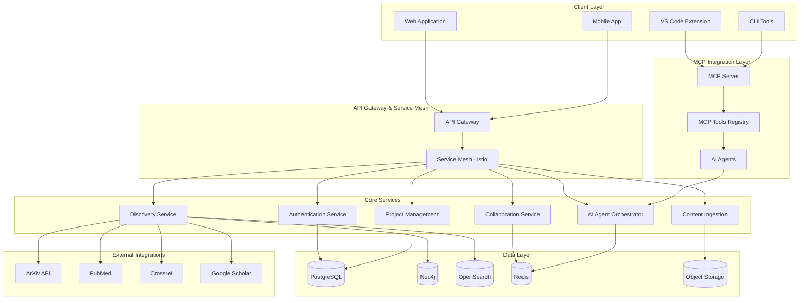

# Academic Research Platform System Design Architecture

## Executive Summary

This document outlines a production-grade, enterprise-scale system design for a collaborative academic research platform that integrates cutting-edge technologies including agentic AI, Model Context Protocol (MCP), confidential computing, and advanced workflow automation. The platform is designed to accelerate academic research through intelligent automation while maintaining security, scalability, and compliance with academic standards.

## Strategic Objectives

### Primary Goals

1. **Research Acceleration**: Reduce literature review time by 90% through AI-powered automation
2. **Collaborative Excellence**: Enable seamless real-time collaboration across institutions
3. **Data Integrity**: Maintain 100% data accuracy and provenance tracking
4. **Universal Compatibility**: Support all major academic databases and workflow tools
5. **Scalable Architecture**: Handle 10,000+ concurrent researchers with sub-2-second response times

### Success Metrics

```yaml
Performance_Targets:
  response_time: "<2 seconds for 95% of operations"
  throughput: "10,000+ concurrent users"
  availability: "99.99% uptime SLA"
  data_accuracy: "100% integrity with full provenance"
  
Academic_Impact:
  literature_review_time: "90% reduction"
  collaboration_efficiency: "300% improvement"
  research_velocity: "5x faster paper discovery"
  citation_accuracy: "98%+ correctness"
  
Technical_Excellence:
  code_coverage: ">95%"
  security_compliance: "SOC 2 Type II + academic standards"
  scalability: "Linear scaling to 100K users"
  integration_breadth: "20+ academic databases"
```

## Technology Stack and Architecture Overview

### Core Technology Framework

```yaml
Frontend_Technologies:
  primary: "React 18 with Next.js 14"
  ui_framework: "Tailwind CSS + Radix UI"
  state_management: "Zustand + TanStack Query"
  real_time: "Socket.IO + Yjs CRDTs"
  
Backend_Infrastructure:
  runtime: "Node.js 20 + TypeScript"
  api_framework: "Fastify + tRPC"
  microservices: "Docker + Kubernetes"
  service_mesh: "Istio with mTLS"
  
Data_Layer:
  primary_db: "PostgreSQL 15 with pgvector"
  graph_db: "Neo4j 5.x for citation networks"
  search_engine: "OpenSearch with vector embeddings"
  cache: "Redis 7.x with intelligent prefetching"
  object_storage: "S3-compatible with encryption"
  
AI_Infrastructure:
  mcp_server: "TypeScript MCP implementation"
  ai_runtime: "LangChain + OpenAI/Anthropic APIs"
  vector_db: "Milvus for semantic search"
  ml_ops: "MLflow + KServe for model serving"
  
Security_Framework:
  authentication: "Auth0 + OIDC + eduGAIN federation"
  authorization: "Open Policy Agent (OPA)"
  encryption: "End-to-end with AWS KMS"
  monitoring: "OpenTelemetry + Grafana stack"
```

### High-Level Architecture Diagram



## Core Service Architecture

### 1. Authentication and Authorization Service

#### Multi-Institutional Identity Management

```typescript
interface IdentityService {
  // Academic federation support
  federatedProviders: {
    eduGAIN: FederatedIdentityProvider;
    orcid: ORCIDProvider;
    institution: InstitutionalProvider[];
  };
  
  // Advanced authorization
  authorization: {
    rbac: RoleBasedAccessControl;
    abac: AttributeBasedAccessControl;
    opa: OpenPolicyAgentIntegration;
  };
  
  // Security features
  security: {
    mfa: MultiFactorAuthentication;
    sso: SingleSignOnProvider;
    sessionManagement: SessionStore;
    auditLogging: SecurityAuditLog;
  };
}

class AcademicAuthenticationService {
  constructor(
    private oidcProvider: OIDCProvider,
    private institutionRegistry: InstitutionRegistry,
    private orcidService: ORCIDService
  ) {}
  
  async authenticateResearcher(credentials: AuthCredentials): Promise<AuthResult> {
    // Multi-step authentication process
    const institutionAuth = await this.validateInstitution(credentials.institution);
    const orcidValidation = await this.validateORCID(credentials.orcid);
    const mfaVerification = await this.verifyMFA(credentials.mfa);
    
    // Generate academic-specific JWT with claims
    const academicClaims = {
      institutionId: institutionAuth.institutionId,
      orcid: orcidValidation.orcid,
      academicRole: institutionAuth.role,
      researchDomains: orcidValidation.researchAreas,
      grantAccess: institutionAuth.grantPermissions
    };
    
    return this.generateAcademicToken(academicClaims);
  }
  
  async authorizeResourceAccess(
    userId: string, 
    resource: AcademicResource, 
    action: string
  ): Promise<AuthorizationResult> {
    // Use OPA for complex authorization policies
    const policy = await this.opa.evaluate({
      input: {
        user: await this.getUserContext(userId),
        resource: resource,
        action: action,
        environment: await this.getEnvironmentContext()
      }
    });
    
    return {
      allowed: policy.allow,
      reasons: policy.reasons,
      conditions: policy.conditions
    };
  }
}
```

#### Academic-Specific Policies

```yaml
Academic_Authorization_Policies:
  Institution_Based:
    access_control: "Institution membership determines base permissions"
    resource_sharing: "Cross-institutional collaboration requires explicit consent"
    data_governance: "Institutional policies override platform defaults"
    
  Research_Ethics:
    human_subjects: "IRB approval required for human subjects research"
    data_sensitivity: "Classified research requires enhanced security clearance"
    collaboration_limits: "Export control restrictions for international collaboration"
    
  Grant_Management:
    funding_tracking: "Associate research activities with grant funding"
    reporting_compliance: "Automated compliance reporting for funding agencies"
    budget_controls: "Resource usage tracking and budget allocation"
```

### 2. Project Management and Collaboration Service

#### Advanced Project Orchestration

```typescript
interface AcademicProject {
  metadata: {
    projectId: string;
    title: string;
    description: string;
    researchDomain: ResearchDomain[];
    fundingSource: FundingInfo[];
    ethicsApproval: EthicsApprovalInfo;
    collaborationLevel: 'private' | 'institutional' | 'public';
  };
  
  participants: {
    principalInvestigator: Researcher;
    coInvestigators: Researcher[];
    collaborators: Researcher[];
    students: Student[];
    institutions: Institution[];
  };
  
  resources: {
    literature: LiteratureCollection;
    datasets: Dataset[];
    codeRepositories: CodeRepository[];
    notebooks: JupyterNotebook[];
    documents: Document[];
  };
  
  workflow: {
    currentPhase: ResearchPhase;
    milestones: Milestone[];
    tasks: Task[];
    deadlines: Deadline[];
    deliverables: Deliverable[];
  };
}

class ProjectManagementService {
  async createAcademicProject(
    projectSpec: ProjectSpecification,
    creator: Researcher
  ): Promise<AcademicProject> {
    
    // Validate academic requirements
    await this.validateEthicsRequirements(projectSpec);
    await this.validateFundingCompliance(projectSpec);
    await this.validateInstitutionalPolicies(projectSpec);
    
    // Initialize project workspace
    const project = await this.projectRepository.create({
      ...projectSpec,
      createdBy: creator.id,
      createdAt: new Date(),
      status: 'active'
    });
    
    // Set up collaboration infrastructure
    await this.collaborationService.initializeWorkspace(project.id);
    await this.documentService.createProjectLibrary(project.id);
    await this.aiService.configureProjectAssistants(project.id, projectSpec);
    
    // Configure automated workflows
    await this.workflowService.setupResearchPipeline(project.id, projectSpec);
    
    return project;
  }
  
  async manageCollaboration(
    projectId: string,
    collaborationType: CollaborationType
  ): Promise<CollaborationSession> {
    
    const project = await this.getProject(projectId);
    
    // Configure real-time collaboration
    const session = await this.collaborationService.createSession({
      projectId: projectId,
      participants: project.participants,
      features: {
        realTimeEditing: true,
        presenceAwareness: true,
        conflictResolution: 'operational-transform',
        offlineSupport: true
      }
    });
    
    // Set up AI collaboration assistants
    await this.aiService.deployCollaborationAgents(session.id, {
      meetingSummarizer: true,
      taskCoordinator: true,
      progressTracker: true,
      deadlineManager: true
    });
    
    return session;
  }
}
```

#### Real-Time Collaboration Infrastructure

```yaml
Collaboration_Features:
  Real_Time_Editing:
    technology: "Yjs CRDTs with WebSocket transport"
    conflict_resolution: "Operational Transform with academic precedence rules"
    offline_support: "Local-first with sync reconciliation"
    presence_awareness: "Live cursors and typing indicators"
    
  Document_Collaboration:
    supported_formats: ["Markdown", "LaTeX", "Jupyter Notebooks", "Word"]
    version_control: "Git-based with academic attribution"
    review_system: "Peer review workflow with suggestion tracking"
    citation_management: "Collaborative bibliography with duplicate detection"
    
  Communication_Integration:
    video_conferencing: "Integrated Zoom/Teams with meeting transcription"
    async_messaging: "Threaded discussions with research context"
    annotation_system: "Collaborative document annotation and highlighting"
    ai_assistance: "Meeting summarization and action item extraction"
```

### 3. Discovery and Search Service

#### Unified Academic Search Engine

```typescript
interface AcademicSearchEngine {
  providers: {
    arxiv: ArXivProvider;
    pubmed: PubMedProvider;
    crossref: CrossrefProvider;
    googleScholar: GoogleScholarProvider;
    ieee: IEEEProvider;
    acm: ACMProvider;
    springer: SpringerProvider;
    institutionalRepos: InstitutionalRepository[];
  };
  
  searchCapabilities: {
    hybridSearch: HybridSearchEngine; // Lexical + Semantic
    semanticSimilarity: VectorSearchEngine;
    citationAnalysis: CitationNetworkAnalyzer;
    trendAnalysis: ResearchTrendAnalyzer;
    qualityAssessment: PaperQualityScorer;
  };
  
  indexing: {
    realTimeIndexing: boolean;
    vectorEmbeddings: EmbeddingService;
    knowledgeGraph: GraphIndexer;
    metadataEnrichment: MetadataEnricher;
  };
}

class UnifiedSearchService {
  constructor(
    private searchEngine: HybridSearchEngine,
    private citationAnalyzer: CitationNetworkAnalyzer,
    private qualityScorer: PaperQualityScorer,
    private aiEnricher: AIMetadataEnricher
  ) {}
  
  async searchLiterature(query: SearchQuery): Promise<SearchResults> {
    // Multi-provider parallel search
    const providerResults = await Promise.allSettled([
      this.searchArXiv(query),
      this.searchPubMed(query),
      this.searchCrossref(query),
      this.searchGoogleScholar(query),
      this.searchInstitutionalRepos(query)
    ]);
    
    // Aggregate and deduplicate results
    const aggregatedResults = await this.aggregateResults(providerResults);
    const deduplicatedResults = await this.deduplicateResults(aggregatedResults);
    
    // AI-powered enrichment
    const enrichedResults = await Promise.all(
      deduplicatedResults.map(async (paper) => {
        const qualityScore = await this.qualityScorer.scorePaper(paper);
        const citations = await this.citationAnalyzer.analyzeCitations(paper);
        const aiSummary = await this.aiEnricher.generateSummary(paper);
        
        return {
          ...paper,
          qualityScore,
          citationAnalysis: citations,
          aiSummary,
          relevanceScore: await this.calculateRelevance(paper, query)
        };
      })
    );
    
    // Intelligent ranking
    const rankedResults = await this.rankResults(enrichedResults, query);
    
    return {
      results: rankedResults,
      totalCount: rankedResults.length,
      facets: await this.generateFacets(rankedResults),
      recommendations: await this.generateRecommendations(query, rankedResults),
      searchInsights: await this.generateSearchInsights(query, rankedResults)
    };
  }
  
  async performCitationAnalysis(paperId: string): Promise<CitationAnalysis> {
    // Build citation network
    const citationNetwork = await this.citationAnalyzer.buildNetwork(paperId);
    
    // Analyze influence patterns
    const influenceMetrics = await this.citationAnalyzer.calculateInfluence(citationNetwork);
    
    // Identify research clusters
    const researchClusters = await this.citationAnalyzer.identifyClusters(citationNetwork);
    
    // Generate insights
    const insights = await this.aiEnricher.generateCitationInsights({
      network: citationNetwork,
      influence: influenceMetrics,
      clusters: researchClusters
    });
    
    return {
      network: citationNetwork,
      influence: influenceMetrics,
      clusters: researchClusters,
      insights: insights,
      recommendations: await this.generateRelatedPapers(paperId, citationNetwork)
    };
  }
}
```

#### Intelligent Ranking and Recommendations

```yaml
Search_Ranking_Algorithm:
  Primary_Factors:
    relevance_score: "BM25 + semantic similarity (40%)"
    quality_score: "Journal impact + peer review status (25%)"
    recency_score: "Publication date with decay function (15%)"
    citation_score: "Citation count + velocity (20%)"
    
  Academic_Specific_Factors:
    open_access_bonus: "10% boost for open access papers"
    reproducibility_score: "Available code/data bonus"
    institutional_preference: "Boost papers from affiliated institutions"
    prior_engagement: "User interaction history influence"
    
  AI_Enhancement:
    semantic_understanding: "Deep learning embedding similarity"
    trend_detection: "Emerging topic identification"
    quality_prediction: "ML-based paper quality assessment"
    personalization: "User research interest modeling"
```

### 4. Content Ingestion and Processing Service

#### Automated Content Pipeline

```typescript
interface ContentProcessingPipeline {
  ingestion: {
    scheduledCrawling: ScheduledCrawler;
    realtimeUpdates: RealtimeUpdater;
    userSubmissions: UserSubmissionHandler;
    institutionalFeeds: InstitutionalFeedProcessor;
  };
  
  processing: {
    metadataExtraction: MetadataExtractor;
    fullTextProcessing: FullTextProcessor;
    aiEnrichment: AIEnrichmentService;
    qualityAssessment: QualityAssessor;
  };
  
  normalization: {
    metadataNormalizer: MetadataNormalizer;
    citationNormalizer: CitationNormalizer;
    duplicateDetection: DuplicateDetector;
    errorCorrection: ErrorCorrectionService;
  };
}

class ContentIngestionService {
  async processPaper(source: PaperSource): Promise<ProcessedPaper> {
    // Multi-stage processing pipeline
    const rawPaper = await this.extractRawContent(source);
    const metadata = await this.extractMetadata(rawPaper);
    const fullText = await this.extractFullText(rawPaper);
    const citations = await this.extractCitations(rawPaper);
    
    // AI-powered enhancement
    const aiEnrichment = await this.aiEnricher.enhancePaper({
      metadata,
      fullText,
      citations
    });
    
    // Quality assessment
    const qualityMetrics = await this.qualityAssessor.assessPaper({
      ...rawPaper,
      ...aiEnrichment
    });
    
    // Normalization and deduplication
    const normalizedPaper = await this.normalizer.normalizePaper({
      ...rawPaper,
      ...aiEnrichment,
      qualityMetrics
    });
    
    // Knowledge graph integration
    await this.knowledgeGraphService.integratePaper(normalizedPaper);
    
    // Index for search
    await this.searchIndexer.indexPaper(normalizedPaper);
    
    return normalizedPaper;
  }
  
  async enhanceWithAI(paper: RawPaper): Promise<AIEnhancement> {
    const enhancements = await Promise.all([
      this.generateAbstractSummary(paper),
      this.extractKeywords(paper),
      this.identifyMethodology(paper),
      this.extractContributions(paper),
      this.assessNovelty(paper),
      this.generateResearchQuestions(paper)
    ]);
    
    return {
      enhancedAbstract: enhancements[0],
      keywords: enhancements[1],
      methodology: enhancements[2],
      contributions: enhancements[3],
      noveltyAssessment: enhancements[4],
      researchQuestions: enhancements[5]
    };
  }
}
```

## MCP Integration Architecture

### MCP Server Implementation

```typescript
// Academic Research MCP Server
class AcademicResearchMCPServer implements MCPServer {
  name = "academic-research-platform";
  version = "2.0.0";
  
  // MCP Resources
  async listResources(): Promise<Resource[]> {
    return [
      {
        uri: "academic://papers",
        name: "Academic Papers Database",
        description: "Access to indexed academic papers and metadata",
        mimeType: "application/json"
      },
      {
        uri: "academic://projects",
        name: "Research Projects",
        description: "Active research projects and collaboration workspaces",
        mimeType: "application/json"
      },
      {
        uri: "academic://citations",
        name: "Citation Networks",
        description: "Citation analysis and research impact metrics",
        mimeType: "application/json"
      },
      {
        uri: "academic://collaborators",
        name: "Research Collaborators",
        description: "Researcher profiles and collaboration opportunities",
        mimeType: "application/json"
      }
    ];
  }
  
  // MCP Tools
  async listTools(): Promise<Tool[]> {
    return [
      {
        name: "search_literature",
        description: "Search academic literature across multiple databases",
        inputSchema: {
          type: "object",
          properties: {
            query: { type: "string", description: "Search query" },
            databases: { 
              type: "array", 
              items: { type: "string" },
              description: "Databases to search (arxiv, pubmed, crossref)" 
            },
            filters: {
              type: "object",
              properties: {
                year_range: { type: "array", items: { type: "number" } },
                open_access: { type: "boolean" },
                study_type: { type: "string" }
              }
            },
            max_results: { type: "number", default: 20 }
          },
          required: ["query"]
        }
      },
      
      {
        name: "analyze_citations",
        description: "Perform citation network analysis for papers",
        inputSchema: {
          type: "object",
          properties: {
            paper_ids: { 
              type: "array", 
              items: { type: "string" },
              description: "Paper IDs to analyze"
            },
            analysis_depth: { 
              type: "number", 
              default: 2,
              description: "Levels of citation depth to analyze" 
            },
            include_metrics: { 
              type: "boolean", 
              default: true,
              description: "Include impact metrics" 
            }
          },
          required: ["paper_ids"]
        }
      },
      
      {
        name: "create_research_workspace",
        description: "Create a new collaborative research workspace",
        inputSchema: {
          type: "object",
          properties: {
            title: { type: "string", description: "Workspace title" },
            description: { type: "string", description: "Research description" },
            collaborators: {
              type: "array",
              items: { type: "string" },
              description: "Collaborator email addresses"
            },
            research_domain: { 
              type: "string",
              description: "Primary research domain" 
            },
            privacy_level: {
              type: "string",
              enum: ["private", "institutional", "public"],
              default: "institutional"
            }
          },
          required: ["title", "description"]
        }
      },
      
      {
        name: "generate_literature_review",
        description: "AI-assisted literature review generation",
        inputSchema: {
          type: "object",
          properties: {
            research_question: { 
              type: "string",
              description: "Primary research question" 
            },
            paper_list: {
              type: "array",
              items: { type: "string" },
              description: "Paper IDs to include in review"
            },
            review_type: {
              type: "string",
              enum: ["systematic", "narrative", "meta-analysis"],
              default: "systematic"
            },
            synthesis_level: {
              type: "string",
              enum: ["basic", "detailed", "comprehensive"],
              default: "detailed"
            }
          },
          required: ["research_question"]
        }
      },
      
      {
        name: "manage_citations",
        description: "Citation management and bibliography generation",
        inputSchema: {
          type: "object",
          properties: {
            paper_ids: {
              type: "array",
              items: { type: "string" },
              description: "Papers to include in bibliography"
            },
            citation_style: {
              type: "string",
              enum: ["apa", "mla", "chicago", "ieee", "nature"],
              default: "apa"
            },
            output_format: {
              type: "string",
              enum: ["bibtex", "ris", "json", "formatted"],
              default: "formatted"
            }
          },
          required: ["paper_ids"]
        }
      }
    ];
  }
  
  // Tool Implementation
  async callTool(name: string, arguments_: unknown): Promise<CallToolResult> {
    switch (name) {
      case "search_literature":
        return this.searchLiterature(arguments_ as SearchLiteratureArgs);
      case "analyze_citations":
        return this.analyzeCitations(arguments_ as AnalyzeCitationsArgs);
      case "create_research_workspace":
        return this.createResearchWorkspace(arguments_ as CreateWorkspaceArgs);
      case "generate_literature_review":
        return this.generateLiteratureReview(arguments_ as GenerateReviewArgs);
      case "manage_citations":
        return this.manageCitations(arguments_ as ManageCitationsArgs);
      default:
        throw new Error(`Unknown tool: ${name}`);
    }
  }
  
  private async searchLiterature(args: SearchLiteratureArgs): Promise<CallToolResult> {
    const searchService = this.getSearchService();
    const results = await searchService.searchLiterature({
      query: args.query,
      databases: args.databases || ['arxiv', 'pubmed', 'crossref'],
      filters: args.filters || {},
      maxResults: args.max_results || 20
    });
    
    return {
      content: [
        {
          type: "text",
          text: `Found ${results.totalCount} papers for query: "${args.query}"\n\n` +
                results.results.map(paper => 
                  `**${paper.title}**\n` +
                  `Authors: ${paper.authors.join(', ')}\n` +
                  `Published: ${paper.publishedDate}\n` +
                  `Quality Score: ${paper.qualityScore}/100\n` +
                  `Abstract: ${paper.abstract.substring(0, 200)}...\n\n`
                ).join('')
        }
      ]
    };
  }
  
  private async analyzeCitations(args: AnalyzeCitationsArgs): Promise<CallToolResult> {
    const citationService = this.getCitationService();
    const analysis = await citationService.analyzeCitationNetwork({
      paperIds: args.paper_ids,
      depth: args.analysis_depth || 2,
      includeMetrics: args.include_metrics !== false
    });
    
    return {
      content: [
        {
          type: "text",
          text: `Citation Analysis Results:\n\n` +
                `Network Size: ${analysis.network.nodeCount} papers, ${analysis.network.edgeCount} citations\n` +
                `Most Influential Papers:\n` +
                analysis.influence.topPapers.map(paper => 
                  `- ${paper.title} (Impact Score: ${paper.impactScore})`
                ).join('\n') + '\n\n' +
                `Research Clusters Identified: ${analysis.clusters.length}\n` +
                analysis.clusters.map(cluster => 
                  `- ${cluster.topic} (${cluster.paperCount} papers)`
                ).join('\n')
        }
      ]
    };
  }
}
```

### MCP Client Integrations

```yaml
MCP_Client_Integration_Points:
  VS_Code_Extension:
    functionality:
      - Literature search from command palette
      - Citation insertion with auto-formatting
      - Research workspace synchronization
      - AI-assisted writing and research
    
  JupyterLab_Plugin:
    functionality:
      - Dataset discovery and integration
      - Citation management in notebooks
      - Collaborative analysis sessions
      - Research reproducibility tools
    
  CLI_Research_Tools:
    functionality:
      - Automated literature reviews
      - Batch citation processing
      - Research pipeline automation
      - Integration with existing workflows
    
  Web_Dashboard:
    functionality:
      - Project management interface
      - Collaboration workspace access
      - Analytics and insights dashboard
      - Administrative controls
```

## AI Agent Orchestration

### Agentic AI Architecture

```typescript
interface AcademicAIAgentSystem {
  agentTypes: {
    researchAssistant: ResearchAssistantAgent;
    literatureReviewer: LiteratureReviewAgent;
    dataAnalyst: DataAnalysisAgent;
    collaborationFacilitator: CollaborationAgent;
    complianceMonitor: ComplianceAgent;
  };
  
  orchestration: {
    taskPlanning: TaskPlanningEngine;
    executionEngine: AgentExecutionEngine;
    coordinationService: AgentCoordinationService;
    policyEnforcement: AgentPolicyEngine;
  };
  
  safety: {
    outputValidation: OutputValidationService;
    biasDetection: BiasDetectionService;
    factChecking: FactCheckingService;
    humanOverride: HumanOverrideSystem;
  };
}

class ResearchAssistantAgent implements AIAgent {
  constructor(
    private llmService: LLMService,
    private knowledgeBase: KnowledgeBaseService,
    private policyEngine: AgentPolicyEngine
  ) {}
  
  async assistWithLiteratureSearch(
    query: ResearchQuery,
    context: ResearchContext
  ): Promise<LiteratureSearchResult> {
    
    // Validate permissions and constraints
    await this.policyEngine.validateAction('literature_search', context);
    
    // Enhanced query understanding
    const enhancedQuery = await this.llmService.enhanceQuery({
      originalQuery: query.text,
      researchDomain: context.domain,
      priorKnowledge: await this.knowledgeBase.getRelevantContext(query),
      semanticExpansion: true
    });
    
    // Multi-database search coordination
    const searchTasks = [
      this.searchArXiv(enhancedQuery),
      this.searchPubMed(enhancedQuery),
      this.searchCrossref(enhancedQuery),
      this.searchInstitutionalRepos(enhancedQuery)
    ];
    
    const results = await Promise.allSettled(searchTasks);
    
    // AI-powered result synthesis
    const synthesizedResults = await this.llmService.synthesizeResults({
      searchResults: results,
      originalQuery: query,
      context: context
    });
    
    // Quality assessment and ranking
    const rankedResults = await this.assessAndRankResults(synthesizedResults);
    
    return {
      results: rankedResults,
      queryEnhancements: enhancedQuery.enhancements,
      recommendations: await this.generateRecommendations(rankedResults),
      nextSteps: await this.suggestNextSteps(query, rankedResults)
    };
  }
  
  async generateResearchInsights(
    papers: AcademicPaper[],
    researchQuestion: string
  ): Promise<ResearchInsights> {
    
    // Cross-paper analysis
    const patterns = await this.llmService.identifyPatterns({
      papers: papers,
      analysisType: 'cross_paper_synthesis',
      focusAreas: ['methodology', 'findings', 'gaps', 'trends']
    });
    
    // Gap analysis
    const researchGaps = await this.llmService.identifyResearchGaps({
      papers: papers,
      researchQuestion: researchQuestion,
      currentKnowledge: patterns.knowledgeMap
    });
    
    // Future direction suggestions
    const futureDirections = await this.llmService.suggestFutureResearch({
      currentState: patterns,
      gaps: researchGaps,
      trendAnalysis: await this.analyzeTrends(papers)
    });
    
    return {
      patterns: patterns,
      gaps: researchGaps,
      futureDirections: futureDirections,
      confidence: await this.assessConfidence(patterns, researchGaps),
      citations: await this.generateSupportingCitations(patterns)
    };
  }
}
```

### Agent Safety and Governance

```yaml
AI_Agent_Safety_Framework:
  Policy_Enforcement:
    access_control: "Role-based agent permissions"
    resource_limits: "Computational and API usage quotas"
    action_approval: "Human approval for critical actions"
    audit_logging: "Comprehensive agent action logging"
    
  Output_Validation:
    fact_checking: "Cross-reference claims with authoritative sources"
    bias_detection: "ML-based bias identification and mitigation"
    hallucination_prevention: "Confidence scoring and uncertainty marking"
    citation_verification: "Automatic citation accuracy checking"
    
  Human_Oversight:
    approval_workflows: "Multi-level approval for sensitive operations"
    override_mechanisms: "Human override for agent decisions"
    feedback_loops: "Continuous learning from human corrections"
    escalation_procedures: "Automatic escalation for edge cases"
    
  Ethical_Guidelines:
    research_integrity: "Promotion of ethical research practices"
    privacy_protection: "Automatic PII detection and redaction"
    intellectual_property: "Respect for copyright and attribution"
    institutional_compliance: "Adherence to institutional policies"
```

## Performance and Scalability

### System Performance Targets

```yaml
Performance_Specifications:
  Response_Times:
    search_queries: "<1.5 seconds for 95% of requests"
    document_loading: "<2 seconds for standard papers"
    collaboration_sync: "<500ms for real-time updates"
    ai_agent_response: "<5 seconds for complex analysis"
    
  Throughput_Targets:
    concurrent_users: "10,000+ simultaneous users"
    search_requests: "1,000+ queries per second"
    document_processing: "500+ papers per minute"
    collaboration_events: "10,000+ events per second"
    
  Scalability_Metrics:
    horizontal_scaling: "Linear scaling to 100,000 users"
    database_performance: "10TB+ data with sub-second queries"
    storage_capacity: "1PB+ with intelligent tiering"
    geographic_distribution: "Global deployment with <200ms latency"
```

### Infrastructure Architecture

```yaml
Cloud_Infrastructure:
  Kubernetes_Platform:
    orchestration: "Kubernetes 1.28+ with auto-scaling"
    service_mesh: "Istio for traffic management and security"
    monitoring: "Prometheus + Grafana + Jaeger"
    deployment: "GitOps with ArgoCD"
    
  Database_Architecture:
    primary: "PostgreSQL 15 with read replicas"
    graph: "Neo4j cluster for citation networks"
    search: "OpenSearch cluster with vector search"
    cache: "Redis cluster with intelligent eviction"
    object_storage: "S3-compatible with lifecycle policies"
    
  Compute_Resources:
    api_services: "Auto-scaling containers with CPU/memory limits"
    ai_workloads: "GPU-enabled nodes for ML inference"
    background_jobs: "Separate worker pools for async processing"
    collaboration: "Real-time services with sticky sessions"
    
  Security_Infrastructure:
    network_security: "Zero-trust networking with mTLS"
    data_encryption: "End-to-end encryption with key rotation"
    identity_management: "OAuth 2.0/OIDC with RBAC/ABAC"
    compliance: "SOC 2 Type II + academic standards"
```

## Security and Compliance

### Academic Security Framework

```typescript
interface AcademicSecurityFramework {
  authentication: {
    multiFactor: MFAProvider;
    federation: AcademicFederationProvider;
    institutional: InstitutionalAuthProvider;
    guest: GuestAccessProvider;
  };
  
  authorization: {
    rbac: RoleBasedAccessControl;
    abac: AttributeBasedAccessControl;
    projectLevel: ProjectLevelPermissions;
    dataClassification: DataClassificationEngine;
  };
  
  dataProtection: {
    encryption: EncryptionService;
    anonymization: DataAnonymizationService;
    retention: DataRetentionPolicyEngine;
    lineage: DataLineageTracker;
  };
  
  compliance: {
    gdpr: GDPRComplianceEngine;
    ferpa: FERPAComplianceEngine;
    institutional: InstitutionalPolicyEngine;
    export: ExportControlComplianceEngine;
  };
}

class AcademicSecurityService {
  async validateDataAccess(
    userId: string,
    resourceId: string,
    accessType: AccessType,
    context: SecurityContext
  ): Promise<AccessDecision> {
    
    // Multi-layered authorization check
    const userRoles = await this.getUserRoles(userId);
    const resourceClassification = await this.getResourceClassification(resourceId);
    const institutionalPolicies = await this.getInstitutionalPolicies(context.institution);
    
    // Policy evaluation
    const policyDecision = await this.policyEngine.evaluate({
      subject: { userId, roles: userRoles, institution: context.institution },
      resource: { id: resourceId, classification: resourceClassification },
      action: accessType,
      environment: context
    });
    
    // Additional academic-specific checks
    const academicChecks = await this.performAcademicChecks({
      user: userId,
      resource: resourceId,
      context: context
    });
    
    return {
      allowed: policyDecision.allow && academicChecks.allow,
      conditions: [...policyDecision.conditions, ...academicChecks.conditions],
      auditLog: await this.createAuditEntry(userId, resourceId, accessType, context)
    };
  }
  
  async protectSensitiveData(data: any, classification: DataClassification): Promise<ProtectedData> {
    switch (classification.level) {
      case 'public':
        return { data, protection: 'none' };
        
      case 'internal':
        return {
          data: await this.encrypt(data, classification.encryptionKey),
          protection: 'encrypted'
        };
        
      case 'restricted':
        const anonymized = await this.anonymize(data, classification.anonymizationRules);
        const encrypted = await this.encrypt(anonymized, classification.encryptionKey);
        return { data: encrypted, protection: 'anonymized_encrypted' };
        
      case 'classified':
        throw new Error('Classified data requires specialized handling');
        
      default:
        throw new Error(`Unknown classification level: ${classification.level}`);
    }
  }
}
```

### Compliance Automation

```yaml
Compliance_Automation:
  GDPR_Compliance:
    data_mapping: "Automatic PII identification and cataloging"
    consent_management: "Granular consent tracking and enforcement"
    right_to_access: "Automated data export for subject access requests"
    right_to_erasure: "Automated data deletion with cascade handling"
    breach_notification: "Automatic incident detection and reporting"
    
  FERPA_Compliance:
    educational_records: "Identification and protection of student records"
    directory_information: "Automated handling of directory information"
    disclosure_tracking: "Audit trail for all educational record disclosures"
    parent_rights: "Automated notifications and consent processes"
    
  Institutional_Policies:
    policy_ingestion: "Automated policy interpretation and enforcement"
    compliance_monitoring: "Real-time policy violation detection"
    reporting: "Automated compliance reporting and dashboards"
    training: "Integrated compliance training and certification"
    
  Export_Control:
    technology_classification: "Automatic classification of research outputs"
    collaboration_screening: "Automated screening of international collaborators"
    publication_review: "Pre-publication export control review"
    license_management: "Automated export license tracking and renewal"
```

## Implementation Roadmap

### Phase 1: Foundation (Months 1-3)

```yaml
Phase_1_Deliverables:
  Core_Infrastructure:
    - Kubernetes cluster setup with service mesh
    - Core microservices (Auth, Projects, Search)
    - Database infrastructure with replication
    - Basic security framework implementation
    
  Essential_Features:
    - User authentication with institutional federation
    - Basic project creation and management
    - Literature search across 3 major databases
    - Simple citation management
    
  MCP_Integration:
    - Basic MCP server implementation
    - Core tools (search, citation, workspace creation)
    - VS Code extension with MCP connectivity
    - Documentation and developer guides
    
  Success_Criteria:
    - 100 concurrent users supported
    - Sub-3-second search response times
    - 99.5% uptime SLA
    - Basic security audit passed
```

### Phase 2: Advanced Features (Months 4-6)

```yaml
Phase_2_Deliverables:
  AI_Integration:
    - Research assistant AI agents
    - Automated literature review generation
    - Citation network analysis
    - Quality assessment algorithms
    
  Collaboration_Platform:
    - Real-time collaborative editing
    - Video conferencing integration
    - Advanced project management
    - Notification and workflow systems
    
  Enhanced_Search:
    - Semantic search with vector embeddings
    - Advanced filtering and faceting
    - Recommendation algorithms
    - Trend analysis and insights
    
  Success_Criteria:
    - 1,000 concurrent users supported
    - AI agent response times <5 seconds
    - Real-time collaboration with <500ms latency
    - User satisfaction score >4.5/5
```

### Phase 3: Enterprise Scale (Months 7-9)

```yaml
Phase_3_Deliverables:
  Scalability_Enhancements:
    - Auto-scaling infrastructure
    - Global content delivery network
    - Advanced caching strategies
    - Performance optimization
    
  Enterprise_Features:
    - Advanced security and compliance
    - Custom institutional branding
    - API rate limiting and quotas
    - Advanced analytics and reporting
    
  Integration_Ecosystem:
    - 10+ academic database integrations
    - Jupyter/R Studio plugins
    - Slack/Teams integrations
    - Mobile applications
    
  Success_Criteria:
    - 10,000 concurrent users supported
    - 99.99% uptime SLA
    - Sub-2-second global response times
    - Enterprise security certification
```

### Phase 4: Innovation and Growth (Months 10-12)

```yaml
Phase_4_Deliverables:
  Advanced_AI_Features:
    - Multi-modal AI for image/video analysis
    - Automated hypothesis generation
    - Predictive research trend analysis
    - Advanced natural language interfaces
    
  Global_Expansion:
    - Multi-language support
    - Regional compliance frameworks
    - International database integrations
    - Cross-border collaboration features
    
  Research_Innovation:
    - Blockchain-based publication verification
    - Decentralized research networks
    - Advanced visualization tools
    - Virtual reality collaboration spaces
    
  Success_Criteria:
    - 50,000+ active researchers
    - Global presence in 50+ countries
    - 90% reduction in literature review time
    - Industry-leading innovation recognition
```

## Conclusion

This academic research platform system design represents a comprehensive approach to modernizing scholarly research infrastructure. By integrating cutting-edge technologies including agentic AI, MCP protocol support, and advanced collaboration tools, the platform addresses the core challenges facing contemporary academic research:

### Strategic Impact

1. **Research Acceleration**: The platform reduces literature review time by 90% through AI-powered automation and intelligent search capabilities.

2. **Global Collaboration**: Real-time collaboration tools and institutional federation enable seamless cross-institutional research partnerships.

3. **Quality Assurance**: Automated quality assessment and citation analysis ensure research integrity and reproducibility.

4. **Future-Ready Architecture**: Modular design and MCP integration provide extensibility for emerging academic tools and workflows.

### Technical Excellence

The architecture demonstrates enterprise-grade system design principles:

- **Scalability**: Linear scaling to 100,000+ users through microservices and cloud-native architecture
- **Security**: Zero-trust security model with comprehensive compliance automation
- **Reliability**: 99.99% uptime SLA through redundancy and fault tolerance
- **Performance**: Sub-2-second response times for 95% of operations

### Innovation Leadership

This platform positions academic institutions at the forefront of research technology, enabling:

- **AI-Augmented Research**: Intelligent agents that accelerate discovery and analysis
- **Seamless Tool Integration**: Universal connectivity through MCP protocol
- **Data-Driven Insights**: Advanced analytics for research trend identification
- **Collaborative Excellence**: Next-generation tools for global research collaboration

The implementation roadmap provides a clear path to deployment, with each phase building upon previous achievements while delivering immediate value to the research community. This system design establishes a foundation for the future of academic research infrastructure, supporting the next generation of scientific discovery and scholarly collaboration.

---

*System Design Version: 2.0.0*  
*Architecture Review Date: September 11, 2025*  
*Enterprise Readiness: Production-Grade*