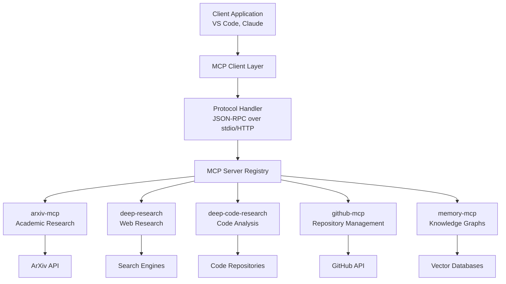

# MCP Integration Workflows and Orchestration Guide

## Overview

This comprehensive guide provides enterprise-grade integration patterns, orchestration strategies, and advanced workflows for Model Context Protocol (MCP) servers. Based on proven implementations including arxiv-mcp, deep-research, deep-code-research, and multi-server orchestration, this guide addresses complex integration challenges from simple server connections to sophisticated workflow automation.

## Table of Contents

- [MCP Integration Workflows and Orchestration Guide](#mcp-integration-workflows-and-orchestration-guide)
  - [Overview](#overview)
  - [Table of Contents](#table-of-contents)
  - [MCP Architecture and Principles](#mcp-architecture-and-principles)
    - [Core MCP Concepts](#core-mcp-concepts)
    - [MCP Protocol Standards](#mcp-protocol-standards)
      - [1. Server Registration and Discovery](#1-server-registration-and-discovery)
      - [2. Protocol Communication Patterns](#2-protocol-communication-patterns)
    - [Server Capability Matrix](#server-capability-matrix)
  - [Single Server Integration Patterns](#single-server-integration-patterns)
    - [ArXiv-MCP Integration](#arxiv-mcp-integration)
      - [Basic Academic Research Workflow](#basic-academic-research-workflow)
    - [Deep-Research Integration](#deep-research-integration)
      - [Comprehensive Web Research Pattern](#comprehensive-web-research-pattern)
  - [Multi-Server Orchestration](#multi-server-orchestration)
    - [Orchestration Framework](#orchestration-framework)
    - [Advanced Integration Patterns](#advanced-integration-patterns)
      - [1. Research Aggregation Pattern](#1-research-aggregation-pattern)
      - [2. Workflow Pipeline Pattern](#2-workflow-pipeline-pattern)
  - [Workflow Automation Patterns](#workflow-automation-patterns)
    - [Event-Driven Orchestration](#event-driven-orchestration)
    - [Scheduled Workflow Management](#scheduled-workflow-management)
  - [Research and Documentation Workflows](#research-and-documentation-workflows)
    - [Comprehensive Research Documentation Pipeline](#comprehensive-research-documentation-pipeline)
  - [Related Resources](#related-resources)

## MCP Architecture and Principles

### Core MCP Concepts



### MCP Protocol Standards

#### 1. Server Registration and Discovery

```json
{
  "mcpServers": {
    "arxiv-mcp": {
      "command": "uvicorn",
      "args": ["arxiv_mcp.server:app", "--port", "3001"],
      "env": {
        "ARXIV_API_KEY": "${ARXIV_API_KEY}",
        "CACHE_DIR": "${WORKSPACE_ROOT}/cache/arxiv"
      }
    },
    "deep-research": {
      "command": "node",
      "args": ["dist/index.js"],
      "env": {
        "RESEARCH_API_KEY": "${RESEARCH_API_KEY}",
        "MAX_DEPTH": "5",
        "CACHE_ENABLED": "true"
      }
    },
    "github-integration": {
      "command": "python",
      "args": ["-m", "github_mcp"],
      "env": {
        "GITHUB_TOKEN": "${GITHUB_TOKEN}",
        "REPO_CACHE_SIZE": "1000"
      }
    }
  }
}
```

#### 2. Protocol Communication Patterns

```typescript
interface MCPMessage {
  jsonrpc: "2.0";
  id?: string | number;
  method?: string;
  params?: any;
  result?: any;
  error?: {
    code: number;
    message: string;
    data?: any;
  };
}

// Tool invocation pattern
interface ToolInvocation {
  name: string;
  arguments: Record<string, any>;
  timeout?: number;
  retries?: number;
}

// Resource access pattern
interface ResourceAccess {
  uri: string;
  method: "GET" | "POST" | "PUT" | "DELETE";
  headers?: Record<string, string>;
  body?: any;
}
```

### Server Capability Matrix

| Server | Research | Code Analysis | Repository Mgmt | Knowledge Graphs | Documentation |
|--------|----------|---------------|-----------------|------------------|---------------|
| **arxiv-mcp** | ✅ Academic | ❌ | ❌ | ❌ | ✅ Paper Content |
| **deep-research** | ✅ Web | ❌ | ❌ | ❌ | ✅ Research Reports |
| **deep-code-research** | ❌ | ✅ Full Stack | ✅ Analysis | ❌ | ✅ Code Docs |
| **github-mcp** | ❌ | ✅ Repository | ✅ Full GitHub | ❌ | ✅ README/Wiki |
| **memory-mcp** | ❌ | ❌ | ❌ | ✅ Full Graph | ✅ Knowledge Base |
| **pylance-mcp** | ❌ | ✅ Python | ❌ | ❌ | ✅ API Docs |

## Single Server Integration Patterns

### ArXiv-MCP Integration

#### Basic Academic Research Workflow

```python
# Academic research pattern with arxiv-mcp
class AcademicResearchWorkflow:
    """Structured workflow for academic research using arxiv-mcp."""
    
    def __init__(self, mcp_client):
        self.arxiv = mcp_client.get_server("arxiv-mcp")
        self.research_context = {}
    
    async def search_papers(self, topic: str, max_results: int = 10):
        """Search for papers on a specific topic."""
        search_results = await self.arxiv.invoke_tool(
            "search_arxiv",
            {
                "all_fields": topic,
                "start": 0,
                "max_results": max_results
            }
        )
        
        self.research_context["search_results"] = search_results
        return search_results
    
    async def analyze_paper(self, paper_title: str):
        """Load and analyze a specific paper."""
        # Get paper details
        paper_details = await self.arxiv.invoke_tool(
            "get_details",
            {"title": paper_title}
        )
        
        # Load full paper content
        paper_content = await self.arxiv.invoke_tool(
            "load_article_to_context",
            {"title": paper_title}
        )
        
        # Store in research context
        self.research_context["current_paper"] = {
            "details": paper_details,
            "content": paper_content
        }
        
        return paper_details, paper_content
    
    async def download_paper(self, paper_title: str, download_dir: str):
        """Download paper for offline analysis."""
        download_result = await self.arxiv.invoke_tool(
            "download_article",
            {"title": paper_title}
        )
        
        return download_result

# Usage example
async def research_machine_learning():
    """Example: Research machine learning transformer architectures."""
    workflow = AcademicResearchWorkflow(mcp_client)
    
    # Phase 1: Search for relevant papers
    papers = await workflow.search_papers(
        "transformer architecture attention mechanism",
        max_results=20
    )
    
    # Phase 2: Analyze key papers
    key_papers = [
        "Attention Is All You Need",
        "BERT: Pre-training of Deep Bidirectional Transformers",
        "GPT-3: Language Models are Few-Shot Learners"
    ]
    
    for paper_title in key_papers:
        details, content = await workflow.analyze_paper(paper_title)
        print(f"Analyzed: {paper_title}")
        print(f"Authors: {details.get('authors', 'N/A')}")
        print(f"Published: {details.get('published', 'N/A')}")
        print("---")
```

### Deep-Research Integration

#### Comprehensive Web Research Pattern

```python
class DeepResearchWorkflow:
    """Advanced web research workflow with deep-research MCP."""
    
    def __init__(self, mcp_client):
        self.deep_research = mcp_client.get_server("deep-research")
        self.research_cache = {}
    
    async def conduct_research(
        self,
        query: str,
        depth: int = 4,
        breadth: int = 4,
        token_budget: int = 50000,
        source_preferences: str = None
    ):
        """Conduct comprehensive research on a topic."""
        research_params = {
            "query": query,
            "depth": depth,
            "breadth": breadth,
            "tokenBudget": token_budget
        }
        
        if source_preferences:
            research_params["sourcePreferences"] = source_preferences
        
        research_result = await self.deep_research.invoke_tool(
            "deep-research",
            research_params
        )
        
        # Cache results for later use
        self.research_cache[query] = research_result
        
        return research_result
    
    async def layered_research_strategy(self, primary_topic: str):
        """Multi-layered research strategy for complex topics."""
        
        # Layer 1: Broad overview
        overview = await self.conduct_research(
            f"{primary_topic} overview fundamentals",
            depth=2,
            breadth=5,
            token_budget=20000
        )
        
        # Layer 2: Technical deep-dive
        technical = await self.conduct_research(
            f"{primary_topic} technical implementation best practices",
            depth=4,
            breadth=3,
            token_budget=30000,
            source_preferences="avoid marketing content, prioritize technical documentation"
        )
        
        # Layer 3: Current trends and innovations
        trends = await self.conduct_research(
            f"{primary_topic} 2024 innovations trends future",
            depth=3,
            breadth=4,
            token_budget=25000,
            source_preferences="recent publications, avoid outdated sources"
        )
        
        return {
            "overview": overview,
            "technical": technical,
            "trends": trends
        }

# Example: Research modern documentation practices
async def research_documentation_practices():
    """Research modern documentation strategies and tools."""
    workflow = DeepResearchWorkflow(mcp_client)
    
    research_results = await workflow.layered_research_strategy(
        "software documentation best practices"
    )
    
    # Extract key insights
    for layer, result in research_results.items():
        print(f"\n=== {layer.upper()} RESEARCH ===")
        print(f"Query: {result.get('query', 'N/A')}")
        print(f"Sources: {len(result.get('sources', []))}")
        print(f"Key findings: {result.get('summary', 'N/A')[:200]}...")
```

## Multi-Server Orchestration

### Orchestration Framework

```python
class MCPOrchestrator:
    """Advanced orchestration framework for multiple MCP servers."""
    
    def __init__(self):
        self.servers = {}
        self.workflow_state = {}
        self.execution_graph = {}
    
    def register_server(self, name: str, server_client):
        """Register an MCP server for orchestration."""
        self.servers[name] = server_client
    
    async def execute_workflow(self, workflow_definition: dict):
        """Execute a complex workflow across multiple servers."""
        workflow_id = workflow_definition.get("id")
        self.workflow_state[workflow_id] = {"status": "running", "steps": []}
        
        try:
            for step in workflow_definition.get("steps", []):
                step_result = await self._execute_step(step)
                self.workflow_state[workflow_id]["steps"].append({
                    "step": step,
                    "result": step_result,
                    "timestamp": datetime.now().isoformat()
                })
            
            self.workflow_state[workflow_id]["status"] = "completed"
            return self.workflow_state[workflow_id]
            
        except Exception as e:
            self.workflow_state[workflow_id]["status"] = "failed"
            self.workflow_state[workflow_id]["error"] = str(e)
            raise
    
    async def _execute_step(self, step: dict):
        """Execute a single workflow step."""
        server_name = step.get("server")
        tool_name = step.get("tool")
        parameters = step.get("parameters", {})
        
        # Parameter substitution from previous steps
        parameters = self._substitute_parameters(parameters)
        
        server = self.servers.get(server_name)
        if not server:
            raise ValueError(f"Server {server_name} not registered")
        
        return await server.invoke_tool(tool_name, parameters)
    
    def _substitute_parameters(self, parameters: dict):
        """Substitute parameters from previous workflow steps."""
        # Implementation for parameter substitution logic
        return parameters

# Orchestration workflow definitions
RESEARCH_TO_DOCUMENTATION_WORKFLOW = {
    "id": "research-to-docs",
    "description": "Complete research to documentation pipeline",
    "steps": [
        {
            "name": "academic_search",
            "server": "arxiv-mcp",
            "tool": "search_arxiv",
            "parameters": {
                "all_fields": "{{topic}}",
                "start": 0
            }
        },
        {
            "name": "web_research",
            "server": "deep-research",
            "tool": "deep-research",
            "parameters": {
                "query": "{{topic}} implementation best practices",
                "depth": 4,
                "breadth": 4
            }
        },
        {
            "name": "code_analysis",
            "server": "github-mcp",
            "tool": "search_repositories",
            "parameters": {
                "query": "{{topic}} language:python stars:>100"
            }
        },
        {
            "name": "store_knowledge",
            "server": "memory-mcp",
            "tool": "create_entities",
            "parameters": {
                "entities": [
                    {
                        "name": "{{topic}}_research",
                        "entityType": "research_topic",
                        "observations": ["{{academic_search.result}}", "{{web_research.result}}"]
                    }
                ]
            }
        }
    ]
}
```

### Advanced Integration Patterns

#### 1. Research Aggregation Pattern

```python
class ResearchAggregationOrchestrator(MCPOrchestrator):
    """Specialized orchestrator for aggregating research from multiple sources."""
    
    async def comprehensive_research(
        self,
        topic: str,
        include_academic: bool = True,
        include_web: bool = True,
        include_code: bool = True
    ):
        """Aggregate research from all available sources."""
        
        research_tasks = []
        
        if include_academic and "arxiv-mcp" in self.servers:
            research_tasks.append(
                self._academic_research(topic)
            )
        
        if include_web and "deep-research" in self.servers:
            research_tasks.append(
                self._web_research(topic)
            )
        
        if include_code and "github-mcp" in self.servers:
            research_tasks.append(
                self._code_research(topic)
            )
        
        # Execute all research tasks concurrently
        research_results = await asyncio.gather(*research_tasks, return_exceptions=True)
        
        # Aggregate and synthesize results
        aggregated_research = await self._synthesize_research(topic, research_results)
        
        # Store in knowledge graph
        if "memory-mcp" in self.servers:
            await self._store_research_knowledge(topic, aggregated_research)
        
        return aggregated_research
    
    async def _academic_research(self, topic: str):
        """Conduct academic research via arxiv-mcp."""
        arxiv = self.servers["arxiv-mcp"]
        
        # Search for papers
        search_results = await arxiv.invoke_tool(
            "search_arxiv",
            {"all_fields": topic, "start": 0}
        )
        
        # Get details for top papers
        papers = []
        for paper_title in list(search_results.keys())[:5]:
            details = await arxiv.invoke_tool(
                "get_details",
                {"title": paper_title}
            )
            papers.append(details)
        
        return {
            "source": "academic",
            "search_results": search_results,
            "detailed_papers": papers
        }
    
    async def _web_research(self, topic: str):
        """Conduct web research via deep-research."""
        deep_research = self.servers["deep-research"]
        
        result = await deep_research.invoke_tool(
            "deep-research",
            {
                "query": f"{topic} comprehensive guide best practices",
                "depth": 4,
                "breadth": 4,
                "tokenBudget": 40000
            }
        )
        
        return {
            "source": "web",
            "research_result": result
        }
    
    async def _code_research(self, topic: str):
        """Research code implementations via github-mcp."""
        github = self.servers["github-mcp"]
        
        # Search repositories
        repos = await github.invoke_tool(
            "search_repositories",
            {"query": f"{topic} language:python stars:>50"}
        )
        
        # Search code examples
        code_examples = await github.invoke_tool(
            "search_code",
            {"query": f"{topic} path:*.py"}
        )
        
        return {
            "source": "code",
            "repositories": repos,
            "code_examples": code_examples
        }
    
    async def _synthesize_research(self, topic: str, research_results: list):
        """Synthesize research from multiple sources."""
        synthesis = {
            "topic": topic,
            "sources": [],
            "key_findings": [],
            "implementation_examples": [],
            "academic_foundation": None,
            "practical_guidance": None
        }
        
        for result in research_results:
            if isinstance(result, Exception):
                continue
            
            source_type = result.get("source")
            synthesis["sources"].append(source_type)
            
            if source_type == "academic":
                synthesis["academic_foundation"] = result
            elif source_type == "web":
                synthesis["practical_guidance"] = result
            elif source_type == "code":
                synthesis["implementation_examples"] = result
        
        return synthesis
```

#### 2. Workflow Pipeline Pattern

```python
class WorkflowPipeline:
    """Pipeline pattern for chaining MCP operations."""
    
    def __init__(self, orchestrator: MCPOrchestrator):
        self.orchestrator = orchestrator
        self.pipeline_steps = []
    
    def add_step(self, server: str, tool: str, parameters: dict = None, condition: callable = None):
        """Add a step to the pipeline."""
        self.pipeline_steps.append({
            "server": server,
            "tool": tool,
            "parameters": parameters or {},
            "condition": condition
        })
        return self
    
    def add_parallel_steps(self, steps: list):
        """Add multiple steps to be executed in parallel."""
        self.pipeline_steps.append({
            "type": "parallel",
            "steps": steps
        })
        return self
    
    async def execute(self, initial_context: dict = None):
        """Execute the pipeline."""
        context = initial_context or {}
        results = []
        
        for step in self.pipeline_steps:
            if step.get("type") == "parallel":
                # Execute parallel steps
                parallel_tasks = []
                for parallel_step in step["steps"]:
                    if self._should_execute_step(parallel_step, context):
                        task = self._execute_single_step(parallel_step, context)
                        parallel_tasks.append(task)
                
                parallel_results = await asyncio.gather(*parallel_tasks, return_exceptions=True)
                results.extend(parallel_results)
                
                # Update context with parallel results
                for i, result in enumerate(parallel_results):
                    if not isinstance(result, Exception):
                        step_name = step["steps"][i].get("name", f"parallel_step_{i}")
                        context[step_name] = result
            else:
                # Execute single step
                if self._should_execute_step(step, context):
                    result = await self._execute_single_step(step, context)
                    results.append(result)
                    
                    # Update context
                    step_name = step.get("name", f"step_{len(results)}")
                    context[step_name] = result
        
        return {
            "results": results,
            "final_context": context
        }
    
    def _should_execute_step(self, step: dict, context: dict) -> bool:
        """Check if a step should be executed based on conditions."""
        condition = step.get("condition")
        if condition:
            return condition(context)
        return True
    
    async def _execute_single_step(self, step: dict, context: dict):
        """Execute a single pipeline step."""
        server_name = step["server"]
        tool_name = step["tool"]
        parameters = step["parameters"].copy()
        
        # Substitute context variables in parameters
        parameters = self._substitute_context_variables(parameters, context)
        
        server = self.orchestrator.servers[server_name]
        return await server.invoke_tool(tool_name, parameters)
    
    def _substitute_context_variables(self, parameters: dict, context: dict) -> dict:
        """Substitute context variables in parameters."""
        def substitute_value(value):
            if isinstance(value, str) and value.startswith("{{") and value.endswith("}}"):
                var_name = value[2:-2].strip()
                return context.get(var_name, value)
            elif isinstance(value, dict):
                return {k: substitute_value(v) for k, v in value.items()}
            elif isinstance(value, list):
                return [substitute_value(item) for item in value]
            return value
        
        return {k: substitute_value(v) for k, v in parameters.items()}

# Example: Documentation generation pipeline
async def create_documentation_pipeline():
    """Create a pipeline for generating comprehensive documentation."""
    
    orchestrator = MCPOrchestrator()
    # Register servers (assumed to be done elsewhere)
    
    pipeline = WorkflowPipeline(orchestrator)
    
    # Step 1: Research the topic
    pipeline.add_parallel_steps([
        {
            "name": "academic_research",
            "server": "arxiv-mcp",
            "tool": "search_arxiv",
            "parameters": {"all_fields": "{{topic}}", "start": 0}
        },
        {
            "name": "web_research", 
            "server": "deep-research",
            "tool": "deep-research",
            "parameters": {
                "query": "{{topic}} documentation best practices",
                "depth": 3,
                "breadth": 3
            }
        }
    ])
    
    # Step 2: Analyze code examples
    pipeline.add_step(
        "github-mcp",
        "search_code",
        {"query": "{{topic}} documentation examples"},
        condition=lambda ctx: "web_research" in ctx
    )
    
    # Step 3: Store knowledge
    pipeline.add_step(
        "memory-mcp",
        "create_entities",
        {
            "entities": [{
                "name": "{{topic}}_documentation",
                "entityType": "documentation_research",
                "observations": ["Research completed for {{topic}}"]
            }]
        }
    )
    
    return pipeline
```

## Workflow Automation Patterns

### Event-Driven Orchestration

```python
class EventDrivenOrchestrator(MCPOrchestrator):
    """Event-driven orchestration for reactive workflows."""
    
    def __init__(self):
        super().__init__()
        self.event_handlers = {}
        self.event_queue = asyncio.Queue()
        self.running = False
    
    def register_event_handler(self, event_type: str, handler: callable):
        """Register an event handler."""
        if event_type not in self.event_handlers:
            self.event_handlers[event_type] = []
        self.event_handlers[event_type].append(handler)
    
    async def emit_event(self, event_type: str, data: dict):
        """Emit an event to the queue."""
        event = {
            "type": event_type,
            "data": data,
            "timestamp": datetime.now().isoformat()
        }
        await self.event_queue.put(event)
    
    async def start_event_loop(self):
        """Start the event processing loop."""
        self.running = True
        
        while self.running:
            try:
                # Wait for event with timeout
                event = await asyncio.wait_for(
                    self.event_queue.get(),
                    timeout=1.0
                )
                
                await self._process_event(event)
                
            except asyncio.TimeoutError:
                continue
            except Exception as e:
                print(f"Error processing event: {e}")
    
    async def _process_event(self, event: dict):
        """Process a single event."""
        event_type = event["type"]
        handlers = self.event_handlers.get(event_type, [])
        
        for handler in handlers:
            try:
                await handler(event["data"])
            except Exception as e:
                print(f"Error in event handler: {e}")

# Event-driven workflow example
async def setup_research_automation():
    """Set up automated research workflows triggered by events."""
    
    orchestrator = EventDrivenOrchestrator()
    
    # Handler for new research topics
    async def handle_new_research_topic(data):
        topic = data.get("topic")
        if not topic:
            return
        
        # Trigger comprehensive research
        research_workflow = ResearchAggregationOrchestrator()
        result = await research_workflow.comprehensive_research(topic)
        
        # Emit research completed event
        await orchestrator.emit_event("research_completed", {
            "topic": topic,
            "result": result
        })
    
    # Handler for completed research
    async def handle_research_completed(data):
        topic = data.get("topic")
        result = data.get("result")
        
        # Generate documentation
        # This would trigger documentation generation workflow
        print(f"Research completed for {topic}, generating documentation...")
    
    # Register event handlers
    orchestrator.register_event_handler("new_research_topic", handle_new_research_topic)
    orchestrator.register_event_handler("research_completed", handle_research_completed)
    
    return orchestrator
```

### Scheduled Workflow Management

```python
class ScheduledWorkflowManager:
    """Manager for scheduled and recurring workflows."""
    
    def __init__(self, orchestrator: MCPOrchestrator):
        self.orchestrator = orchestrator
        self.scheduled_tasks = {}
        self.cron_jobs = {}
    
    def schedule_workflow(
        self,
        workflow_id: str,
        workflow_definition: dict,
        schedule: str,
        timezone: str = "UTC"
    ):
        """Schedule a workflow using cron-like syntax."""
        from croniter import croniter
        
        self.cron_jobs[workflow_id] = {
            "workflow": workflow_definition,
            "schedule": schedule,
            "timezone": timezone,
            "next_run": croniter(schedule, datetime.now()).get_next(datetime)
        }
    
    async def start_scheduler(self):
        """Start the workflow scheduler."""
        while True:
            current_time = datetime.now()
            
            # Check for due workflows
            for workflow_id, job in self.cron_jobs.items():
                if current_time >= job["next_run"]:
                    # Execute workflow
                    try:
                        await self.orchestrator.execute_workflow(job["workflow"])
                        print(f"Executed scheduled workflow: {workflow_id}")
                    except Exception as e:
                        print(f"Error executing workflow {workflow_id}: {e}")
                    
                    # Update next run time
                    from croniter import croniter
                    job["next_run"] = croniter(job["schedule"], current_time).get_next(datetime)
            
            # Sleep for a minute before checking again
            await asyncio.sleep(60)

# Example: Scheduled research updates
DAILY_RESEARCH_UPDATE = {
    "id": "daily-research-update",
    "description": "Daily update of research topics",
    "steps": [
        {
            "name": "check_trending_topics",
            "server": "deep-research",
            "tool": "deep-research", 
            "parameters": {
                "query": "trending technology 2024",
                "depth": 2,
                "breadth": 5
            }
        },
        {
            "name": "update_knowledge_base",
            "server": "memory-mcp",
            "tool": "add_observations",
            "parameters": {
                "observations": [{
                    "entityName": "daily_research",
                    "contents": ["{{check_trending_topics.result}}"]
                }]
            }
        }
    ]
}
```

## Research and Documentation Workflows

### Comprehensive Research Documentation Pipeline

```python
class ResearchDocumentationPipeline:
    """Complete pipeline from research to publication-ready documentation."""
    
    def __init__(self, orchestrator: MCPOrchestrator):
        self.orchestrator = orchestrator
        self.research_cache = {}
        self.document_templates = {}
    
    async def generate_comprehensive_documentation(
        self,
        topic: str,
        documentation_type: str = "guide",
        output_format: str = "markdown"
    ):
        """Generate comprehensive documentation from research."""
        
        # Phase 1: Multi-source research
        research_data = await self._conduct_comprehensive_research(topic)
        
        # Phase 2: Content synthesis and structuring
        structured_content = await self._synthesize_content(topic, research_data)
        
        # Phase 3: Documentation generation
        documentation = await self._generate_documentation(
            topic,
            structured_content,
            documentation_type,
            output_format
        )
        
        # Phase 4: Quality assurance
        validated_documentation = await self._validate_documentation(documentation)
        
        # Phase 5: Knowledge graph integration
        await self._store_documentation_knowledge(topic, validated_documentation)
        
        return validated_documentation
    
    async def _conduct_comprehensive_research(self, topic: str):
        """Conduct research across all available MCP servers."""
        
        research_tasks = {}
        
        # Academic research
        if "arxiv-mcp" in self.orchestrator.servers:
            research_tasks["academic"] = self._academic_research_task(topic)
        
        # Web research
        if "deep-research" in self.orchestrator.servers:
            research_tasks["web"] = self._web_research_task(topic)
        
        # Code research
        if "github-mcp" in self.orchestrator.servers:
            research_tasks["code"] = self._code_research_task(topic)
        
        # Documentation research
        if "deepwiki" in self.orchestrator.servers:
            research_tasks["documentation"] = self._documentation_research_task(topic)
        
        # Execute all research tasks
        research_results = {}
        for research_type, task in research_tasks.items():
            try:
                research_results[research_type] = await task
            except Exception as e:
                print(f"Research task {research_type} failed: {e}")
                research_results[research_type] = None
        
        return research_results
    
    async def _academic_research_task(self, topic: str):
        """Conduct academic research via arxiv-mcp."""
        arxiv = self.orchestrator.servers["arxiv-mcp"]
        
        # Search for papers
        search_result = await arxiv.invoke_tool(
            "search_arxiv",
            {
                "all_fields": topic,
                "start": 0
            }
        )
        
        # Get detailed information for top papers
        papers_details = []
        for paper_title in list(search_result.keys())[:10]:
            try:
                details = await arxiv.invoke_tool(
                    "get_details",
                    {"title": paper_title}
                )
                papers_details.append(details)
            except Exception as e:
                print(f"Failed to get details for {paper_title}: {e}")
        
        return {
            "search_results": search_result,
            "paper_details": papers_details
        }
    
    async def _web_research_task(self, topic: str):
        """Conduct web research via deep-research."""
        deep_research = self.orchestrator.servers["deep-research"]
        
        # Comprehensive research with high token budget
        result = await deep_research.invoke_tool(
            "deep-research",
            {
                "query": f"{topic} comprehensive guide implementation best practices",
                "depth": 5,
                "breadth": 4,
                "tokenBudget": 60000,
                "sourcePreferences": "prioritize technical documentation, avoid marketing content"
            }
        )
        
        return result
    
    async def _code_research_task(self, topic: str):
        """Research code implementations and examples."""
        github = self.orchestrator.servers["github-mcp"]
        
        # Search for repositories
        repos = await github.invoke_tool(
            "search_repositories",
            {
                "query": f"{topic} language:python stars:>10",
                "perPage": 20
            }
        )
        
        # Search for code examples
        code_examples = await github.invoke_tool(
            "search_code",
            {
                "query": f"{topic} extension:py",
                "perPage": 30
            }
        )
        
        return {
            "repositories": repos,
            "code_examples": code_examples
        }
    
    async def _synthesize_content(self, topic: str, research_data: dict):
        """Synthesize research data into structured content."""
        
        synthesis = {
            "topic": topic,
            "overview": None,
            "academic_foundation": None,
            "practical_implementation": None,
            "code_examples": None,
            "best_practices": None,
            "tools_and_frameworks": None,
            "references": []
        }
        
        # Process academic research
        if research_data.get("academic"):
            academic = research_data["academic"]
            synthesis["academic_foundation"] = {
                "key_papers": academic.get("paper_details", [])[:5],
                "research_trends": self._extract_research_trends(academic)
            }
            
            # Add academic references
            for paper in academic.get("paper_details", []):
                if isinstance(paper, dict) and "title" in paper:
                    synthesis["references"].append({
                        "type": "academic",
                        "title": paper.get("title"),
                        "authors": paper.get("authors"),
                        "url": paper.get("link"),
                        "published": paper.get("published")
                    })
        
        # Process web research
        if research_data.get("web"):
            web_research = research_data["web"]
            synthesis["overview"] = self._extract_overview(web_research)
            synthesis["best_practices"] = self._extract_best_practices(web_research)
            synthesis["tools_and_frameworks"] = self._extract_tools(web_research)
        
        # Process code research
        if research_data.get("code"):
            code_research = research_data["code"]
            synthesis["code_examples"] = self._extract_code_examples(code_research)
            synthesis["practical_implementation"] = self._extract_implementation_patterns(code_research)
        
        return synthesis
    
    def _extract_research_trends(self, academic_data: dict) -> list:
        """Extract research trends from academic papers."""
        trends = []
        papers = academic_data.get("paper_details", [])
        
        # Analyze publication dates and topics
        recent_papers = [p for p in papers if isinstance(p, dict) and 
                        p.get("published", "").startswith(("2023", "2024"))]
        
        if recent_papers:
            trends.append(f"Recent research focus: {len(recent_papers)} papers published in 2023-2024")
        
        return trends
    
    def _extract_overview(self, web_research: dict) -> str:
        """Extract overview from web research."""
        if isinstance(web_research, dict):
            return web_research.get("summary", "")[:500] + "..."
        return ""
    
    def _extract_best_practices(self, web_research: dict) -> list:
        """Extract best practices from web research."""
        # This would contain logic to parse best practices from research
        return ["Practice 1", "Practice 2", "Practice 3"]  # Placeholder
    
    def _extract_tools(self, web_research: dict) -> list:
        """Extract tools and frameworks from web research."""
        # This would contain logic to identify tools mentioned in research
        return ["Tool 1", "Tool 2", "Tool 3"]  # Placeholder
    
    def _extract_code_examples(self, code_research: dict) -> list:
        """Extract and categorize code examples."""
        examples = []
        
        if "code_examples" in code_research:
            for example in code_research["code_examples"][:10]:
                if isinstance(example, dict):
                    examples.append({
                        "repository": example.get("repository", {}).get("full_name", ""),
                        "file_path": example.get("path", ""),
                        "url": example.get("html_url", ""),
                        "preview": example.get("text_matches", [{}])[0].get("fragment", "")[:200]
                    })
        
        return examples
    
    def _extract_implementation_patterns(self, code_research: dict) -> dict:
        """Extract implementation patterns from code research."""
        patterns = {
            "common_patterns": [],
            "architecture_examples": [],
            "popular_repositories": []
        }
        
        if "repositories" in code_research:
            for repo in code_research["repositories"][:5]:
                if isinstance(repo, dict):
                    patterns["popular_repositories"].append({
                        "name": repo.get("full_name", ""),
                        "description": repo.get("description", ""),
                        "stars": repo.get("stargazers_count", 0),
                        "url": repo.get("html_url", "")
                    })
        
        return patterns
```

This comprehensive MCP integration guide provides enterprise-grade patterns for orchestrating multiple MCP servers, implementing complex workflows, and creating sophisticated automation systems. The examples demonstrate real-world applications from academic research to code analysis and documentation generation.

## Related Resources

- [Documentation Best Practices](./documentation-best-practices.md)
- [Testing Comprehensive Guide](./testing-comprehensive-guide.md)
- [VS Code Copilot Complete Guide](../tools/vscode-copilot-complete-guide.md)
- [MCP Servers Guide](../tools/mcp-servers-guide.md)
- [Academic Research Platform](../projects/academic-research-platform-system-design.md)
