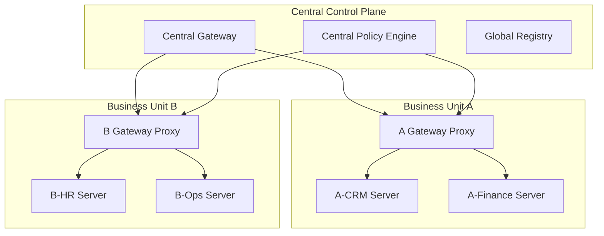

# MCP Multi-Server Integration Patterns

## Overview

This document provides detailed implementation patterns for integrating multiple MCP servers in enterprise environments. These patterns enable complex workflows that span multiple domains while maintaining security, governance, and operational excellence.

## Integration Architecture Patterns

### 1. Federated Gateway Pattern

**Use Case**: Enterprise with multiple business units requiring isolated MCP servers with centralized governance.

**Architecture**:



**Implementation Details**:

```yaml
federation_config:
  central_gateway:
    global_policies:
      - cross_bu_data_sharing: "restricted"
      - audit_retention: "7_years"
      - encryption_in_transit: "required"
  
  business_unit_gateways:
    isolation_level: "network_and_iam"
    local_policy_override: "security_only"
    cross_unit_routing: "explicit_approval"
```

### 2. Orchestrated Workflow Pattern

**Use Case**: Complex business processes requiring coordination across multiple MCP servers with specific execution sequences.

**Example: Customer Onboarding Workflow**:

```yaml
workflow_definition:
  name: "customer_onboarding"
  steps:
    - name: "validate_customer"
      mcp_server: "compliance_server"
      tools: ["kyc_check", "sanctions_screening"]
      
    - name: "create_accounts"
      mcp_server: "finance_server"
      tools: ["create_billing_account", "setup_payment_method"]
      depends_on: ["validate_customer"]
      
    - name: "provision_services"
      mcp_server: "ops_server"
      tools: ["create_tenant", "setup_monitoring"]
      depends_on: ["create_accounts"]
      
    - name: "send_welcome"
      mcp_server: "communication_server"
      tools: ["send_email", "create_support_ticket"]
      depends_on: ["provision_services"]
```

**Orchestration Engine Configuration**:

```yaml
orchestration:
  engine: "temporal"
  error_handling:
    retry_policy:
      max_attempts: 3
      backoff: "exponential"
    failure_handling: "compensating_transactions"
  
  state_management:
    persistence: "event_sourced"
    checkpointing: "per_step"
    replay_capability: true
```

### 3. Event-Driven Integration Pattern

**Use Case**: Real-time coordination between MCP servers based on business events.

**Architecture**:

```yaml
event_driven_config:
  event_bus:
    provider: "apache_kafka"
    topics:
      - name: "customer_events"
        partitions: 12
        retention: "30_days"
      - name: "order_events"
        partitions: 8
        retention: "90_days"
  
  event_processors:
    - name: "order_fulfillment_processor"
      subscribes_to: ["order_events"]
      triggers_mcp: "inventory_server"
      tools: ["reserve_inventory", "schedule_shipment"]
    
    - name: "customer_lifecycle_processor"
      subscribes_to: ["customer_events"]
      triggers_mcp: ["marketing_server", "analytics_server"]
      tools: ["update_segment", "trigger_campaign", "log_interaction"]
```

### 4. Saga Pattern for Distributed Transactions

**Use Case**: Multi-step business transactions requiring consistency across multiple MCP servers.

**Example: Order Processing Saga**:

```yaml
saga_definition:
  name: "order_processing_saga"
  compensations_enabled: true
  
  steps:
    - name: "reserve_inventory"
      mcp_server: "inventory_server"
      action: "reserve_items"
      compensation: "release_reservation"
      
    - name: "charge_payment"
      mcp_server: "payment_server"
      action: "charge_card"
      compensation: "refund_charge"
      
    - name: "create_shipment"
      mcp_server: "logistics_server"
      action: "schedule_delivery"
      compensation: "cancel_shipment"
      
    - name: "update_customer"
      mcp_server: "crm_server"
      action: "record_purchase"
      compensation: "revert_purchase_record"
```

## Security Integration Patterns

### 1. Zero-Trust Network Architecture

**Implementation**:

```yaml
zero_trust_config:
  network_segmentation:
    - mcp_servers: "isolated_subnets"
    - gateways: "dmz_subnet"
    - agents: "compute_subnet"
  
  service_mesh:
    provider: "istio"
    mutual_tls: "strict"
    policy_enforcement: "per_request"
  
  identity_verification:
    workload_identity: "spiffe"
    certificate_rotation: "24_hours"
    attestation: "continuous"
```

### 2. Progressive Authentication Pattern

**Use Case**: Escalating authentication requirements based on action sensitivity.

```yaml
progressive_auth:
  levels:
    - level: 1
      description: "Basic operations"
      requirements: ["service_account_token"]
      
    - level: 2
      description: "Sensitive data access"
      requirements: ["service_account_token", "user_delegation"]
      
    - level: 3
      description: "High-risk operations"
      requirements: ["service_account_token", "user_delegation", "mfa"]
      
    - level: 4
      description: "Critical business functions"
      requirements: ["service_account_token", "user_delegation", "mfa", "approval_workflow"]
```

### 3. Data Classification and Routing

**Pattern**: Route requests to appropriate MCP servers based on data classification.

```yaml
data_routing:
  classifications:
    - level: "public"
      mcp_servers: ["public_api_server", "website_server"]
      encryption: "in_transit"
      
    - level: "internal"
      mcp_servers: ["hr_server", "finance_server"]
      encryption: "in_transit_and_at_rest"
      
    - level: "confidential"
      mcp_servers: ["executive_server", "legal_server"]
      encryption: "in_transit_and_at_rest"
      location: "on_premises_only"
      
    - level: "restricted"
      mcp_servers: ["compliance_server"]
      encryption: "in_transit_and_at_rest"
      location: "secure_enclave"
      additional_controls: ["data_loss_prevention", "user_activity_monitoring"]
```

## Operational Integration Patterns

### 1. Circuit Breaker Pattern

**Implementation**:

```yaml
circuit_breaker_config:
  per_mcp_server:
    failure_threshold: 5
    timeout: "30s"
    half_open_max_calls: 3
    half_open_timeout: "60s"
  
  cascading_protection:
    upstream_failures: "isolate_downstream"
    dependency_mapping: "automatic_discovery"
    fallback_strategies: ["cached_responses", "degraded_mode"]
```

### 2. Bulkhead Pattern

**Pattern**: Isolate resources to prevent cascade failures.

```yaml
bulkhead_config:
  resource_pools:
    - name: "critical_operations"
      mcp_servers: ["payment_server", "compliance_server"]
      resources:
        cpu_cores: 4
        memory: "8Gi"
        connections: 100
    
    - name: "standard_operations"
      mcp_servers: ["crm_server", "inventory_server"]
      resources:
        cpu_cores: 2
        memory: "4Gi"
        connections: 50
    
    - name: "batch_operations"
      mcp_servers: ["analytics_server", "reporting_server"]
      resources:
        cpu_cores: 8
        memory: "16Gi"
        connections: 200
```

### 3. Health Check and Service Discovery

**Configuration**:

```yaml
health_monitoring:
  discovery_service: "consul"
  health_checks:
    - type: "http"
      endpoint: "/health"
      interval: "10s"
      timeout: "5s"
    
    - type: "tcp"
      port: 8080
      interval: "30s"
      timeout: "3s"
  
  load_balancing:
    strategy: "weighted_round_robin"
    health_factor: 0.7
    latency_factor: 0.3
```

## Performance Optimization Patterns

### 1. Caching Strategies

**Multi-Layer Caching**:

```yaml
caching_strategy:
  layers:
    - name: "edge_cache"
      location: "gateway"
      ttl: "5m"
      eviction: "lru"
      size: "100MB"
    
    - name: "application_cache"
      location: "mcp_server"
      ttl: "1h"
      eviction: "lfu"
      size: "1GB"
    
    - name: "distributed_cache"
      location: "redis_cluster"
      ttl: "24h"
      eviction: "ttl_based"
      size: "10GB"
```

### 2. Connection Pooling

**Configuration**:

```yaml
connection_pooling:
  database_pools:
    - mcp_server: "crm_server"
      pool_size: 20
      max_overflow: 10
      recycle_time: "3600s"
    
    - mcp_server: "analytics_server"
      pool_size: 50
      max_overflow: 20
      recycle_time: "1800s"
  
  http_pools:
    - mcp_server: "external_api_server"
      pool_size: 100
      keep_alive: "60s"
      timeout: "30s"
```

### 3. Batch Processing Pattern

**Use Case**: Optimize for high-throughput scenarios.

```yaml
batch_processing:
  batch_size: 100
  flush_interval: "10s"
  compression: "gzip"
  
  strategies:
    - name: "time_based"
      trigger: "every_minute"
      max_items: 1000
    
    - name: "size_based"
      trigger: "batch_full"
      max_items: 500
    
    - name: "priority_based"
      trigger: "high_priority_item"
      max_items: 50
```

## Monitoring and Observability

### 1. Distributed Tracing

**OpenTelemetry Configuration**:

```yaml
tracing_config:
  exporters:
    - name: "jaeger"
      endpoint: "http://jaeger:14268/api/traces"
    
    - name: "zipkin"
      endpoint: "http://zipkin:9411/api/v2/spans"
  
  sampling:
    strategy: "probabilistic"
    rate: 0.1
    priority_boost: "error_spans"
  
  correlation:
    request_id_header: "x-request-id"
    user_id_header: "x-user-id"
    tenant_id_header: "x-tenant-id"
```

### 2. Metrics Collection

**Prometheus Configuration**:

```yaml
metrics_config:
  custom_metrics:
    - name: "mcp_tool_duration_seconds"
      type: "histogram"
      labels: ["mcp_server", "tool_name", "status"]
    
    - name: "mcp_requests_total"
      type: "counter"
      labels: ["mcp_server", "method", "status_code"]
    
    - name: "mcp_active_sessions"
      type: "gauge"
      labels: ["mcp_server", "agent_type"]
```

### 3. Log Aggregation

**ELK Stack Configuration**:

```yaml
logging_config:
  structured_logging: true
  log_level: "info"
  
  fields:
    - request_id
    - user_id
    - tenant_id
    - mcp_server
    - tool_name
    - execution_time
    - error_code
  
  retention:
    audit_logs: "7_years"
    operational_logs: "90_days"
    debug_logs: "7_days"
```

## Testing Strategies

### 1. Integration Testing

**Test Configuration**:

```yaml
integration_tests:
  test_environments:
    - name: "staging"
      mcp_servers: "full_deployment"
      data: "synthetic"
    
    - name: "pre_prod"
      mcp_servers: "production_mirror"
      data: "sanitized_production"
  
  test_scenarios:
    - name: "cross_server_workflow"
      steps: ["validate", "process", "notify"]
      expected_outcome: "success"
    
    - name: "failure_recovery"
      inject_failure: "payment_server_timeout"
      expected_outcome: "compensating_transaction"
```

### 2. Chaos Engineering

**Chaos Testing Configuration**:

```yaml
chaos_experiments:
  network_partitions:
    - target: "mcp_server_subnet"
      duration: "5m"
      expected: "graceful_degradation"
  
  resource_exhaustion:
    - target: "memory_intensive_server"
      limit: "90%_memory"
      duration: "10m"
      expected: "load_shedding"
  
  dependency_failures:
    - target: "database_connection"
      failure_rate: "50%"
      duration: "2m"
      expected: "circuit_breaker_activation"
```

## Implementation Examples

### 1. Customer 360 Integration

**Scenario**: Agent needs comprehensive customer view from multiple systems.

```python
# Pseudo-code for customer 360 integration
class Customer360Agent:
    def __init__(self, mcp_gateway):
        self.gateway = mcp_gateway
        self.servers = {
            'crm': 'crm_server',
            'billing': 'billing_server',
            'support': 'support_server',
            'marketing': 'marketing_server'
        }
    
    async def get_customer_360(self, customer_id):
        # Parallel data gathering
        tasks = [
            self.get_customer_profile(customer_id),
            self.get_billing_history(customer_id),
            self.get_support_tickets(customer_id),
            self.get_marketing_preferences(customer_id)
        ]
        
        results = await asyncio.gather(*tasks, return_exceptions=True)
        
        # Aggregate and return unified view
        return self.merge_customer_data(results)
    
    async def get_customer_profile(self, customer_id):
        return await self.gateway.call_tool(
            server=self.servers['crm'],
            tool='get_customer',
            params={'id': customer_id}
        )
```

### 2. Financial Transaction Processing

**Scenario**: Multi-step financial transaction with compliance checks.

```python
class FinancialTransactionAgent:
    async def process_transaction(self, transaction_request):
        # Step 1: Compliance validation
        compliance_result = await self.gateway.call_tool(
            server='compliance_server',
            tool='validate_transaction',
            params=transaction_request
        )
        
        if not compliance_result['approved']:
            raise ComplianceException(compliance_result['reason'])
        
        # Step 2: Account validation
        account_validation = await self.gateway.call_tool(
            server='account_server',
            tool='validate_accounts',
            params={
                'from_account': transaction_request['from_account'],
                'to_account': transaction_request['to_account']
            }
        )
        
        # Step 3: Execute transaction with saga pattern
        return await self.execute_transaction_saga(
            transaction_request, 
            compliance_result['transaction_id']
        )
```

## Best Practices Summary

### 1. Design Principles

- **Loose Coupling**: Minimize dependencies between MCP servers
- **High Cohesion**: Group related functionality within servers
- **Fault Tolerance**: Design for partial failures and graceful degradation
- **Scalability**: Plan for horizontal scaling of individual servers

### 2. Security Considerations

- **Defense in Depth**: Multiple security layers
- **Principle of Least Privilege**: Minimal necessary permissions
- **Secure by Default**: Safe defaults for all configurations
- **Continuous Monitoring**: Real-time security observability

### 3. Operational Excellence

- **Automation**: Automate deployment, scaling, and recovery
- **Observability**: Comprehensive monitoring and alerting
- **Documentation**: Keep integration patterns well-documented
- **Testing**: Comprehensive testing including chaos engineering

This guide provides the foundation for implementing complex, multi-server MCP integrations that meet enterprise requirements for security, scalability, and operational excellence.
