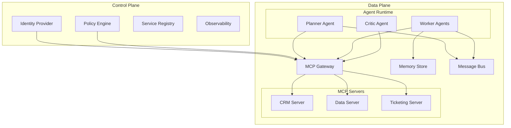

# Enterprise MCP Servers Guide

## Overview

This comprehensive guide provides enterprise-grade patterns, architectures, and best practices for implementing Model Context Protocol (MCP) servers in production environments. Based on current industry research and security frameworks, this guide addresses the critical needs of organizations deploying AI agents with secure, scalable, and governed tool orchestration.

## Table of Contents

1. [Introduction to MCP Servers](#introduction-to-mcp-servers)
2. [Enterprise Architecture Patterns](#enterprise-architecture-patterns)
3. [Security Framework](#security-framework)
4. [Multi-Agent Orchestration](#multi-agent-orchestration)
5. [Governance and Compliance](#governance-and-compliance)
6. [Implementation Strategies](#implementation-strategies)
7. [Operational Excellence](#operational-excellence)
8. [Reference Architecture](#reference-architecture)
9. [Best Practices and Anti-Patterns](#best-practices-and-anti-patterns)
10. [Implementation Roadmap](#implementation-roadmap)

## Introduction to MCP Servers

### What are MCP Servers?

Model Context Protocol (MCP) servers are standards-based tool interfaces that expose enterprise capabilities (CRUD APIs, search/retrieval, actions, knowledge resources) to AI agents via a uniform protocol. They serve as policy-aware adapters that present resources and tools to agents while maintaining security boundaries and governance controls.

### Key Characteristics

- **Policy-Aware Integration**: Built-in governance and security controls
- **Standardized Interface**: Uniform protocol for agent-tool interactions
- **Enterprise-Grade**: Designed for production environments with compliance requirements
- **Scalable Architecture**: Support for multi-agent orchestration and high-throughput scenarios

### Enterprise Value Proposition

1. **Unified Tool Ecosystem**: Consistent interface across diverse enterprise systems
2. **Security by Design**: Built-in authentication, authorization, and audit trails
3. **Governance Integration**: Policy enforcement and compliance alignment
4. **Operational Excellence**: Observability, monitoring, and reliability patterns

## Enterprise Architecture Patterns

### 1. Two-Plane Architecture (Recommended Baseline)

The foundation of enterprise MCP deployment separates concerns into control and data planes:

#### Control Plane (Security/Governance)

- **Identity and Access Management**: OIDC/OAuth2, SAML, SCIM integration
- **Policy Decision/Enforcement**: Central PDP (OPA/Rego or Cedar) with distributed PEPs
- **Catalog & Registry**: MCP server registry with versioning and capability schemas
- **Approvals & Change Management**: Workflow for onboarding and high-risk actions
- **Observability & Compliance**: Centralized logging, tracing, and audit capabilities

#### Data Plane (Execution)

- **MCP Servers**: Domain-aligned servers wrapping underlying APIs/databases
- **Agent Execution Sandboxes**: Per-task ephemeral environments with egress policies
- **Memory/RAG Stores**: Vector databases and knowledge graphs with tenancy isolation
- **Message Bus/Event Stream**: Agent coordination infrastructure with topic-level ACLs

### 2. MCP Gateway Pattern

A critical mediation layer that serves as the front door for all MCP traffic:

**Core Functions:**

- Authentication (mutual TLS, JWT/OIDC, workload identity)
- Authorization by scope and attribute mapping
- Egress & Data Loss Controls (URL allowlists, SSRF protections, PII detection)
- Rate Limiting and Quota enforcement
- Policy injection with tamper-resistant constraints
- Comprehensive audit fan-out

**Implementation Considerations:**

```yaml
# Example Gateway Configuration
gateway:
  authentication:
    method: "mTLS + JWT"
    workload_identity: "SPIFFE"
  authorization:
    policy_engine: "OPA"
    decision_cache_ttl: "5m"
  rate_limiting:
    per_principal: "1000/hour"
    per_tool: "100/hour"
    adaptive_surge: true
  egress_control:
    url_allowlist: ["api.company.com", "data.warehouse.internal"]
    content_inspection: true
    pii_detection: true
```

### 3. Domain-Aligned MCP Servers

Organize MCP servers by business domain for clear ownership and bounded contexts:

**Benefits:**

- Clear ownership and accountability
- Domain schema evolution independence
- Scoped blast radius for changes
- Predictable change windows

**Design Principles:**

- One MCP server per domain team
- Cohesive resources and tools within domain
- Least-privilege service accounts
- Built-in input/output validation

### 4. MCP Broker/Aggregator Pattern

For complex scenarios requiring cross-system orchestration:

**Use Cases:**

- Customer 360 queries hitting CRM + billing + support
- Multi-system transaction coordination
- Schema harmonization across backends

**Capabilities:**

- Sub-call orchestration with result merging
- Cross-system policy enforcement
- Caching with differential privacy
- Standardized error semantics

## Security Framework

### Threat Model for Enterprise MCP

**Primary Threat Categories:**

1. **Indirect Prompt Injection**: Malicious instructions in documents/emails influencing agent behavior
2. **Tool Scope Exploitation**: Privilege escalation through overbroad permissions
3. **Data Exfiltration**: Via outbound tools, storage writes, or error channels
4. **Code/Command Execution**: RCE vectors through shell, SQL, or code execution tools
5. **Supply Chain Risk**: Malicious or compromised MCP servers and dependencies
6. **Multi-Agent Emergent Risks**: Collusion, infinite loops, unsafe consensus

### Defense-in-Depth Strategy

#### 1. Identity and Authorization

```yaml
identity_framework:
  workload_identity: "SPIFFE/SPIRE"
  token_lifetime: "5-15 minutes"
  access_control: "ABAC/ReBAC"
  policy_storage: "Git with signed releases"
  continuous_reauth: "sensitive_actions"
```

#### 2. Tool-Level Security

- **Explicit Allowlists**: Per agent role and task type
- **Input/Output Schemas**: JSON Schema validation with rejection policies
- **TEE/Confidential Compute**: For high-sensitivity workloads
- **Execution Sandboxing**: Per-invocation ephemeral containers

#### 3. Content Safety and Injection Resistance

- **Boundary Normalization**: Strip HTML/JS, enforce markdown/plaintext
- **Context Segment Separation**: Cryptographically signed system prompts
- **Injection Detection**: Heuristic and model-based detectors
- **Safety Critics**: Independent safety evaluation agents

#### 4. Secrets and Key Management

```yaml
secrets_management:
  provider: "HashiCorp Vault"
  credential_type: "dynamic"
  rotation_frequency: "hourly"
  scope: "per_tool"
  encryption: "envelope_encryption_with_tenant_deks"
```

## Multi-Agent Orchestration

### Core Orchestration Patterns

#### 1. Coordinator-Workers (Hierarchical)

- **Structure**: Central planner with specialized worker agents
- **Use Cases**: Complex task decomposition and execution
- **Controls**: Planner limiters, tool scopes, independent reviewers

#### 2. Blackboard/Stigmergic Collaboration

- **Structure**: Shared state with role-based read/write permissions
- **Use Cases**: Investigative workflows, collaborative analysis
- **Controls**: Schema-typed slots, moderation services, conflict resolution

#### 3. Contract Net/Market-Based Allocation

- **Structure**: Agents bid for tasks based on capability/cost
- **Use Cases**: Resource optimization, variable tool costs
- **Controls**: Audit trails, randomized tie-breaks, periodic rebidding

#### 4. Critic/Referee and Debate Patterns

- **Structure**: Independent evaluation and multi-agent consensus
- **Use Cases**: High-stakes decisions, quality assurance
- **Controls**: Distinct safety policies, confidence thresholds

### Safety-First Autonomy Framework

```yaml
autonomy_controls:
  sandbox_budgets:
    max_cost: "$50"
    max_duration: "30 minutes"
    max_tool_calls: "100"
  boundary_controls:
    human_in_loop: "external_writes"
    approval_required: "financial_transactions"
    escalation_threshold: "confidence < 0.8"
  monitoring:
    loop_detection: true
    resource_monitoring: true
    anomaly_detection: true
```

## Governance and Compliance

### Regulatory Alignment (2025)

#### EU AI Act Compliance

- **Risk Tiering**: Classify AI systems by risk level
- **Documentation**: Technical documentation and system cards
- **Human Oversight**: Required for high-risk applications
- **Data Governance**: Transparency and data subject rights

#### NIST AI Risk Management Framework

- **Govern**: Risk governance and oversight structures
- **Map**: AI risk assessment and categorization
- **Measure**: Continuous monitoring and evaluation
- **Manage**: Risk mitigation and response strategies

#### ISO/IEC Standards Integration

- **27001**: Information Security Management Systems
- **23894**: AI Risk Management
- **42001**: AI Management Systems

### Policy-as-Code Framework

```yaml
policy_framework:
  storage: "Git repository"
  language: "OPA Rego / Cedar"
  versioning: "Semantic versioning"
  deployment: "GitOps with signed releases"
  validation: "CI/CD policy tests"
  enforcement: "Distributed PEPs"
```

### Data Governance Architecture

#### Classification and Zoning

- **Public**: Open access resources
- **Internal**: Organization-restricted data
- **Confidential**: Limited access with encryption
- **Restricted**: Highest security controls

#### Lineage and Provenance

- **Source Tracking**: Which data sources contributed to outputs
- **Tool Attribution**: Which tools were used in processing
- **Citation Generation**: Automatic source attribution
- **Audit Trails**: Complete decision lineage

## Implementation Strategies

### Phase 1: Foundation (Months 1-3)

1. **Control Plane Setup**
   - Deploy identity provider integration
   - Implement policy engine (OPA/Cedar)
   - Setup MCP gateway with basic security
   - Establish service registry

2. **Initial MCP Servers**
   - Deploy 2-3 domain servers (CRM, tickets, data)
   - Implement basic tool validation
   - Setup observability infrastructure

3. **Security Baseline**
   - Mutual TLS between components
   - Basic input/output validation
   - Audit logging to SIEM

### Phase 2: Scale and Security (Months 4-6)

1. **Expanded MCP Ecosystem**
   - Deploy 6-8 additional domain servers
   - Implement advanced policy controls
   - Add human-in-the-loop workflows

2. **Multi-Agent Introduction**
   - Deploy coordinator-worker pattern
   - Add critic/reviewer agents
   - Implement budget and time controls

3. **Enhanced Security**
   - Execution sandboxing
   - Advanced injection detection
   - Supply chain security (SBOM, signed artifacts)

### Phase 3: Production Scale (Months 7-12)

1. **Full Orchestration**
   - Complex multi-agent workflows
   - Event-sourced agent state
   - Advanced coordination patterns

2. **Enterprise Integration**
   - Multi-region deployment
   - Disaster recovery capabilities
   - Advanced compliance reporting

3. **Optimization**
   - Cost optimization strategies
   - Performance tuning
   - Advanced caching patterns

## Operational Excellence

### Observability and Monitoring

#### OpenTelemetry AI Semantics

```yaml
telemetry_configuration:
  traces:
    ai_spans:
      - prompt_hashes
      - tool_metadata
      - token_usage
      - cost_tracking
      - latency_percentiles
  metrics:
    high_cardinality_labels:
      - tenant_id
      - agent_role
      - mcp_server
      - data_classification
  alerts:
    anomaly_detection:
      - tool_usage_spikes
      - egress_destination_changes
      - token_budget_overruns
```

#### Service Level Objectives (SLOs)

- **Planner Latency**: p95 < 2 seconds
- **Tool Success Rate**: > 99.5%
- **Approval Latency**: p95 < 30 seconds
- **MCP Server Availability**: > 99.9%

### Cost Management Framework

```yaml
cost_controls:
  budgets:
    per_project: "$1000/month"
    per_agent_session: "$10"
    per_tool_call: "$0.01"
  optimization:
    embedding_cache: "7_days"
    result_cache: "24_hours"
    batch_processing: "off_peak_hours"
  monitoring:
    real_time_tracking: true
    cost_attribution: "tenant_level"
    budget_alerts: "80%_threshold"
```

### Disaster Recovery and Business Continuity

#### Recovery Strategies

- **Cross-Region Replication**: MCP servers and configuration
- **State Backup**: Event store and agent memory backups
- **Policy Versioning**: Git-based policy history
- **Credential Recovery**: Vault backup and restore procedures

#### Recovery Time Objectives

- **RTO**: 4 hours for critical MCP services
- **RPO**: 1 hour for agent state and audit logs
- **Service Degradation**: Read-only mode within 30 minutes

## Reference Architecture

### Technology Stack

#### Recommended Components

```yaml
infrastructure:
  orchestration: "Kubernetes"
  service_mesh: "Istio/Linkerd"
  storage: "PostgreSQL + pgvector"
  messaging: "Apache Kafka"
  secrets: "HashiCorp Vault"

identity_and_policy:
  identity_provider: "Okta/Azure AD"
  policy_engine: "Open Policy Agent"
  gateway: "Envoy with custom MCP filter"

observability:
  tracing: "Jaeger/Tempo"
  metrics: "Prometheus/Grafana"
  logging: "ELK/EFK stack"
  siem: "Splunk/Azure Sentinel"

security:
  image_signing: "Sigstore/Cosign"
  vulnerability_scanning: "Trivy/Snyk"
  compliance: "Falco/OPA Gatekeeper"
```

### Deployment Architecture



## Best Practices and Anti-Patterns

### Security Best Practices

#### ✅ Do

- Implement least-privilege access controls
- Use short-lived, scoped credentials
- Validate all inputs and outputs
- Implement comprehensive audit logging
- Use signed and versioned policies
- Deploy execution sandboxing
- Monitor for anomalous behavior

#### ❌ Don't

- Share tool scopes across tenants
- Embed secrets in prompts
- Allow unbounded autonomous loops
- Use flat, global permissions
- Deploy without input validation
- Skip supply chain verification
- Ignore audit trail gaps

### Operational Best Practices

#### Deployment Strategy

- **Blue-Green Deployments**: For MCP servers and agents
- **Canary Releases**: For policy changes and new tools
- **Feature Flags**: For gradual rollout of capabilities
- **Rollback Procedures**: Automated and well-tested

#### Performance Optimization

- **Connection Pooling**: For MCP server connections
- **Result Caching**: With appropriate TTLs and invalidation
- **Batch Processing**: For bulk operations and embeddings
- **Resource Limits**: CPU/memory/network for all components

## Implementation Roadmap

### Quarterly Milestones

#### Q1: Foundation

- [ ] Control plane deployment (IdP, policy, gateway, registry)
- [ ] 2-3 domain MCP servers operational
- [ ] Basic observability and DLP controls
- [ ] Security baseline establishment

#### Q2: Expansion

- [ ] 6-8 MCP servers deployed across domains
- [ ] Human-in-the-loop workflows for high-risk actions
- [ ] Event-sourced agent state implementation
- [ ] Red team program initiation

#### Q3: Orchestration

- [ ] Multi-agent workflows in production
- [ ] DAG/state machine orchestration
- [ ] Critic/reviewer agent integration
- [ ] Budget and resource controls

#### Q4: Scale and Optimization

- [ ] Multi-region deployment
- [ ] Confidential compute integration
- [ ] Cost optimization and caching
- [ ] Full compliance audit (EU AI Act)

### Success Metrics

#### Technical Metrics

- **Availability**: > 99.9% uptime for critical services
- **Performance**: < 2s p95 latency for agent operations
- **Security**: Zero successful injection or exfiltration attempts
- **Cost**: < 10% variance from planned budgets

#### Business Metrics

- **Agent Adoption**: > 80% of eligible use cases automated
- **Compliance**: 100% audit compliance score
- **Developer Productivity**: 50% reduction in integration time
- **Risk Reduction**: 90% reduction in manual high-risk operations

## Conclusion

This enterprise MCP servers guide provides a comprehensive framework for implementing secure, scalable, and governed AI agent orchestration. By following the architectural patterns, security frameworks, and implementation strategies outlined here, organizations can capture the productivity benefits of AI agents while maintaining the security and compliance posture required for enterprise environments.

The key to success lies in treating MCP servers as first-class enterprise infrastructure with appropriate governance, security controls, and operational excellence practices. As the MCP ecosystem continues to evolve, this foundation will enable organizations to adapt and scale their AI agent capabilities while maintaining enterprise-grade reliability and security.

## Additional Resources

- [Integration Examples](integration_examples/mcp-multi-server-integration-patterns.md)

## Related Resources

- [Security Vulnerability Analysis](../../projects/arxiv-mcp-enhanced-design.md)
- [Implementation Guides](../../guides/implementation/next-steps-implementation-guide.md)
- [VS Code Copilot Integration](../vscode-copilot-customization-complete.md)
